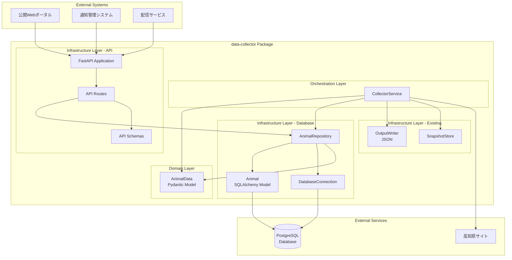
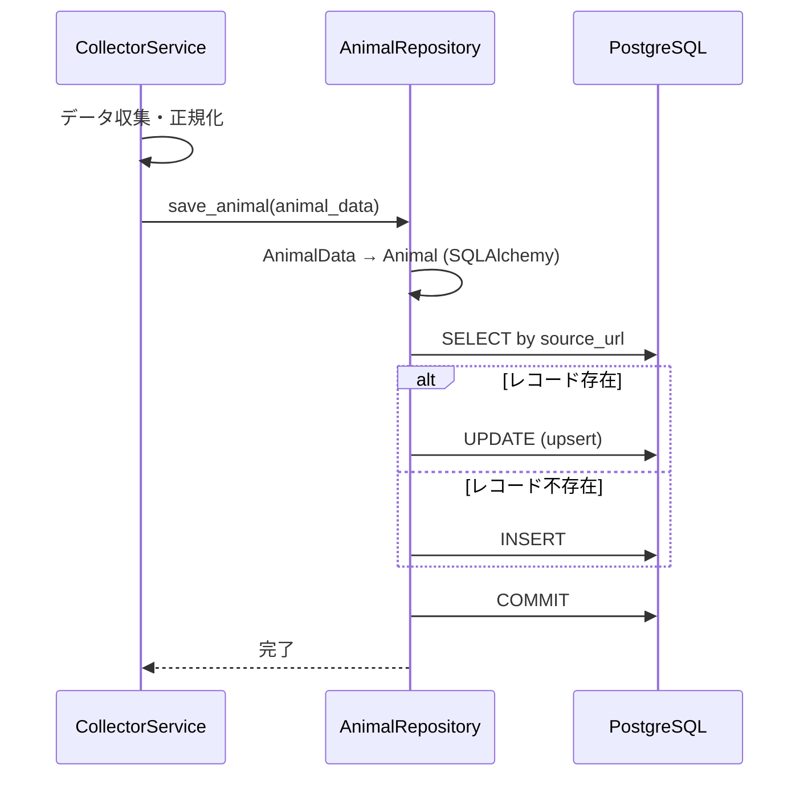
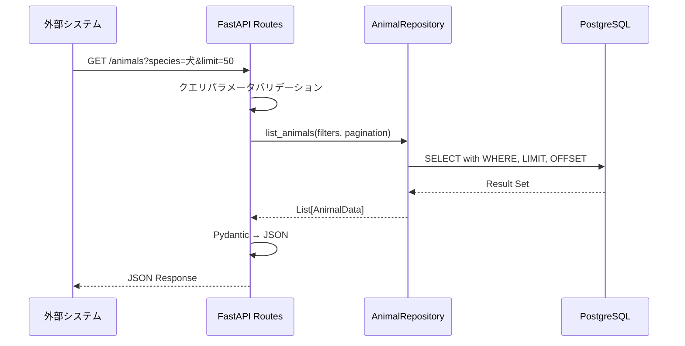
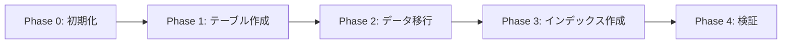

# 技術設計書

## 概要

本機能は、既存の data-collector で収集・正規化された保護動物データをPostgreSQLデータベースに永続化し、外部システム（公開Webポータル、通知管理、配信サービス）が利用できるREST APIを提供します。

**Purpose**: 動物データの一元管理と効率的なアクセスを実現し、データの統合性とアクセシビリティを向上させます。

**Users**: 外部システム開発者が REST API を通じて動物データを取得・統合し、システム管理者がデータベースを管理します。

**Impact**: 現在のファイルベース永続化（JSON出力）からデータベースベースの永続化に移行し、data-collector の出力先を拡張します。既存の JSON 出力機能は当面併用します。

### Goals

- データベーススキーマの設計と実装（PostgreSQL + SQLAlchemy 2.0）
- データ永続化機能の実装（upsert、トランザクション管理）
- REST API の実装（取得、フィルタリング、ページネーション）
- 既存 data-collector との統合（CollectorService からのデータベース永続化）

### Non-Goals

- API 認証・認可機能（Phase 2 で検討）
- data-collector と animal-repository の完全なパッケージ分離（Phase 2 で検討）
- リアルタイム通知機能（既存の notification-manager に委譲）
- 管理UI（別機能として実装予定）

## アーキテクチャ

### 既存アーキテクチャ分析

**現在の構造:**
- **レイヤードアーキテクチャ:** domain, infrastructure, orchestration の明確な分離
- **依存性注入:** CollectorService がコンポーネントをコンストラクタで受け取る
- **ファイルベース永続化:** JSON 出力（`output/animals.json`）、スナップショット管理

**統合ポイント:**
- `src/data_collector/domain/models.py::AnimalData` - Pydantic モデル（再利用）
- `src/data_collector/orchestration/collector_service.py` - データベース永続化を追加
- `src/data_collector/infrastructure/output_writer.py` - 併用（将来的に段階的移行）

**保持すべきパターン:**
- レイヤードアーキテクチャ
- Pydantic によるデータバリデーション
- 構造化ロギング（`logging` モジュール）

### アーキテクチャパターン & 境界マップ



**アーキテクチャ統合:**
- **採用パターン:** レイヤードアーキテクチャ + Repository パターン
- **ドメイン境界:**
  - Domain層: ビジネスロジックとデータモデル（AnimalData）
  - Infrastructure層: データベースアクセス、API提供、外部サービス連携
  - Orchestration層: ユースケースの調整
- **既存パターン保持:** domain層の純粋性（infrastructureへの依存なし）
- **新規コンポーネント理由:**
  - **DatabaseConnection**: 接続プール管理、セッションライフサイクル
  - **AnimalRepository**: データアクセスロジックのカプセル化
  - **FastAPI Application**: REST API 提供、自動ドキュメント生成
- **Steering準拠:** ファイルベース知識管理、段階的詳細化、型安全性

### 技術スタック

| レイヤー | 選定 / バージョン | 役割 | 備考 |
|---------|------------------|------|------|
| Backend / Services | FastAPI 0.100+ | REST API提供、依存性注入 | Pydantic統合、自動APIドキュメント生成 |
| Backend / Services | SQLAlchemy 2.0+ | ORM、データベースアクセス | 非同期サポート、マイグレーション統合 |
| Data / Storage | PostgreSQL 14+ | データベース | JSONB、配列型、GINインデックスサポート |
| Data / Storage | asyncpg (最新) | PostgreSQLドライバー | 非同期ネイティブサポート、高速 |
| Data / Storage | Alembic 1.11+ | マイグレーション管理 | SQLAlchemy標準、バージョン管理 |
| Infrastructure / Runtime | uvicorn (最新) | ASGIサーバー | 高速、FastAPI標準 |
| Infrastructure / Runtime | pydantic-settings 2.0+ | 環境変数管理 | 型安全な設定管理 |

**技術選定理由:**
- **PostgreSQL**: JSONB型サポート（image_urls配列格納）、成熟したエコシステム、高い信頼性
- **FastAPI**: Pydantic 2.x との統合、自動OpenAPIドキュメント生成、非同期サポート
- **SQLAlchemy 2.0**: 非同期サポート、Pydantic統合パターン確立、成熟したORM
- **asyncpg**: PostgreSQL専用高速ドライバー、async/awaitネイティブサポート

詳細な調査結果は `research.md` を参照。

## システムフロー

### データ永続化フロー



**キー決定:**
- **Upsert動作**: `source_url` をユニーク制約として使用し、既存レコードは更新、新規は挿入
- **トランザクション境界**: Repository メソッド内で完結（単一操作の原子性保証）
- **エラーハンドリング**: データベースエラーは例外として送出、呼び出し元でロギング

### API取得フロー



**キー決定:**
- **バリデーション**: FastAPI の自動バリデーション機能を使用（Pydantic スキーマ）
- **ページネーション**: デフォルト limit=50, offset=0、最大 limit=1000
- **フィルタリング**: AND 条件で複数パラメータを結合

## 要件トレーサビリティ

| 要件 | 概要 | コンポーネント | インターフェース | フロー |
|------|------|---------------|-----------------|--------|
| 1.1-1.6 | DBスキーマ設計 | Animal (SQLAlchemy Model) | Table Schema | - |
| 2.1-2.5 | データ永続化 | AnimalRepository | save_animal() | データ永続化フロー |
| 3.1-3.6 | データ取得API | API Routes, AnimalRepository | GET /animals, GET /animals/{id} | API取得フロー |
| 4.1-4.6 | フィルタリング | AnimalRepository | list_animals(filters) | API取得フロー |
| 5.1-5.5 | ページネーション | AnimalRepository | list_animals(pagination) | API取得フロー |
| 6.1-6.5 | エラーハンドリング | FastAPI Exception Handlers | HTTPException | - |
| 7.1-7.5 | DB接続管理 | DatabaseConnection | get_session() | 全フロー |

## コンポーネントとインターフェース

### コンポーネント概要

| コンポーネント | ドメイン/レイヤー | 意図 | 要件カバレッジ | 主要依存関係 | 契約 |
|---------------|------------------|------|---------------|-------------|------|
| Animal (SQLAlchemy) | Infrastructure/Database | データベーステーブル定義 | 1.1-1.6 | PostgreSQL (P0) | Table Schema |
| AnimalRepository | Infrastructure/Database | データアクセス層 | 2.1-2.5, 4.1-4.6, 5.1-5.5 | Animal Model (P0), AsyncSession (P0) | Service |
| DatabaseConnection | Infrastructure/Database | 接続プール管理 | 7.1-7.5 | PostgreSQL (P0), pydantic-settings (P0) | Service |
| FastAPI Application | Infrastructure/API | REST API 提供 | 3.1-3.6, 6.1-6.5 | AnimalRepository (P0), uvicorn (P0) | API |
| API Routes | Infrastructure/API | エンドポイント定義 | 3.1-3.6, 4.1-4.6, 5.1-5.5 | AnimalRepository (P0) | API |
| API Schemas | Infrastructure/API | リクエスト/レスポンススキーマ | 3.1-3.6 | Pydantic (P0) | State |

### Infrastructure / Database

#### Animal (SQLAlchemy Model)

| フィールド | 詳細 |
|----------|------|
| 意図 | PostgreSQLテーブルスキーマ定義 |
| 要件 | 1.1-1.6 |

**責務と制約:**
- データベーステーブル `animals` の構造定義
- カラム型、制約、インデックスの宣言
- Pydantic AnimalData との変換サポート（`from_attributes=True`）

**依存関係:**
- Outbound: PostgreSQL — テーブル作成、データ永続化 (P0)
- External: SQLAlchemy 2.0 — ORM機能 (P0)

**契約:** [x] Table Schema

##### Table Schema

```python
from sqlalchemy import Column, Integer, String, Date, Text, Index
from sqlalchemy.dialects.postgresql import JSONB
from sqlalchemy.ext.declarative import declarative_base

Base = declarative_base()

class Animal(Base):
    __tablename__ = "animals"

    # Primary Key
    id: int = Column(Integer, primary_key=True, autoincrement=True)

    # 必須フィールド
    species: str = Column(String(50), nullable=False, index=True)
    shelter_date: date = Column(Date, nullable=False, index=True)
    location: str = Column(Text, nullable=False, index=True)
    source_url: str = Column(Text, nullable=False, unique=True)

    # 準必須フィールド
    sex: str = Column(String(20), nullable=False, default="不明", index=True)
    age_months: Optional[int] = Column(Integer, nullable=True)
    color: Optional[str] = Column(String(100), nullable=True)
    size: Optional[str] = Column(String(50), nullable=True)
    phone: Optional[str] = Column(String(20), nullable=True)

    # JSONB配列
    image_urls: List[str] = Column(JSONB, nullable=False, default=[])

    # インデックス
    __table_args__ = (
        Index('idx_animals_search', 'species', 'sex', 'location'),
    )
```

**事前条件:**
- PostgreSQL 14+ が利用可能
- JSONB 型がサポートされている

**事後条件:**
- テーブル `animals` が作成される
- インデックスが適用される

**不変条件:**
- `id` は自動インクリメントで一意
- `source_url` は一意制約で重複不可

**実装ノート:**
- **統合:** Alembic マイグレーションでテーブル作成
- **バリデーション:** SQLAlchemy の型チェックとNOT NULL制約
- **リスク:** JSONB型のパフォーマンス（GINインデックス検討）

#### AnimalRepository

| フィールド | 詳細 |
|----------|------|
| 意図 | 動物データのCRUD操作とクエリ機能を提供 |
| 要件 | 2.1-2.5, 4.1-4.6, 5.1-5.5 |

**責務と制約:**
- データアクセスロジックのカプセル化
- トランザクション境界の管理（メソッド単位）
- Pydantic AnimalData と SQLAlchemy Animal の変換

**依存関係:**
- Inbound: CollectorService, API Routes — データ永続化・取得 (P0)
- Outbound: Animal Model — ORM操作 (P0)
- Outbound: AsyncSession — データベースセッション (P0)

**契約:** [x] Service

##### Service Interface

```python
from typing import List, Optional
from sqlalchemy.ext.asyncio import AsyncSession
from ..domain.models import AnimalData

class AnimalRepository:
    def __init__(self, session: AsyncSession):
        self.session = session

    async def save_animal(self, animal_data: AnimalData) -> AnimalData:
        """
        動物データを保存（upsert）

        Args:
            animal_data: 保存する動物データ（Pydantic）

        Returns:
            AnimalData: 保存後のデータ（IDを含む）

        Raises:
            DatabaseError: データベース接続エラー
            ValidationError: バリデーションエラー
        """
        pass

    async def get_animal_by_id(self, animal_id: int) -> Optional[AnimalData]:
        """
        IDで動物データを取得

        Args:
            animal_id: 動物ID

        Returns:
            Optional[AnimalData]: 動物データ、存在しない場合は None
        """
        pass

    async def list_animals(
        self,
        species: Optional[str] = None,
        sex: Optional[str] = None,
        location: Optional[str] = None,
        shelter_date_from: Optional[date] = None,
        shelter_date_to: Optional[date] = None,
        limit: int = 50,
        offset: int = 0
    ) -> tuple[List[AnimalData], int]:
        """
        動物データをフィルタリング・ページネーションして取得

        Args:
            species: 動物種別フィルタ
            sex: 性別フィルタ
            location: 場所フィルタ（部分一致）
            shelter_date_from: 収容日開始
            shelter_date_to: 収容日終了
            limit: 取得件数（最大1000）
            offset: オフセット

        Returns:
            tuple[List[AnimalData], int]: (動物データリスト, 総件数)
        """
        pass
```

**事前条件:**
- `session` は有効な AsyncSession
- `animal_data` は Pydantic バリデーション済み

**事後条件:**
- データベースに永続化済み
- トランザクションがコミット済み

**不変条件:**
- `source_url` の一意性を保証

**実装ノート:**
- **統合:** CollectorService と FastAPI Routes から利用
- **バリデーション:** Pydantic による事前バリデーション
- **リスク:** Upsert のパフォーマンス（大量データ時の SELECT → INSERT/UPDATE）

#### DatabaseConnection

| フィールド | 詳細 |
|----------|------|
| 意図 | データベース接続プールとセッション管理 |
| 要件 | 7.1-7.5 |

**責務と制約:**
- コネクションプールの作成と管理
- セッションライフサイクル管理（リクエストごと）
- 環境変数からの接続情報読み込み

**依存関係:**
- Outbound: PostgreSQL — データベース接続 (P0)
- External: pydantic-settings — 環境変数管理 (P0)
- External: SQLAlchemy AsyncEngine — 接続プール (P0)

**契約:** [x] Service

##### Service Interface

```python
from sqlalchemy.ext.asyncio import create_async_engine, AsyncSession, async_sessionmaker
from pydantic_settings import BaseSettings
from typing import AsyncGenerator

class DatabaseSettings(BaseSettings):
    database_url: str = Field(..., env="DATABASE_URL")
    pool_size: int = Field(default=5, env="DB_POOL_SIZE")
    max_overflow: int = Field(default=10, env="DB_MAX_OVERFLOW")

    class Config:
        env_file = ".env"

class DatabaseConnection:
    def __init__(self, settings: DatabaseSettings):
        self.engine = create_async_engine(
            settings.database_url,
            pool_size=settings.pool_size,
            max_overflow=settings.max_overflow,
            echo=False,
        )
        self.async_session_maker = async_sessionmaker(
            self.engine,
            class_=AsyncSession,
            expire_on_commit=False,
        )

    async def get_session(self) -> AsyncGenerator[AsyncSession, None]:
        """
        データベースセッションを取得

        Yields:
            AsyncSession: データベースセッション

        Raises:
            DatabaseError: 接続エラー
        """
        async with self.async_session_maker() as session:
            yield session

    async def close(self) -> None:
        """接続プールを閉じる"""
        await self.engine.dispose()
```

**事前条件:**
- 環境変数 `DATABASE_URL` が設定されている
- PostgreSQL が起動している

**事後条件:**
- コネクションプールが作成される
- セッションが適切にクローズされる

**不変条件:**
- プールサイズの上限を超えない

**実装ノート:**
- **統合:** FastAPI の起動時に初期化、終了時にクローズ
- **バリデーション:** 起動時にデータベース接続テスト
- **リスク:** コネクションプール枯渇時のタイムアウト処理

### Infrastructure / API

#### FastAPI Application

| フィールド | 詳細 |
|----------|------|
| 意図 | REST API アプリケーションの提供 |
| 要件 | 3.1-3.6, 6.1-6.5 |

**責務と制約:**
- FastAPI インスタンスの作成と設定
- エラーハンドラーの登録
- ライフサイクルイベント管理（起動・終了）

**依存関係:**
- Inbound: 外部システム — HTTP リクエスト (P0)
- Outbound: API Routes — エンドポイント処理 (P0)
- Outbound: DatabaseConnection — セッション管理 (P0)
- External: uvicorn — ASGIサーバー (P0)

**契約:** [x] API

##### API Contract

| エンドポイント | メソッド | リクエスト | レスポンス | エラー |
|--------------|---------|-----------|-----------|--------|
| `/animals` | GET | QueryParams: species, sex, location, shelter_date_from, shelter_date_to, limit, offset | PaginatedResponse[AnimalPublic] | 400, 500 |
| `/animals/{id}` | GET | PathParam: id (int) | AnimalPublic | 404, 500 |
| `/docs` | GET | - | OpenAPI UI | - |
| `/openapi.json` | GET | - | OpenAPI Schema | - |

**実装ノート:**
- **統合:** uvicorn で起動、Docker コンテナ化
- **バリデーション:** FastAPI 自動バリデーション
- **リスク:** 同時接続数の制限（uvicorn workers 設定）

#### API Routes

| フィールド | 詳細 |
|----------|------|
| 意図 | REST API エンドポイントの定義 |
| 要件 | 3.1-3.6, 4.1-4.6, 5.1-5.5 |

**責務と制約:**
- エンドポイントロジックの実装
- リクエストバリデーションとレスポンス変換
- AnimalRepository の呼び出し

**依存関係:**
- Inbound: FastAPI Application — ルーティング (P0)
- Outbound: AnimalRepository — データアクセス (P0)
- Outbound: API Schemas — バリデーション (P0)

**契約:** [x] API

##### API Contract

```python
from fastapi import APIRouter, Depends, HTTPException, Query
from typing import Annotated, Optional
from datetime import date

router = APIRouter(prefix="/animals", tags=["animals"])

@router.get("/", response_model=PaginatedResponse[AnimalPublic])
async def list_animals(
    session: SessionDep,
    species: Optional[str] = Query(None, description="動物種別フィルタ"),
    sex: Optional[str] = Query(None, description="性別フィルタ"),
    location: Optional[str] = Query(None, description="場所フィルタ"),
    shelter_date_from: Optional[date] = Query(None, description="収容日開始"),
    shelter_date_to: Optional[date] = Query(None, description="収容日終了"),
    limit: Annotated[int, Query(le=1000, ge=1)] = 50,
    offset: Annotated[int, Query(ge=0)] = 0,
) -> PaginatedResponse[AnimalPublic]:
    """動物データリストを取得"""
    pass

@router.get("/{animal_id}", response_model=AnimalPublic)
async def get_animal(
    animal_id: int,
    session: SessionDep,
) -> AnimalPublic:
    """動物データを個別取得"""
    pass
```

**エラーレスポンス:**
- 400: バリデーションエラー（不正なパラメータ）
- 404: リソースが見つからない
- 500: データベースエラー

**実装ノート:**
- **統合:** FastAPI Application にルーター登録
- **バリデーション:** Query パラメータの型チェックと範囲制限
- **リスク:** limit パラメータの悪用（最大値1000で制限）

#### API Schemas

| フィールド | 詳細 |
|----------|------|
| 意図 | API リクエスト/レスポンスのスキーマ定義 |
| 要件 | 3.1-3.6 |

**責務と制約:**
- Pydantic スキーマの定義
- 既存 AnimalData との変換ロジック

**依存関係:**
- Inbound: API Routes — バリデーション (P0)
- External: Pydantic — スキーマ定義 (P0)

**契約:** [x] State

##### State Management

```python
from pydantic import BaseModel, Field
from typing import List, Generic, TypeVar
from datetime import date

T = TypeVar('T')

class AnimalPublic(BaseModel):
    """公開用動物データスキーマ"""
    id: int
    species: str
    sex: str
    age_months: Optional[int]
    color: Optional[str]
    size: Optional[str]
    shelter_date: date
    location: str
    phone: Optional[str]
    image_urls: List[str]
    source_url: str

    model_config = {"from_attributes": True}

class PaginationMeta(BaseModel):
    """ページネーションメタデータ"""
    total_count: int
    limit: int
    offset: int
    current_page: int
    total_pages: int
    has_next: bool

class PaginatedResponse(BaseModel, Generic[T]):
    """ページネーション付きレスポンス"""
    items: List[T]
    meta: PaginationMeta
```

**実装ノート:**
- **統合:** FastAPI の response_model で使用
- **バリデーション:** Pydantic による自動バリデーション
- **リスク:** なし

## データモデル

### ドメインモデル

**集約とトランザクション境界:**
- **Animal 集約:** 単一の動物データ（id, species, location, etc.）
- **トランザクション境界:** Repository メソッド単位（save_animal, list_animals）

**エンティティ:**
- `Animal`: データベーステーブルエンティティ（SQLAlchemy）
- `AnimalData`: ドメインエンティティ（Pydantic、不変）

**ビジネスルールと不変条件:**
- `species` は「犬」「猫」「その他」のいずれか
- `sex` は「男の子」「女の子」「不明」のいずれか
- `source_url` は一意（重複不可）
- `location` は必須（最低限都道府県名）
- `age_months` は0以上

### 論理データモデル

**構造定義:**
```
animals テーブル:
  - id (PK, autoincrement)
  - species (NOT NULL, INDEX)
  - sex (NOT NULL, INDEX, DEFAULT '不明')
  - age_months (NULL)
  - color (NULL)
  - size (NULL)
  - shelter_date (NOT NULL, INDEX)
  - location (NOT NULL, INDEX)
  - phone (NULL)
  - image_urls (JSONB, NOT NULL, DEFAULT '[]')
  - source_url (NOT NULL, UNIQUE)
```

**整合性と一貫性:**
- **トランザクション境界:** Repository メソッド単位
- **参照整合性:** なし（単一テーブル）
- **時間的側面:** なし（現時点ではバージョニングなし）

### 物理データモデル（Relational）

**テーブル定義:**
```sql
CREATE TABLE animals (
    id SERIAL PRIMARY KEY,
    species VARCHAR(50) NOT NULL,
    sex VARCHAR(20) NOT NULL DEFAULT '不明',
    age_months INTEGER,
    color VARCHAR(100),
    size VARCHAR(50),
    shelter_date DATE NOT NULL,
    location TEXT NOT NULL,
    phone VARCHAR(20),
    image_urls JSONB NOT NULL DEFAULT '[]'::jsonb,
    source_url TEXT NOT NULL UNIQUE
);
```

**インデックス定義:**
```sql
CREATE INDEX idx_animals_species ON animals(species);
CREATE INDEX idx_animals_sex ON animals(sex);
CREATE INDEX idx_animals_location ON animals(location);
CREATE INDEX idx_animals_shelter_date ON animals(shelter_date);
CREATE INDEX idx_animals_search ON animals(species, sex, location);
CREATE UNIQUE INDEX idx_animals_source_url ON animals(source_url);
```

**パーティショニング戦略:**
- 現時点では不要（Phase 2 で検討）
- 将来的に `shelter_date` による範囲パーティショニング検討

### データ契約とインテグレーション

**API データ転送:**
```json
{
  "items": [
    {
      "id": 1,
      "species": "犬",
      "sex": "男の子",
      "age_months": 24,
      "color": "茶色",
      "size": "中型",
      "shelter_date": "2026-01-05",
      "location": "高知県動物愛護センター",
      "phone": "088-123-4567",
      "image_urls": ["https://example.com/image1.jpg"],
      "source_url": "https://kochi-apc.com/center-data/123"
    }
  ],
  "meta": {
    "total_count": 150,
    "limit": 50,
    "offset": 0,
    "current_page": 1,
    "total_pages": 3,
    "has_next": true
  }
}
```

**バリデーションルール:**
- `species`: enum ["犬", "猫", "その他"]
- `sex`: enum ["男の子", "女の子", "不明"]
- `shelter_date`: ISO 8601 日付形式
- `image_urls`: URL 配列
- `source_url`: URL 形式

**シリアライゼーション形式:**
- JSON（UTF-8エンコーディング）
- Content-Type: application/json

## エラーハンドリング

### エラー戦略

各エラータイプに対する具体的なハンドリングパターンと回復機構を定義します。

### エラーカテゴリとレスポンス

**ユーザーエラー (4xx):**
- **400 Bad Request**: 不正なクエリパラメータ → フィールド別バリデーションエラーメッセージ
- **404 Not Found**: リソースが見つからない → リソースIDとエラーメッセージ
- **422 Unprocessable Entity**: Pydanticバリデーションエラー → 詳細なフィールドエラー

**システムエラー (5xx):**
- **500 Internal Server Error**: データベース接続エラー → 汎用エラーメッセージ（詳細はログのみ）
- **503 Service Unavailable**: コネクションプール枯渇 → リトライ提案

**ビジネスロジックエラー (422):**
- **種別制約違反**: species が「犬」「猫」「その他」以外 → 許可値リスト表示
- **性別制約違反**: sex が「男の子」「女の子」「不明」以外 → 許可値リスト表示

**エラーレスポンス形式:**
```json
{
  "detail": "Validation error",
  "errors": [
    {
      "field": "species",
      "message": "Invalid species value. Must be one of: 犬, 猫, その他"
    }
  ]
}
```

### モニタリング

**エラー追跡:**
- すべての例外をログ出力（レベル: ERROR）
- スタックトレースを詳細ログに記録

**ロギング:**
- 構造化ロギング（JSON形式推奨）
- フィールド: timestamp, level, module, message, extra（リクエストID、ユーザーID）

**ヘルスモニタリング:**
- `/health` エンドポイント（データベース接続チェック）
- Prometheus メトリクス（Phase 2 で検討）

## テストスト ラテジー

### ユニットテスト

**対象:**
1. `AnimalRepository.save_animal()` - upsert ロジック
2. `AnimalRepository.list_animals()` - フィルタリング・ページネーション
3. `DatabaseConnection.get_session()` - セッション管理
4. Pydantic スキーマのバリデーション

**アプローチ:**
- pytest + pytest-asyncio
- モックデータベース（SQLite in-memory）

### 統合テスト

**対象:**
1. CollectorService → AnimalRepository 連携
2. API Routes → AnimalRepository 連携
3. FastAPI エンドポイントのE2Eテスト
4. データベースマイグレーション（Alembic）
5. 環境変数読み込み（pydantic-settings）

**アプローチ:**
- pytest + httpx
- テスト用PostgreSQLコンテナ（Docker Compose）

### パフォーマンステスト

**対象:**
1. 大量データ挿入（1000件のupsert）
2. フィルタリングクエリ（複数条件）
3. ページネーション（offset=10000）
4. 同時接続数（50リクエスト）

**アプローチ:**
- locust または pytest-benchmark
- 想定データ量: 10,000件

## セキュリティ考慮事項

**現時点での対応:**
- SQL インジェクション対策: SQLAlchemy パラメータバインディング
- XSS 対策: FastAPI の自動エスケープ
- CORS 設定: 環境変数で許可オリジンを設定

**Phase 2 で検討:**
- API キーベース認証
- レートリミット（APIの過剰利用防止）
- HTTPS 強制

## パフォーマンスとスケーラビリティ

**目標メトリクス:**
- API レスポンスタイム: 95パーセンタイルで < 200ms
- データベースクエリ: < 100ms
- 同時接続数: 100リクエスト/秒

**スケーリングアプローチ:**
- 水平スケーリング: uvicorn workers 増加
- データベースプール: pool_size / max_overflow 調整

**キャッシング戦略:**
- Phase 2 で検討（Redis）

## マイグレーション戦略

**Alembic による段階的マイグレーション:**



**フェーズ詳細:**
1. **Phase 0**: Alembic 初期化、`alembic init`
2. **Phase 1**: `animals` テーブル作成マイグレーション
3. **Phase 2**: 既存 JSON データのインポート（オプショナル）
4. **Phase 3**: インデックス作成マイグレーション
5. **Phase 4**: データ整合性検証、ロールバックテスト

**ロールバックトリガー:**
- マイグレーション失敗時
- パフォーマンス劣化検出時
- データ整合性違反検出時

**検証チェックポイント:**
- テーブル存在確認
- インデックス存在確認
- データ件数確認
- サンプルクエリ実行

## Supporting References

### データベーススキーマ詳細（SQL）

完全なスキーマ定義は上記「物理データモデル」セクションを参照。

### 外部依存関係

**調査済み技術:**
- [FastAPI SQL Databases Tutorial](https://fastapi.tiangolo.com/tutorial/sql-databases/)
- [Setting up FastAPI with Async SQLAlchemy 2.0 & Pydantic V2](https://medium.com/@tclaitken/setting-up-a-fastapi-app-with-async-sqlalchemy-2-0-pydantic-v2-e6c540be4308)
- [FastAPI Dependency Injection with Service and Repository Layers](https://blog.dotcs.me/posts/fastapi-dependency-injection-x-layers)
- [SQLAlchemy 2.0 Asynchronous I/O Documentation](https://docs.sqlalchemy.org/en/20/orm/extensions/asyncio.html)
- [PostgreSQL JSONB with SQLAlchemy](https://www.geeksforgeeks.org/python/jsonb-sqlalchemy/)

詳細な調査結果は `research.md` を参照。
