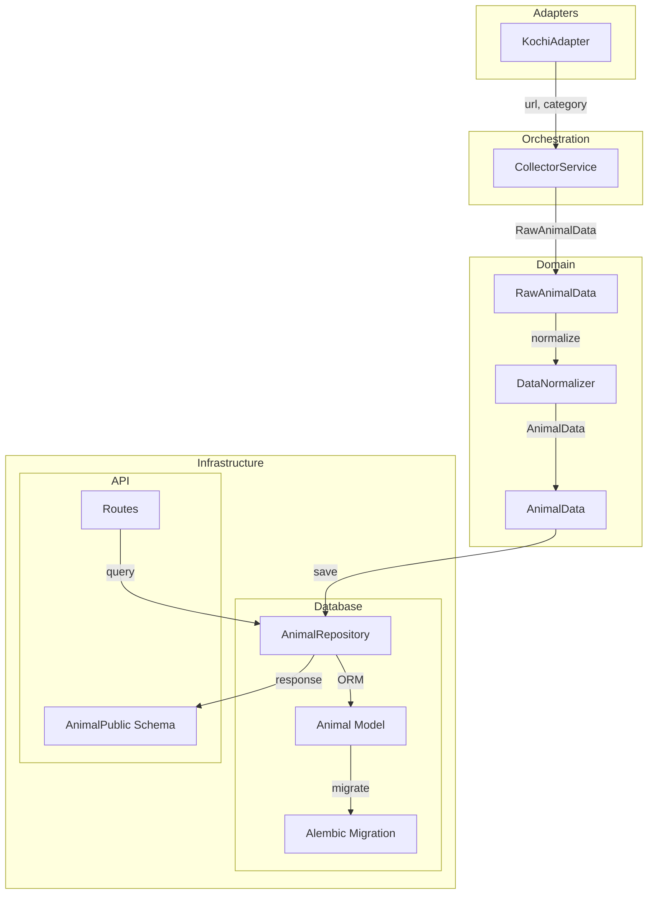
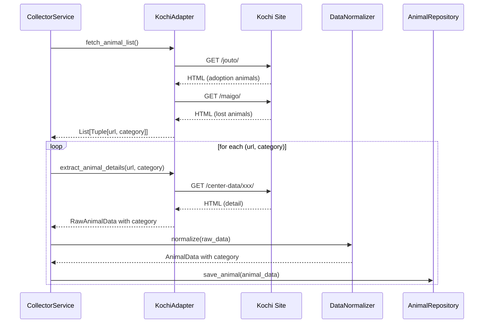
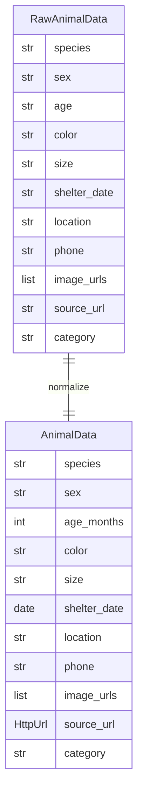
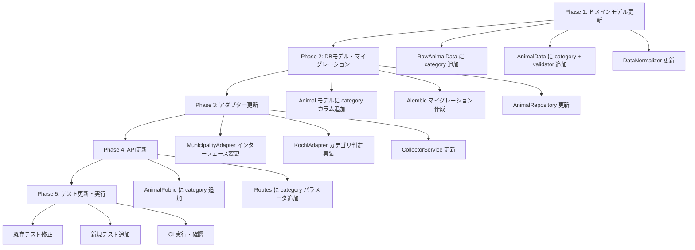

# Technical Design: animal-category-field

## Overview

**Purpose**: 保護動物データに `category` フィールドを追加し、「譲渡対象（adoption）」と「迷子（lost）」を区別できるようにする。

**Users**: システム開発者、API 利用者、将来の public-web-portal が本機能を利用し、カテゴリ別のデータ処理・表示を実現する。

**Impact**: data-collector のドメインモデル、データベーススキーマ、REST API、アダプターすべてに category フィールドを追加。既存データはデフォルト値 'adoption' でマイグレーション。

### Goals

- 収集元ページ（/jouto/ または /maigo/）に基づくカテゴリ自動判定
- 全レイヤー（Domain → DB → API）での category フィールド一貫性
- 既存データとの後方互換性維持
- API でのカテゴリフィルタリング機能提供

### Non-Goals

- カテゴリの UI 表示（public-web-portal の範囲）
- 3つ以上のカテゴリ値への拡張
- 既存データの手動カテゴリ修正ツール

## Architecture

### Existing Architecture Analysis

現在のシステムは以下のレイヤー構造を持つ:

```
Adapters → Domain Models → Infrastructure (DB/API)
```

- **KochiAdapter**: `/jouto/` と `/maigo/` 両ページからデータ収集するが、カテゴリ情報を保持していない
- **RawAnimalData / AnimalData**: category フィールドなし
- **Animal テーブル / AnimalPublic スキーマ**: category カラム/フィールドなし

### Architecture Pattern & Boundary Map



**Architecture Integration**:
- 選択パターン: 既存レイヤードアーキテクチャの拡張
- 責務分離: カテゴリ判定はアダプター層、バリデーションはドメイン層
- 既存パターン維持: field_validator、インデックス、フィルタパラメータのパターンを流用
- 新コンポーネント: なし（既存コンポーネントへのフィールド追加のみ）

### Technology Stack

| Layer | Choice / Version | Role in Feature | Notes |
|-------|------------------|-----------------|-------|
| Backend | Python 3.11+ / Pydantic v2 | ドメインモデル、バリデーション | field_validator で 2 値制約 |
| Data | PostgreSQL / SQLAlchemy 2.0 | category カラム永続化 | VARCHAR(20), NOT NULL, index |
| Migration | Alembic | スキーマ変更管理 | デフォルト値でのカラム追加 |
| API | FastAPI | category クエリパラメータ | Query パラメータバリデーション |

## System Flows

### データ収集フロー（カテゴリ付き）



**Key Decision**: カテゴリは fetch_animal_list() 時点で判定し、以降のデータフローで保持する。

## Requirements Traceability

| Requirement | Summary | Components | Interfaces | Flows |
|-------------|---------|------------|------------|-------|
| 1.1 | RawAnimalData に category 追加 | RawAnimalData | BaseModel field | - |
| 1.2 | AnimalData に category 追加 | AnimalData | BaseModel field | - |
| 1.3 | 2 値制約バリデーション | AnimalData | field_validator | - |
| 1.4 | 無効値でエラー | AnimalData | ValidationError | - |
| 1.5 | 必須フィールド | RawAnimalData, AnimalData | Field(...) | - |
| 2.1 | Animal テーブルに category | Animal | Column | - |
| 2.2 | category インデックス | Animal | Index | - |
| 2.3 | Alembic マイグレーション | Migration | - | - |
| 2.4 | 既存データにデフォルト | Migration | server_default | - |
| 2.5 | 複合インデックス更新 | Animal | Index | - |
| 3.1 | AnimalPublic に category | AnimalPublic | BaseModel field | - |
| 3.2 | category クエリパラメータ | Routes | Query | API Flow |
| 3.3 | category=adoption フィルタ | Routes, Repository | Query, filter | API Flow |
| 3.4 | category=lost フィルタ | Routes, Repository | Query, filter | API Flow |
| 3.5 | category 省略で全件 | Routes, Repository | Optional | API Flow |
| 3.6 | 無効カテゴリで 400 | Routes | HTTPException | API Flow |
| 4.1 | /jouto/ で adoption 設定 | KochiAdapter | _fetch_from_page | 収集フロー |
| 4.2 | /maigo/ で lost 設定 | KochiAdapter | _fetch_from_page | 収集フロー |
| 4.3 | インターフェース拡張 | MunicipalityAdapter | fetch_animal_list | - |
| 4.4 | 新規アダプター対応 | MunicipalityAdapter | abstract method | - |
| 4.5 | 判定不可時デフォルト | KochiAdapter | fallback logic | - |
| 5.1 | 既存データデフォルト | Migration | server_default | - |
| 5.2 | category なしリクエスト受付 | Routes | Optional param | - |
| 5.3 | 既存クライアント動作 | AnimalPublic | 後方互換 | - |
| 5.4 | ロールバック可能 | Migration | downgrade | - |
| 5.5 | source_url 一意性維持 | - | 既存制約維持 | - |

## Components and Interfaces

| Component | Domain/Layer | Intent | Req Coverage | Key Dependencies | Contracts |
|-----------|--------------|--------|--------------|------------------|-----------|
| RawAnimalData | Domain | 収集生データにカテゴリ追加 | 1.1, 1.5 | - | State |
| AnimalData | Domain | 正規化データにカテゴリ追加 | 1.2-1.5 | RawAnimalData (P0) | State |
| DataNormalizer | Domain | カテゴリの正規化（パススルー） | 1.2 | RawAnimalData (P0) | Service |
| Animal | Infrastructure/DB | category カラム追加 | 2.1-2.5 | - | State |
| AnimalRepository | Infrastructure/DB | category フィルタ対応 | 3.3-3.5 | Animal (P0) | Service |
| AnimalPublic | Infrastructure/API | category フィールド追加 | 3.1, 5.3 | Animal (P0) | State |
| Routes | Infrastructure/API | category クエリパラメータ | 3.2-3.6 | AnimalRepository (P0) | API |
| MunicipalityAdapter | Adapters | インターフェース拡張 | 4.3, 4.4 | - | Service |
| KochiAdapter | Adapters | カテゴリ判定ロジック | 4.1, 4.2, 4.5 | MunicipalityAdapter (P0) | Service |
| Migration | Infrastructure/DB | category カラム追加 | 2.3, 2.4, 5.1, 5.4 | - | Batch |

### Domain Layer

#### RawAnimalData

| Field | Detail |
|-------|--------|
| Intent | 収集した生データにカテゴリ情報を含める |
| Requirements | 1.1, 1.5 |

**Responsibilities & Constraints**
- アダプターが収集した生データを保持
- category は必須フィールド（空文字列不可）
- バリデーションはこの段階では行わない（文字列として保持）

**Dependencies**
- Inbound: KochiAdapter — 生データ作成 (P0)

**Contracts**: State [x]

##### State Management

```python
class RawAnimalData(BaseModel):
    # ... existing fields ...
    category: str = Field(..., description="カテゴリ ('adoption' or 'lost')")
```

#### AnimalData

| Field | Detail |
|-------|--------|
| Intent | 正規化済みデータでカテゴリの 2 値制約を保証 |
| Requirements | 1.2, 1.3, 1.4, 1.5 |

**Responsibilities & Constraints**
- category フィールドは `'adoption'` または `'lost'` のみ許容
- 無効な値は ValidationError をスロー
- 必須フィールド（デフォルト値なし）

**Dependencies**
- Inbound: DataNormalizer — 正規化処理 (P0)
- Outbound: AnimalRepository — 永続化 (P0)

**Contracts**: State [x]

##### State Management

```python
class AnimalData(BaseModel):
    # ... existing fields ...
    category: str = Field(..., description="カテゴリ ('adoption' or 'lost')")

    @field_validator("category")
    @classmethod
    def validate_category(cls, v: str) -> str:
        if v not in ["adoption", "lost"]:
            raise ValueError(
                f"無効なカテゴリ: {v}。'adoption', 'lost' のいずれかである必要があります"
            )
        return v
```

#### DataNormalizer

| Field | Detail |
|-------|--------|
| Intent | RawAnimalData.category を AnimalData.category にパススルー |
| Requirements | 1.2 |

**Responsibilities & Constraints**
- category はすでにアダプターで設定済みのためパススルー
- 特別な正規化処理は不要

**Dependencies**
- Inbound: RawAnimalData (P0)
- Outbound: AnimalData (P0)

**Contracts**: Service [x]

##### Service Interface

```python
@staticmethod
def normalize(raw_data: RawAnimalData) -> AnimalData:
    return AnimalData(
        # ... existing fields ...
        category=raw_data.category,  # パススルー
    )
```

### Infrastructure/Database Layer

#### Animal (ORM Model)

| Field | Detail |
|-------|--------|
| Intent | category カラムを追加し、インデックスで検索性能を確保 |
| Requirements | 2.1, 2.2, 2.5 |

**Responsibilities & Constraints**
- category: VARCHAR(20), NOT NULL, デフォルト 'adoption'
- 単一カラムインデックス追加
- 複合インデックス idx_animals_search に category を追加

**Dependencies**
- Inbound: AnimalRepository — CRUD 操作 (P0)

**Contracts**: State [x]

##### State Management

```python
class Animal(Base):
    # ... existing columns ...

    # カテゴリカラム追加
    category: str = Column(
        String(20),
        nullable=False,
        default="adoption",
        server_default="adoption",
        index=True
    )

    # 複合インデックス更新
    __table_args__ = (
        Index("idx_animals_search", "species", "sex", "location", "category"),
    )
```

#### AnimalRepository

| Field | Detail |
|-------|--------|
| Intent | category フィルタ対応のクエリメソッド拡張 |
| Requirements | 3.3, 3.4, 3.5 |

**Responsibilities & Constraints**
- list_animals(), list_animals_orm() に category パラメータ追加
- _to_orm(), _to_pydantic() で category フィールドをマッピング
- category=None の場合はフィルタなし（全件）

**Dependencies**
- Inbound: Routes — API リクエスト (P0)
- Outbound: Animal — ORM 操作 (P0)

**Contracts**: Service [x]

##### Service Interface

```python
async def list_animals(
    self,
    species: Optional[str] = None,
    sex: Optional[str] = None,
    location: Optional[str] = None,
    category: Optional[str] = None,  # 追加
    shelter_date_from: Optional[date] = None,
    shelter_date_to: Optional[date] = None,
    limit: int = 50,
    offset: int = 0,
) -> Tuple[List[AnimalData], int]:
    """
    Preconditions: category は 'adoption', 'lost', None のいずれか
    Postconditions: 指定カテゴリでフィルタされたデータを返却
    """
    pass

def _to_orm(self, animal_data: AnimalData) -> Animal:
    """AnimalData.category を Animal.category にマッピング"""
    pass

def _to_pydantic(self, orm_animal: Animal) -> AnimalData:
    """Animal.category を AnimalData.category にマッピング"""
    pass
```

#### Migration (Alembic)

| Field | Detail |
|-------|--------|
| Intent | category カラムを安全に追加・ロールバック可能に |
| Requirements | 2.3, 2.4, 5.1, 5.4 |

**Responsibilities & Constraints**
- upgrade: category カラム追加（デフォルト 'adoption'）
- downgrade: category カラム削除
- 既存データは自動的にデフォルト値が適用される

**Contracts**: Batch [x]

##### Batch / Job Contract

- **Trigger**: `alembic upgrade head`
- **Input / validation**: 既存 animals テーブルの存在確認
- **Output / destination**: category カラム追加、インデックス作成
- **Idempotency & recovery**: downgrade でカラム削除可能

```python
def upgrade():
    op.add_column(
        'animals',
        sa.Column(
            'category',
            sa.String(20),
            nullable=False,
            server_default='adoption'
        )
    )
    op.create_index('ix_animals_category', 'animals', ['category'])
    # 複合インデックス再作成（既存を削除して新規作成）
    op.drop_index('idx_animals_search', table_name='animals')
    op.create_index(
        'idx_animals_search',
        'animals',
        ['species', 'sex', 'location', 'category']
    )

def downgrade():
    op.drop_index('idx_animals_search', table_name='animals')
    op.create_index(
        'idx_animals_search',
        'animals',
        ['species', 'sex', 'location']
    )
    op.drop_index('ix_animals_category', table_name='animals')
    op.drop_column('animals', 'category')
```

### Infrastructure/API Layer

#### AnimalPublic (Schema)

| Field | Detail |
|-------|--------|
| Intent | API レスポンスに category フィールドを追加 |
| Requirements | 3.1, 5.3 |

**Responsibilities & Constraints**
- category フィールドを公開
- 既存クライアントは新フィールドを無視可能（後方互換）

**Contracts**: State [x]

##### State Management

```python
class AnimalPublic(BaseModel):
    # ... existing fields ...
    category: str  # 追加

    model_config = ConfigDict(from_attributes=True)
```

#### Routes

| Field | Detail |
|-------|--------|
| Intent | GET /animals に category クエリパラメータを追加 |
| Requirements | 3.2, 3.3, 3.4, 3.5, 3.6 |

**Responsibilities & Constraints**
- category パラメータはオプショナル
- 有効値: 'adoption', 'lost', None（全件）
- 無効値の場合は HTTP 400 エラー

**Dependencies**
- Outbound: AnimalRepository — データ取得 (P0)

**Contracts**: API [x]

##### API Contract

| Method | Endpoint | Request | Response | Errors |
|--------|----------|---------|----------|--------|
| GET | /animals | Query: category (Optional[str]) | PaginatedResponse[AnimalPublic] | 400 (無効カテゴリ) |

```python
@router.get("/animals", response_model=PaginatedResponse[AnimalPublic])
async def list_animals(
    session: SessionDep,
    species: Optional[str] = Query(None),
    sex: Optional[str] = Query(None),
    location: Optional[str] = Query(None),
    category: Optional[str] = Query(
        None,
        description="カテゴリフィルタ ('adoption' または 'lost')"
    ),
    # ... other params ...
) -> PaginatedResponse[AnimalPublic]:
    # バリデーション
    if category is not None and category not in ["adoption", "lost"]:
        raise HTTPException(
            status_code=400,
            detail=f"無効なカテゴリ: {category}。'adoption', 'lost' のいずれかを指定してください"
        )
    # ...
```

### Adapters Layer

#### MunicipalityAdapter

| Field | Detail |
|-------|--------|
| Intent | fetch_animal_list() の返却型を拡張 |
| Requirements | 4.3, 4.4 |

**Responsibilities & Constraints**
- 返却型を `List[str]` から `List[Tuple[str, str]]` に変更
- extract_animal_details() に category 引数を追加
- 将来のアダプター追加時も同じインターフェースを使用

**Contracts**: Service [x]

##### Service Interface

```python
class MunicipalityAdapter(ABC):
    @abstractmethod
    def fetch_animal_list(self) -> List[Tuple[str, str]]:
        """
        Returns:
            List[Tuple[str, str]]: (detail_url, category) のリスト
        """
        pass

    @abstractmethod
    def extract_animal_details(
        self,
        detail_url: str,
        category: str = "adoption"
    ) -> RawAnimalData:
        """
        Args:
            detail_url: 個体詳細ページの URL
            category: カテゴリ ('adoption' or 'lost')
        """
        pass
```

#### KochiAdapter

| Field | Detail |
|-------|--------|
| Intent | 収集元ページに基づきカテゴリを判定 |
| Requirements | 4.1, 4.2, 4.5 |

**Responsibilities & Constraints**
- /jouto/ ページからの収集 → 'adoption'
- /maigo/ ページからの収集 → 'lost'
- 判定不可時はデフォルト 'adoption' + 警告ログ

**Dependencies**
- Outbound: MunicipalityAdapter — インターフェース実装 (P0)

**Contracts**: Service [x]

##### Service Interface

```python
class KochiAdapter(MunicipalityAdapter):
    CATEGORY_ADOPTION = "adoption"
    CATEGORY_LOST = "lost"

    def fetch_animal_list(self) -> List[Tuple[str, str]]:
        all_urls = []
        for page_url, category in [
            (self.JOUTO_URL, self.CATEGORY_ADOPTION),
            (self.MAIGO_URL, self.CATEGORY_LOST),
        ]:
            urls = self._fetch_from_page(page_url, category)
            all_urls.extend([(url, category) for url in urls])
        return all_urls

    def extract_animal_details(
        self,
        detail_url: str,
        category: str = "adoption"
    ) -> RawAnimalData:
        # ... extract logic ...
        return RawAnimalData(
            # ... existing fields ...
            category=category,
        )
```

**Implementation Notes**
- カテゴリ判定は fetch_animal_list() 内で行い、URL とペアで返却
- 判定不可時のフォールバック: デフォルト 'adoption' + logger.warning()

## Data Models

### Domain Model



**Business Rules & Invariants**:
- category は `'adoption'` または `'lost'` のみ（AnimalData でバリデーション）
- category は必須フィールド（NULL 不可）

### Physical Data Model

**For Relational Database (PostgreSQL)**:

```sql
-- animals テーブル変更
ALTER TABLE animals
ADD COLUMN category VARCHAR(20) NOT NULL DEFAULT 'adoption';

-- 単一カラムインデックス
CREATE INDEX ix_animals_category ON animals (category);

-- 複合インデックス再作成
DROP INDEX IF EXISTS idx_animals_search;
CREATE INDEX idx_animals_search ON animals (species, sex, location, category);
```

### Data Contracts & Integration

**API Data Transfer**:

```python
# AnimalPublic (Response)
{
    "id": 1,
    "species": "犬",
    "sex": "男の子",
    "age_months": 24,
    "color": "茶色",
    "size": "中型",
    "shelter_date": "2026-01-05",
    "location": "高知県動物愛護センター",
    "phone": "088-123-4567",
    "image_urls": ["https://..."],
    "source_url": "https://...",
    "category": "adoption"  // 追加
}
```

## Error Handling

### Error Categories and Responses

**User Errors (4xx)**:
- `400 Bad Request`: 無効なカテゴリ値（`category=invalid`）
  - Response: `{"detail": "無効なカテゴリ: invalid。'adoption', 'lost' のいずれかを指定してください"}`

**Business Logic Errors (422)**:
- ValidationError: AnimalData 作成時の無効カテゴリ
  - 内部処理で発生、API には伝播しない（アダプターが正しい値を設定）

### Monitoring

- category バリデーションエラーをログに記録
- カテゴリ別の収集件数をメトリクスとして出力

## Testing Strategy

### Unit Tests

- **RawAnimalData**: category フィールドの存在確認
- **AnimalData.validate_category**: 有効値 ('adoption', 'lost') の受け入れ
- **AnimalData.validate_category**: 無効値での ValidationError
- **DataNormalizer.normalize**: category のパススルー確認
- **KochiAdapter._fetch_from_page**: カテゴリ付き URL ペアの返却

### Integration Tests

- **AnimalRepository.list_animals**: category フィルタの動作確認
- **Routes.list_animals**: category クエリパラメータの処理
- **KochiAdapter → CollectorService**: エンドツーエンドのカテゴリフロー

### E2E Tests

- `GET /animals?category=adoption` → 譲渡対象のみ返却
- `GET /animals?category=lost` → 迷子のみ返却
- `GET /animals` → 全カテゴリ返却
- `GET /animals?category=invalid` → 400 エラー

### Migration Tests

- upgrade: category カラム追加、既存データにデフォルト値設定確認
- downgrade: category カラム削除、他のカラムに影響なし確認

## Migration Strategy



**Phase Breakdown**:
1. ドメインモデル: RawAnimalData, AnimalData, DataNormalizer
2. データベース: Animal モデル、マイグレーション、Repository
3. アダプター: MunicipalityAdapter インターフェース、KochiAdapter 実装
4. API: AnimalPublic スキーマ、Routes
5. テスト: 全テストファイルの更新と実行

**Rollback Triggers**:
- マイグレーション失敗時: `alembic downgrade -1`
- テスト失敗時: コード変更をリバート
