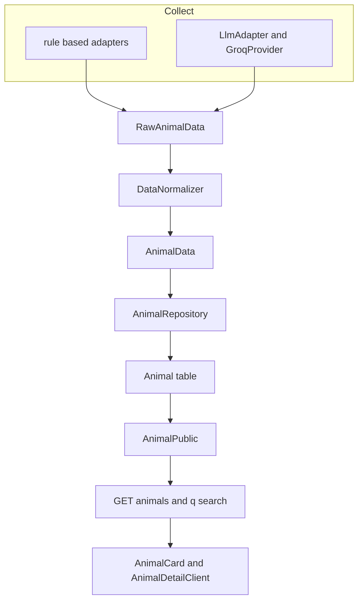
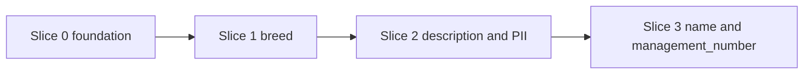
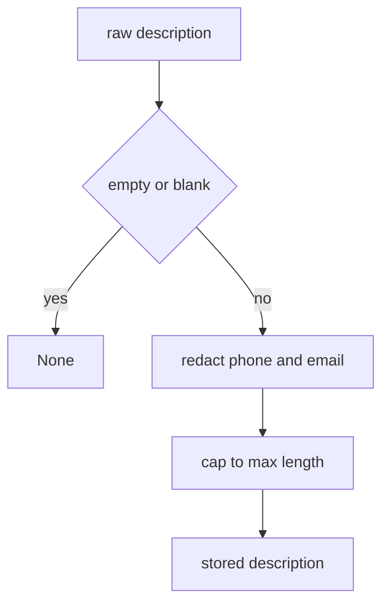
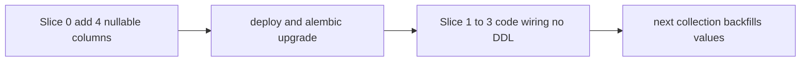

# Technical Design: animal-identity-fields

## Overview

**Purpose**: 保護動物の「個体識別情報」4フィールド（`breed`=品種, `name`=仮名, `description`=性格・特徴, `management_number`=管理番号）を、収集 → 正規化（PII伏字） → 保存 → 公開API → フロントエンド → キーワード検索 まで一気通貫で扱えるようにする。

**Users**: 里親希望者（品種・性格で魅力を判断し、キーワード検索で目的の子に辿り着く）、迷子の飼い主（品種・特徴・管理番号で自分の子を同定する）、運営者（収集済みで捨てていた値を保存・公開できる）。

**Impact**: 既存の動物データパイプライン（rule-based アダプター群 + LLM 抽出 → DataNormalizer → AnimalRepository → 公開API → Next.js ポータル）に、後方互換な4つの任意フィールドを縦断追加する。全フィールドは nullable であり、サイトごとに取得可否が異なることを前提に欠損を許容して段階的に充填する。

### Goals
- 4フィールドを ORM・ドメインモデル・公開API・フロントエンド型に additive nullable で追加し、既存スイートを Green に保つ。
- 既に解析済みで破棄している値（高知の品種、柏の特徴等）を対応フィールドへ配線し、代表アダプターと LLM 経路で実値を保存する。
- `description` に PII 伏字（電話・メール）を適用し、伏字済みのみ公開する。
- `q` 検索の対象に `breed` を追加する（カタカナ↔ひらがなを正規化して照合）。name/description/management_number は検索対象に含めない（表示のみ）。
- breed → description → name/management_number の順でスライス実装・PR 分割できる構造にする。

### Non-Goals
- `AnimalArchive`（卒業済み履歴）への4フィールド追加（別スコープ）。
- `description` 内の**氏名**伏字（`_redact_pii` の電話/メールに留め、氏名は将来課題）。
- 100+ 全アダプターの一括配線（基底2ファイル + 代表サイト先行、残りは段階横展開）。
- repository の q 検索 OR句2箇所の DRY 統合（本 spec 外。ただし両方を同時更新する）。
- `description`(Text) への検索インデックス最適化（現状件数では不要）。

## Architecture

### Existing Architecture Analysis
- **収集**: rule-based アダプター（`RuleBasedAdapter` 基底 + `WordPressListAdapter`/`SinglePageTableAdapter` + 100+ サイト派生）と LLM 経路（`LlmAdapter` + `GroqProvider`）が `RawAnimalData` を生成。`CollectorService` が `RawAnimalData → DataNormalizer.normalize → AnimalData` を素通し保存。
- **永続化**: `AnimalRepository` が `_to_orm`/`_to_pydantic`/`save_animal` の3箇所で ORM `Animal` とドメイン `AnimalData` をマッピング。
- **公開**: `AnimalPublic`(pydantic, `from_attributes=True`) が ORM から自動変換。`GET /animals` の `q` 検索は `repository.list_animals_orm` の `or_(... ilike ...)` 句。
- **表示**: Next.js の `AnimalCard`/`AnimalDetailClient` が `AnimalPublic` 型を条件描画。
- **保たれる境界**: species 正規化（犬/猫/その他 3値）と breed（自由値）は別物として分離。core フィールドは無条件上書き、という repository の既存更新ポリシーを踏襲。

### Architecture Pattern & Boundary Map
パターン: 既存の**レイヤード・パイプライン**を踏襲した縦断的フィールド追加。新しい境界は導入せず、各層に4フィールドの通り道を足す。



**Architecture Integration**:
- Selected pattern: レイヤード・パイプラインの縦断拡張（新境界なし）。
- Domain boundaries: 正規化（PII伏字・長さ丸め）は `DataNormalizer` に集約。検索ロジックは `AnimalRepository` に集約。表示の欠損ガードは frontend コンポーネントに集約。
- Existing patterns preserved: nullable 任意フィールド（`color`/`size`）、`prefecture` の nullable+index migration、`_cap_color` の正規化作法、`AnimalPublic` の `from_attributes`。
- New components rationale: 新コンポーネントは無し。`DataNormalizer._cap_text`（汎用）と `_normalize_description`（PII付）の2ヘルパーのみ追加。
- Steering compliance: rule-based 100% 方針と整合（新規抽出は最小、既存値の配線優先）。

### Technology Stack

| Layer | Choice / Version | Role in Feature | Notes |
|-------|------------------|-----------------|-------|
| Frontend | Next.js 15 / React 19 / TypeScript strict | カード・詳細の条件表示、型追加 | `T \| null` 規約、`whitespace-pre-line` で description |
| Backend / Services | FastAPI / pydantic v2 / Python 3.11 | スキーマ拡張、q 検索 OR | `AnimalPublic` は `from_attributes` |
| Data / Storage | SQLAlchemy + Alembic + PostgreSQL(Supabase) | 4カラム additive nullable | head=`a7b8c9d0e1f2`、雛形=prefecture migration |
| Collection | rule-based adapters + Groq LLM | 既存解析値の配線、LLM スキーマ拡張 | `features → description` 境界マップ |

## System Flows

### スライス依存（実装順序）

Key decisions:
- Slice 0 が B層（`RawAnimalData` default 空 / `AnimalData` default None）を先に通すため、後続は未配線フィールドが None でも収集・保存・公開が従来どおり成功する（1.5, 6.2 の根拠）。
- migration は Slice 0 に集約（additive nullable・本番 DDL 1回）。

### description の正規化（PII）

Key decisions: 伏字は**丸めの前**に行い、伏字後の文字数で `_DESCRIPTION_MAX_LEN` に丸める。`management_number` には PII を適用しない（番号の誤伏字回避）。

## Requirements Traceability

| Requirement | Summary | Components | Interfaces |
|-------------|---------|------------|------------|
| 1.1 | ORM 4カラム nullable | Animal(ORM) | DDL |
| 1.2 | Raw/Animal 4フィールド任意 | RawAnimalData, AnimalData | pydantic model |
| 1.3 | AnimalPublic 4フィールド任意 | AnimalPublic | API schema |
| 1.4 | migration 後方互換 | Alembic migration | DDL |
| 1.5 | 欠損でも保存・取得成功 | RawAnimalData, AnimalRepository | model defaults |
| 2.1 | description に PII 伏字 | DataNormalizer | `_normalize_description` |
| 2.2 | 長さ上限で丸め | DataNormalizer | `_cap_text` / `_normalize_description` |
| 2.3 | 空→None | DataNormalizer | helpers |
| 2.4 | breed/name/mgmt をトリム | DataNormalizer | `_cap_text` |
| 2.5 | description は電話/メール伏字（氏名は非対象） | DataNormalizer | `_redact_pii` |
| 2.6 | mgmt に PII 非適用 | DataNormalizer | `_cap_text`（伏字なし） |
| 3.1 | 既存解析値を配線 | rule-based adapters | RawAnimalData 配線 |
| 3.2 | LLM スキーマで4項目取得 | GroqProvider, LlmAdapter | extraction tool |
| 3.3 | 欠損は None で継続 | adapters, LlmAdapter | defaults |
| 3.4 | 代表アダプターで実値 | kochi, kashiwa, wakayama, sendai | adapter wiring |
| 3.5 | 既存収集を悪化させない | adapters | species ロジック不変 |
| 4.1 | 値があれば応答に含める | AnimalPublic | from_attributes |
| 4.2 | q に breed のみ追加（name/desc/mgmtは非検索） | AnimalRepository | OR句2箇所 |
| 4.3 | breed のカナ正規化照合（漢字読みは非対象） | AnimalRepository | translate + Python正規化 |
| 4.4 | None は省略/null・検索無視 | AnimalPublic, repository | nullable |
| 4.5 | LIKE エスケープ・max_length 踏襲 | routes, repository | `_escape_like` |
| 4.6 | 伏字済みのみ返す | DataNormalizer, AnimalPublic | 正規化時点で伏字 |
| 5.1 | カードに name/breed | AnimalCard | 条件描画 |
| 5.2 | 詳細に description | AnimalDetailClient | pre-line 段落 |
| 5.3 | 詳細に management_number | AnimalDetailClient | dl 行 |
| 5.4 | None は非描画 | AnimalCard, AnimalDetailClient | 条件描画 |
| 5.5 | 型を任意追加 | types/animal.ts | `T \| null` |
| 6.1-6.5 | 後方互換・スライス・TDD | 全層 | nullable + default |

## Components and Interfaces

| Component | Layer | Intent | Req Coverage | Contracts |
|-----------|-------|--------|--------------|-----------|
| Animal(ORM) + migration | Data | 4カラム nullable 追加 | 1.1, 1.4, 6.1 | State |
| RawAnimalData / AnimalData | Domain | 4フィールド任意追加 | 1.2, 1.5, 6.2 | State |
| DataNormalizer | Domain | PII伏字・長さ丸め・トリム | 2.1-2.5, 4.5 | Service |
| AnimalRepository | Data | マッピング3箇所 + q検索OR2箇所 | 1.5, 4.2-4.4 | Service |
| rule-based adapters | Collection | 解析済み値の配線 | 3.1, 3.4, 3.5 | Batch |
| GroqProvider / LlmAdapter | Collection | 抽出スキーマ拡張 + features→description | 3.2, 3.3 | Batch |
| AnimalPublic / routes | API | 任意フィールド公開・q文言 | 1.3, 4.1, 4.3, 4.4 | API |
| AnimalCard / AnimalDetailClient | Frontend | 条件表示・型 | 5.1-5.5 | State |

### Domain Layer

#### DataNormalizer
| Field | Detail |
|-------|--------|
| Intent | 4フィールドの正規化（トリム・空→None・長さ丸め）と description の PII 伏字 |
| Requirements | 2.1, 2.2, 2.3, 2.4, 2.5, 4.5 |

**Responsibilities & Constraints**
- `_cap_text(raw, max_len)`: `_cap_color` から `_redact_pii` 行を除いた汎用ヘルパー。breed/name/management_number に適用。
- `_normalize_description(raw)`: `not raw → None` → `strip` → 空→None → `_redact_pii`（電話/メール） → `_DESCRIPTION_MAX_LEN` で丸め。
- 長さ定数（`_BREED_MAX_LEN=50` 等）は ORM 列長と**厳密一致**（不一致は INSERT 失敗で1サイト全損）。
- `normalize()` の build ブロックで4フィールドを `AnimalData` に渡す。

**Contracts**: Service [x]

##### Service Interface
```python
class DataNormalizer:
    @staticmethod
    def _cap_text(raw: str | None, max_len: int) -> str | None: ...
    @staticmethod
    def _normalize_description(raw: str | None) -> str | None: ...
```
- Preconditions: `raw` は任意文字列または None。
- Postconditions: 空/空白は None。description は電話/メールが `███` 化された値、または None。長さは max_len 以内。
- Invariants: management_number に PII 伏字を適用しない。

**Implementation Notes**
- Integration: `normalize()`（105-118 build ブロック）に4行追加。
- Validation: breed/name/mgmt は無検証（自由値）。species 正規化には触れない。
- Risks: 列長 < 定数で INSERT 失敗 → 定数=列長を test で保証。email 正規表現が `@ユーザー名` を伏字化しうる（過剰側＝許容、非PII温存 test で可視化）。

### Data Layer

#### AnimalRepository
| Field | Detail |
|-------|--------|
| Intent | ORM↔ドメインのマッピングと q 検索への4フィールド反映 |
| Requirements | 1.5, 4.2, 4.3, 4.4 |

**Responsibilities & Constraints**
- `_to_orm` / `_to_pydantic` / `save_animal` 更新ブロックの**3箇所**に4フィールドを追加。更新は category 同様**無条件上書き**（再収集で自然充填、6.4 と整合）。
- q 検索 OR句の**2箇所**（`list_animals`:285-294 / `list_animals_orm`:373-382）に **breed のみ**を追加。`name`/`description`/`management_number` は検索対象外（表示のみ）。
- **breed のカナ正規化検索**: カタカナとひらがなは Unicode コードポイントが規則的に対応する（オフセット一定）。SQL 式 `translate(Animal.breed, <カタカナ列>, <ひらがな列>)` で保存値を全てひらがなに正規化し、検索語も Python 側で同じ正規化を施した上で `ilike(f"%{正規化済みq}%")` で照合する。これにより「チワワ」と「ちわわ」が相互ヒットする。漢字↔読みは非対象（4.3）。専用カラム追加は不要（式ベース・breed は短値で件数規模も小さくフルスキャン許容）。

**Contracts**: Service [x]

**Implementation Notes**
- Integration: `_escape_like` と `escape="\\"` を流用。`max_length=100` 据え置き。
- Risks: 3箇所/2箇所のいずれか漏れで挙動が経路間で食い違う → 同時更新必須。description(Text) の ilike はフルスキャン（将来課題）。

### Collection Layer

#### rule-based adapters
| Field | Detail |
|-------|--------|
| Intent | 既に解析済みの値を `RawAnimalData` へ配線 |
| Requirements | 3.1, 3.4, 3.5 |

**Implementation Notes**
- Integration: 基底2ファイル（`wordpress_list.py:117` / `single_page_table.py:87`）の `RawAnimalData(...)` に `breed/name/description/management_number=fields.get(...)` を追加。派生は `FIELD_SELECTORS`/`COLUMN_FIELDS` にキー1行で開通。代表: kochi(305 の breed)、wakayama(160 の breed + 仮名/性格)、sendai(h3 の管理番号/愛称)、kashiwa(`_features`→description、形式B から仮名+番号)。
- Validation: breed は species（3値正規化）とは別物として自由値保存。species ロジック不変（3.5）。
- Risks: kochi の管理番号/仮名ラベルの実 HTML 存在は未検証（確信度60%）→ live test で確認（3.4 は wakayama/sendai/kashiwa でも充足可）。

#### GroqProvider / LlmAdapter
| Field | Detail |
|-------|--------|
| Intent | LLM 抽出スキーマに4項目追加、`features → description` マップ、MULTI ドロップ修正 |
| Requirements | 3.2, 3.3 |

**Contracts**: Batch [x]

**Implementation Notes**
- Integration: 単頭 `ANIMAL_EXTRACTION_TOOL` の properties に breed/name/description/management_number を**required 外**で追加 + プロンプトに「ページに無ければ空文字」を明示。`LlmAdapter.extract_animal_details`(138-151) と `_expand_multi_animal_pdf`(220-234) で `fields.get(key, "")` を渡す（MULTI のドロップ修正）。`features → description` をここでマップ。
- Risks: required 増は `tool_use_failed` の温床 → required に入れない。name/description は幻覚リスク → 「無ければ空」指示。

### API Layer

#### AnimalPublic / routes
| Field | Detail |
|-------|--------|
| Intent | 任意フィールドの公開と q 文言更新 |
| Requirements | 1.3, 4.1, 4.3, 4.4 |

**Contracts**: API [x]

##### API Contract
| Method | Endpoint | Request | Response | Errors |
|--------|----------|---------|----------|--------|
| GET | /animals | `q` ほか既存 | items[] に `breed`/`name`/`description`/`management_number`（値があれば、無ければ null） | 422, 500 |
| GET | /animals/{id} | id | 同上 | 404, 500 |

**Implementation Notes**
- Integration: `AnimalPublic` に `breed/name/description/management_number: str | None = None` を追加（`from_attributes` が ORM カラムを自動取得）。`routes.py` の `q` description 文言を更新（ロジックは repository）。

### Frontend Layer (Summary-only)

- `types/animal.ts`: `AnimalPublic` に `breed/name/description/management_number: string | null` を JSDoc 付きで追加（5.5）。`mockAnimal`（テスト）は同コミットで更新。
- `AnimalCard.tsx`: 見出し付近に `name`/`breed` を条件表示（既存見出しは維持）。`{animal.name && (...)}` 形式。description/management_number はカードに出さない（5.1, 5.4）。
- `AnimalDetailClient.tsx`: 詳細 dl に `breed`/`management_number`（color/size と同形）、description は dl 外の `whitespace-pre-line` 段落セクションで**テキストノード描画**（5.2, 5.3, 5.4）。

## Data Models

### Logical Data Model
4フィールドはすべて `Animal` 集約の任意属性。識別子・参照整合性への影響なし。

| Field | Type | Nullable | Index | 正規化 |
|-------|------|----------|-------|--------|
| breed | VARCHAR(50) | yes | yes (`idx_animals_breed`) | trim + 長さ丸め |
| name | VARCHAR(100) | yes | no | trim + 長さ丸め |
| management_number | VARCHAR(50) | yes | no | trim + 長さ丸め（PII非適用） |
| description | Text | yes | no | PII伏字（電話/メール）+ 長さ丸め |

### Physical Data Model (PostgreSQL)
- 新 migration `{rev}_add_identity_fields_to_animals`、`down_revision='a7b8c9d0e1f2'`。
- upgrade: `op.add_column` ×4 + `op.create_index('idx_animals_breed', 'animals', ['breed'])`。downgrade: index drop + column drop ×4。
- `server_default` 不要（全 nullable、既存行は NULL）。雛形は `9b1c2d3e4f5a_add_prefecture_to_animals.py`。
- `test_migration.py` の `expected_columns` に4カラム名を追記（ORM と migration を必ず同時更新）。

### Data Contracts & Integration
- API: `AnimalPublic` に4任意フィールド。値が None のフィールドは `null` で返す（または省略）。検索ヒット判定では None を無視。
- 後方互換: 既存 API 利用者は新フィールドを無視できる（追加のみ・破壊なし）。

## Error Handling

### Error Strategy
- **長さ超過**: 正規化で max_len に丸めて INSERT 失敗を未然防止（列長=定数を保証）。
- **欠損（None）**: 全層で None を許容。保存・取得・公開・検索を従来どおり成功させる（graceful degradation）。
- **PII 混入（description）**: 保存前に `_redact_pii` で電話/メールを `███` 化。フロントはテキストノード描画で XSS 回避。
- **LLM 抽出失敗**: 新フィールドは required 外で `tool_use_failed` を誘発しない。欠損は空文字→None。

### Monitoring
- 既存の収集サマリー/フィールド充填率トラッキングに4フィールドが乗る（別途強制はしない）。新フィールド起因の保存エラーは既存の `save_animal` warning ログで観測。

## Testing Strategy

### Unit Tests
- `DataNormalizer._cap_text`: trim / 空→None / 長さ丸め（breed/name/mgmt）。
- `DataNormalizer._normalize_description`: 電話（全角/半角/ハイフン無し10-11桁）・メールを `███` 化、伏字後に丸め、非PII温存、空→None。
- ドメインモデル: `RawAnimalData`/`AnimalData` が4フィールド省略時に None で構築可。
- 代表アダプター: kochi/wakayama/sendai/kashiwa の fixture HTML → `RawAnimalData` に実値が入る。

### Integration Tests
- repository ラウンドトリップ: `_to_orm`/`_to_pydantic` で4フィールドが None/実値とも保持。
- q 検索: `list_animals_orm(q='チワワ')`→breed 一致、`q='人懐っこい'`→description 一致、management_number だけ一致は非ヒット。
- migration: `test_migration.py` の `expected_columns` に4カラム。
- LLM: モックで breed/description を素通し、MULTI の management_number/features がドロップされない。

### E2E / UI Tests
- frontend vitest: カードに name/breed 表示、None で非描画。詳細に description（改行保持・HTML がテキスト描画される regression）と management_number。
- `next build` と既存スイート全 Green（6.5）。

## Security Considerations
- **PII（description）**: 第三者（飼い主・発見者）の電話/メールを保存前に伏字化。**氏名は本 spec の対象外**（`_redact_pii` 未対応、保護動物の性格記述に人名混入は稀、削除依頼窓口で対応）。management_number には PII を適用しない。
- **XSS**: description は自由文のため、フロントで**テキストノード描画**（`{animal.description}` を JSX テキストとして）し、HTML を解釈させない。
- **検索インジェクション**: q は既存 `_escape_like` + `escape="\\"` を踏襲（SQLi はバインドで非該当、LIKE ワイルドカードのみエスケープ）。

## Migration Strategy

- Phase: Slice 0 で additive nullable 4カラムを1回追加（本番 Supabase DDL 1回）。後続 Slice はコード配線のみで DDL 無し。
- Rollback: downgrade で index + 4カラム drop（既存データは新カラムのみ失う、core データ無傷）。
- Validation checkpoint: 既存スイート Green、`/animals` が4フィールドを null 透過、代表アダプターで実値、q 検索ヒット。
- バックフィル不要: 既存行は次回収集で自然に充填（6.4）。
