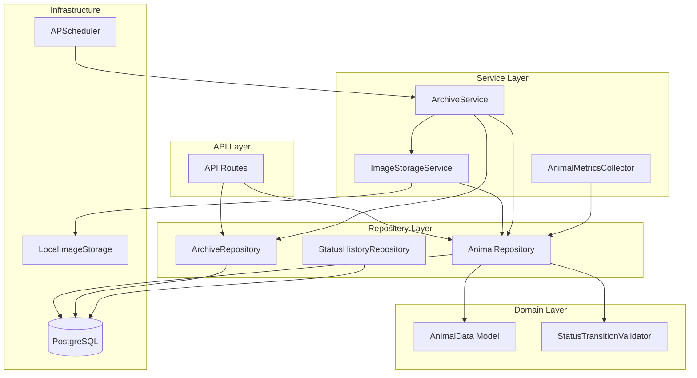
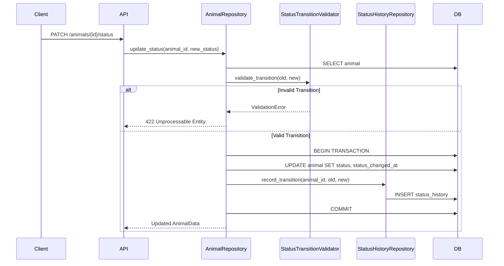
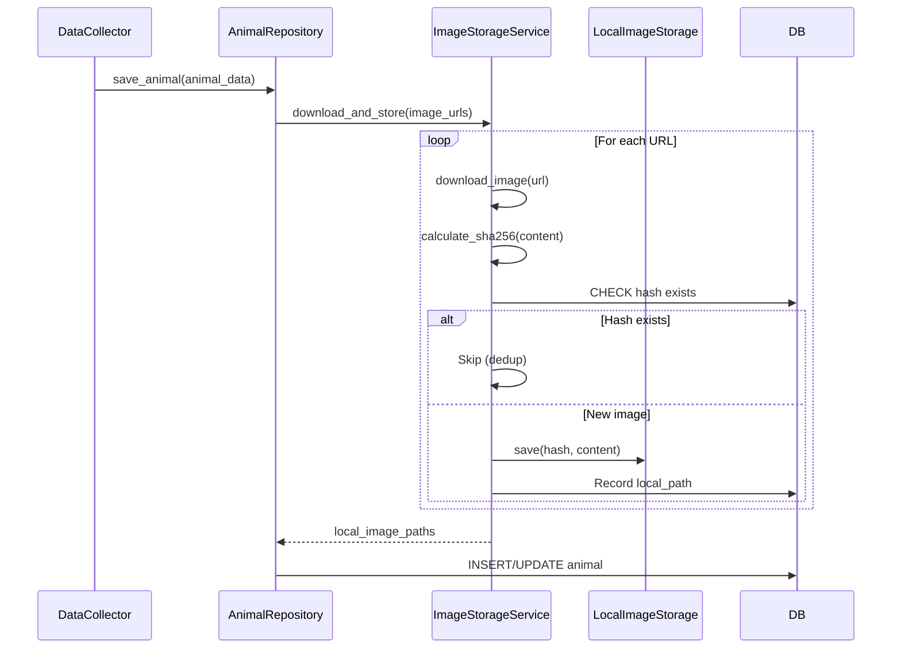
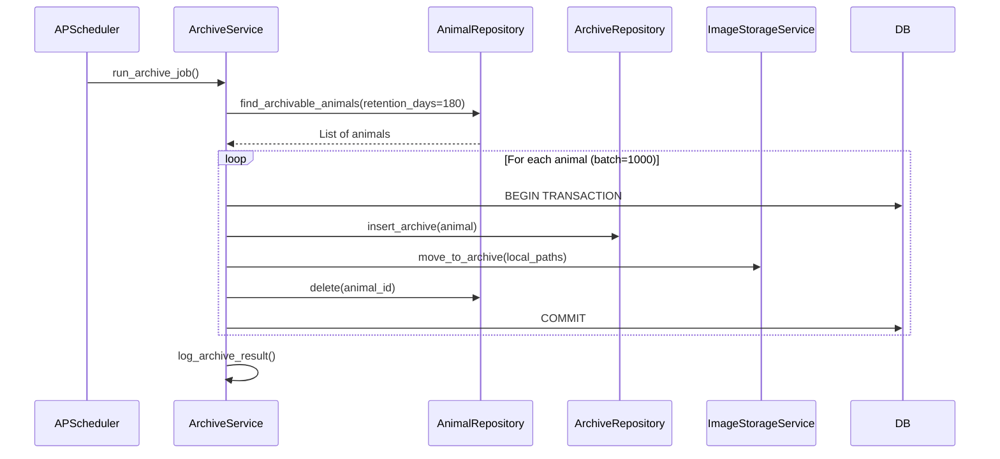
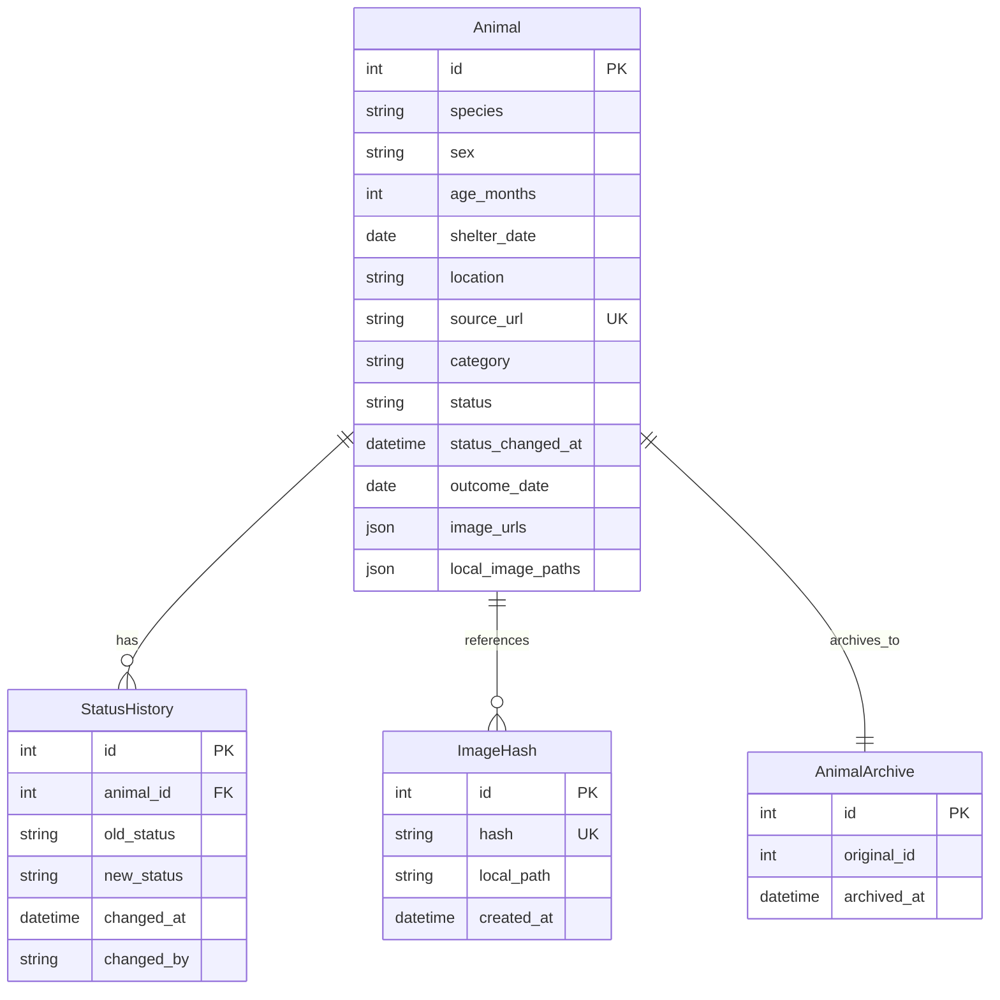

# Design Document: animal-repository

## Overview

**Purpose**: animal-repository は、正規化された保護動物データを長期的に蓄積・管理するためのデータ基盤機能を提供する。既存の animal-api-persistence（基本的な CRUD 操作）を拡張し、ステータス管理、データ保持ポリシー、画像永続化機能を追加する。

**Users**: システム運用者、開発者が動物データのライフサイクル管理、ストレージ最適化、監視機能を活用する。

**Impact**: 既存の Animal モデル、AnimalRepository、API エンドポイントを拡張し、新規テーブル（`animals_archive`、`animal_status_history`）と新規サービス（`ImageStorageService`、`ArchiveService`）を追加する。

### Goals

- 動物のステータス（収容中/譲渡済み/返還済み/死亡）を追跡し、状態遷移履歴を保持する
- 譲渡完了後6ヶ月間のデータ保持と自動アーカイブ機能を提供する
- 外部画像 URL からローカルストレージへの画像永続化を実現する
- 既存 API との後方互換性を維持する

### Non-Goals

- S3 互換オブジェクトストレージへの対応（将来検討）
- リアルタイム通知との統合（notification-manager の責務）
- 画像のリサイズ・最適化処理
- 分散環境でのスケジューラー運用（単一インスタンス前提）

## Architecture

### Existing Architecture Analysis

**現行コンポーネント**:
- `AnimalData` (Pydantic): ドメインモデル - species, sex, age_months, image_urls, source_url, category
- `Animal` (SQLAlchemy ORM): DB モデル - 上記フィールド + id, 各種インデックス
- `AnimalRepository`: CRUD 操作 - save_animal, get_animal_by_id, list_animals
- `API Routes`: REST API - GET /animals, GET /animals/{id}

**拡張対象**:
- Animal モデルに status, status_changed_at, outcome_date, local_image_paths カラム追加
- AnimalRepository にステータス管理、フィルタリング機能追加
- 新規テーブル・サービスの追加

### Architecture Pattern & Boundary Map



**Architecture Integration**:
- **Selected pattern**: Repository パターン + Service レイヤー（既存パターン踏襲）
- **Domain boundaries**: ステータス管理は Repository 層、画像/アーカイブは Service 層に分離
- **Existing patterns preserved**: Pydantic/ORM 変換、AsyncSession、フィルタリング・ページネーション
- **New components rationale**: 画像処理とアーカイブは複雑な責務のため独立サービス化
- **Steering compliance**: ファイルベース永続化、段階的詳細化の原則に従う

### Technology Stack

| Layer | Choice / Version | Role in Feature | Notes |
|-------|------------------|-----------------|-------|
| Backend | Python 3.9+, FastAPI | API エンドポイント拡張 | 既存スタック維持 |
| Data | PostgreSQL, SQLAlchemy 2.x | データ永続化、JSONB サポート | Alembic マイグレーション |
| Scheduler | APScheduler 3.x | アーカイブジョブ、日次レポート | SQLAlchemyJobStore 使用 |
| HTTP Client | httpx 0.27+ | 画像ダウンロード | AsyncClient、リトライ対応 |
| Storage | ローカルファイルシステム | 画像永続化 | 将来 S3 移行パス確保 |

## System Flows

### ステータス変更フロー



### 画像永続化フロー



### アーカイブ処理フロー



## Requirements Traceability

| Requirement | Summary | Components | Interfaces | Flows |
|-------------|---------|------------|------------|-------|
| 1.1, 1.2, 1.3 | ステータスフィールド、デフォルト、変更日時 | Animal, AnimalRepository | update_status() | ステータス変更フロー |
| 1.4 | ステータス履歴 | StatusHistoryRepository, animal_status_history | record_transition() | ステータス変更フロー |
| 1.5 | 成果日記録 | Animal, AnimalRepository | update_status() | ステータス変更フロー |
| 1.6 | ステータスフィルタリング | AnimalRepository | list_animals(status=) | - |
| 2.1, 2.2 | 保持期間、アーカイブ移動 | ArchiveService, ArchiveRepository | run_archive_job() | アーカイブ処理フロー |
| 2.3 | アーカイブ読み取り専用 | ArchiveRepository | list_archived(), get_archived_by_id() | - |
| 2.4 | 保持期間設定 | ArchiveService | RETENTION_DAYS 環境変数 | - |
| 2.5 | アーカイブ中の一貫性 | ArchiveService | トランザクション管理 | アーカイブ処理フロー |
| 2.6, 2.7 | 処理ログ、エラー通知 | ArchiveService, AuditLogger | log_archive_result() | - |
| 3.1, 3.2 | 画像ダウンロード、UUID命名 | ImageStorageService | download_and_store() | 画像永続化フロー |
| 3.3 | ローカルパス記録 | Animal, AnimalRepository | local_image_paths カラム | - |
| 3.4, 3.5 | ダウンロード中 fallback、失敗時継続 | ImageStorageService | リトライ/エラーハンドリング | 画像永続化フロー |
| 3.6 | ハッシュ重複検出 | ImageStorageService, image_hashes テーブル | check_duplicate() | 画像永続化フロー |
| 3.7 | アーカイブ時画像移動 | ImageStorageService | move_to_archive() | アーカイブ処理フロー |
| 3.8 | 画像形式検証 | ImageStorageService | validate_image_format() | 画像永続化フロー |
| 4.1 | source_url ユニーク | Animal | 既存制約維持 | - |
| 4.2, 4.3 | ステータス遷移検証 | StatusTransitionValidator | validate_transition() | ステータス変更フロー |
| 4.4, 4.5 | トランザクション原子性 | AnimalRepository | session.commit/rollback | - |
| 5.1 | AnimalData 互換性 | AnimalData | 新フィールドは Optional | - |
| 5.2, 5.3 | 既存 API 動作維持 | API Routes | デフォルト動作変更なし | - |
| 5.4 | category 共存 | Animal | 既存フィールド維持 | - |
| 5.5 | Alembic 非破壊マイグレーション | Alembic migration | ALTER TABLE | - |
| 6.1 | ステータス別集計 | AnimalMetricsCollector | get_status_counts() | - |
| 6.2 | 画像ストレージ監視 | ImageStorageService, AlertManager | check_storage_usage() | - |
| 6.3 | アーカイブ対象日次レポート | ArchiveService | generate_daily_report() | - |
| 6.4 | 画像DL失敗率アラート | ImageStorageService, AlertManager | check_failure_rate() | - |
| 6.5 | 監査ログ | AuditLogger | log_status_change() | - |

## Components and Interfaces

### Component Summary

| Component | Domain/Layer | Intent | Req Coverage | Key Dependencies | Contracts |
|-----------|--------------|--------|--------------|------------------|-----------|
| Animal (Extended) | Infrastructure/DB | 動物データ永続化モデル | 1.1-1.5, 3.3, 4.1 | Base (P0) | - |
| AnimalData (Extended) | Domain | ドメインモデル | 5.1 | - | - |
| AnimalRepository (Extended) | Repository | CRUD + ステータス管理 | 1.1-1.6, 4.4, 4.5, 5.2, 5.3 | Animal (P0), Session (P0) | Service |
| StatusTransitionValidator | Domain | ステータス遷移検証 | 4.2, 4.3 | - | Service |
| StatusHistoryRepository | Repository | ステータス履歴 CRUD | 1.4 | Session (P0) | Service |
| ImageStorageService | Service | 画像ダウンロード・保存 | 3.1-3.8, 6.2, 6.4 | httpx (P0), LocalImageStorage (P0) | Service |
| LocalImageStorage | Infrastructure | ファイルシステム操作 | 3.1, 3.7 | - | Service |
| ArchiveService | Service | アーカイブ処理オーケストレーション | 2.1-2.7 | AnimalRepository (P0), ArchiveRepository (P0), ImageStorageService (P1) | Service, Batch |
| ArchiveRepository | Repository | アーカイブデータ読み取り専用 | 2.3 | Session (P0) | Service |
| AnimalMetricsCollector | Service | メトリクス収集 | 6.1, 6.3 | AnimalRepository (P0) | Service |

### Domain Layer

#### AnimalData (Extended)

| Field | Detail |
|-------|--------|
| Intent | 正規化された保護動物データのドメインモデル（拡張版） |
| Requirements | 1.1, 1.3, 1.5, 3.3, 5.1 |

**Responsibilities & Constraints**
- 既存フィールド（species, sex, age_months, image_urls, source_url, category）を維持
- 新規フィールドは全て Optional として後方互換性を確保
- Pydantic バリデーションで型安全性を保証

**Dependencies**
- Inbound: AnimalRepository — ORM 変換 (P0)

**Contracts**: Service [ ]

##### Service Interface

```python
from typing import List, Optional
from datetime import date, datetime
from pydantic import BaseModel, Field, HttpUrl
from enum import Enum

class AnimalStatus(str, Enum):
    """動物ステータス"""
    SHELTERED = "sheltered"
    ADOPTED = "adopted"
    RETURNED = "returned"
    DECEASED = "deceased"

class AnimalData(BaseModel):
    """拡張版動物データモデル"""
    # 既存フィールド（必須）
    species: str
    shelter_date: date
    location: str
    source_url: HttpUrl
    category: str

    # 既存フィールド（オプション）
    sex: str = "不明"
    age_months: Optional[int] = None
    color: Optional[str] = None
    size: Optional[str] = None
    phone: Optional[str] = None
    image_urls: List[HttpUrl] = Field(default_factory=list)

    # 新規フィールド（全て Optional で後方互換性確保）
    status: Optional[AnimalStatus] = None
    status_changed_at: Optional[datetime] = None
    outcome_date: Optional[date] = None
    local_image_paths: Optional[List[str]] = None
```

- Preconditions: species, shelter_date, location, source_url, category は必須
- Postconditions: バリデーション済みの AnimalData インスタンス
- Invariants: 新規フィールドが None の場合、既存システムと同等の動作

#### StatusTransitionValidator

| Field | Detail |
|-------|--------|
| Intent | ステータス遷移の妥当性を検証 |
| Requirements | 4.2, 4.3 |

**Responsibilities & Constraints**
- 有効なステータス遷移のみを許可
- deceased からの遷移は禁止
- 不正遷移時は ValidationError を発生

**Dependencies**
- Inbound: AnimalRepository — 遷移検証 (P0)

**Contracts**: Service [x]

##### Service Interface

```python
from typing import Tuple
from src.data_collector.domain.models import AnimalStatus

class StatusTransitionError(ValueError):
    """不正なステータス遷移エラー"""
    def __init__(self, old_status: AnimalStatus, new_status: AnimalStatus):
        self.old_status = old_status
        self.new_status = new_status
        super().__init__(
            f"無効なステータス遷移: {old_status.value} → {new_status.value}"
        )

class StatusTransitionValidator:
    """ステータス遷移検証"""

    # 有効な遷移: (from_status, to_status)
    VALID_TRANSITIONS: set[Tuple[AnimalStatus, AnimalStatus]] = {
        (AnimalStatus.SHELTERED, AnimalStatus.ADOPTED),
        (AnimalStatus.SHELTERED, AnimalStatus.RETURNED),
        (AnimalStatus.SHELTERED, AnimalStatus.DECEASED),
        (AnimalStatus.ADOPTED, AnimalStatus.RETURNED),  # 返還
        (AnimalStatus.ADOPTED, AnimalStatus.DECEASED),
        (AnimalStatus.RETURNED, AnimalStatus.ADOPTED),  # 再譲渡
        (AnimalStatus.RETURNED, AnimalStatus.DECEASED),
    }

    def validate_transition(
        self,
        old_status: AnimalStatus,
        new_status: AnimalStatus
    ) -> None:
        """
        ステータス遷移を検証

        Args:
            old_status: 現在のステータス
            new_status: 新しいステータス

        Raises:
            StatusTransitionError: 不正な遷移の場合
        """
        ...
```

- Preconditions: old_status, new_status は有効な AnimalStatus
- Postconditions: 遷移が有効な場合は何も返さない、無効な場合は例外
- Invariants: VALID_TRANSITIONS は不変

### Repository Layer

#### AnimalRepository (Extended)

| Field | Detail |
|-------|--------|
| Intent | 動物データの CRUD + ステータス管理 |
| Requirements | 1.1-1.6, 4.4, 4.5, 5.2, 5.3 |

**Responsibilities & Constraints**
- 既存メソッド（save_animal, get_animal_by_id, list_animals）の動作維持
- ステータス更新時はトランザクション内で履歴も記録
- ステータスフィルタリングの追加

**Dependencies**
- Inbound: API Routes — データ操作 (P0)
- Outbound: StatusTransitionValidator — 遷移検証 (P0)
- Outbound: StatusHistoryRepository — 履歴記録 (P0)
- External: AsyncSession — DB 接続 (P0)

**Contracts**: Service [x] / API [ ] / Event [ ] / Batch [ ] / State [ ]

##### Service Interface

```python
from typing import List, Optional, Tuple
from datetime import date
from sqlalchemy.ext.asyncio import AsyncSession
from src.data_collector.domain.models import AnimalData, AnimalStatus

class AnimalRepository:
    """動物データリポジトリ（拡張版）"""

    def __init__(self, session: AsyncSession): ...

    # 既存メソッド（シグネチャ維持）
    async def save_animal(self, animal_data: AnimalData) -> AnimalData: ...
    async def get_animal_by_id(self, animal_id: int) -> Optional[AnimalData]: ...
    async def list_animals(
        self,
        species: Optional[str] = None,
        sex: Optional[str] = None,
        location: Optional[str] = None,
        category: Optional[str] = None,
        shelter_date_from: Optional[date] = None,
        shelter_date_to: Optional[date] = None,
        limit: int = 50,
        offset: int = 0,
    ) -> Tuple[List[AnimalData], int]: ...

    # 新規メソッド
    async def update_status(
        self,
        animal_id: int,
        new_status: AnimalStatus,
        outcome_date: Optional[date] = None,
    ) -> AnimalData:
        """
        動物のステータスを更新

        Args:
            animal_id: 動物ID
            new_status: 新しいステータス
            outcome_date: 成果日（adopted/returned の場合）

        Returns:
            AnimalData: 更新後のデータ

        Raises:
            StatusTransitionError: 不正なステータス遷移
            NotFoundError: 動物が存在しない
        """
        ...

    async def list_animals_by_status(
        self,
        status: AnimalStatus,
        limit: int = 50,
        offset: int = 0,
    ) -> Tuple[List[AnimalData], int]:
        """ステータスで動物をフィルタリング"""
        ...

    async def find_archivable_animals(
        self,
        retention_days: int = 180,
        limit: int = 1000,
    ) -> List[AnimalData]:
        """アーカイブ対象の動物を検索"""
        ...

    async def update_local_image_paths(
        self,
        animal_id: int,
        local_paths: List[str],
    ) -> AnimalData:
        """ローカル画像パスを更新"""
        ...
```

- Preconditions: 有効な session、animal_id は正の整数
- Postconditions: DB 操作成功時は更新後の AnimalData を返却
- Invariants: source_url のユニーク制約は維持

#### StatusHistoryRepository

| Field | Detail |
|-------|--------|
| Intent | ステータス変更履歴の記録・取得 |
| Requirements | 1.4 |

**Dependencies**
- Inbound: AnimalRepository — 履歴記録 (P0)
- External: AsyncSession — DB 接続 (P0)

**Contracts**: Service [x]

##### Service Interface

```python
from typing import List, Optional
from datetime import datetime
from dataclasses import dataclass
from sqlalchemy.ext.asyncio import AsyncSession
from src.data_collector.domain.models import AnimalStatus

@dataclass
class StatusHistoryEntry:
    """ステータス履歴エントリ"""
    id: int
    animal_id: int
    old_status: AnimalStatus
    new_status: AnimalStatus
    changed_at: datetime
    changed_by: Optional[str] = None

class StatusHistoryRepository:
    """ステータス履歴リポジトリ"""

    def __init__(self, session: AsyncSession): ...

    async def record_transition(
        self,
        animal_id: int,
        old_status: AnimalStatus,
        new_status: AnimalStatus,
        changed_by: Optional[str] = None,
    ) -> StatusHistoryEntry:
        """ステータス遷移を記録"""
        ...

    async def get_history(
        self,
        animal_id: int,
    ) -> List[StatusHistoryEntry]:
        """動物のステータス履歴を取得"""
        ...
```

#### ArchiveRepository

| Field | Detail |
|-------|--------|
| Intent | アーカイブデータの読み取り専用アクセス |
| Requirements | 2.3 |

**Dependencies**
- Inbound: API Routes — アーカイブデータ参照 (P1)
- External: AsyncSession — DB 接続 (P0)

**Contracts**: Service [x]

##### Service Interface

```python
from typing import List, Optional, Tuple
from datetime import date
from sqlalchemy.ext.asyncio import AsyncSession
from src.data_collector.domain.models import AnimalData

class ArchiveRepository:
    """アーカイブリポジトリ（読み取り専用）"""

    def __init__(self, session: AsyncSession): ...

    async def get_archived_by_id(
        self,
        animal_id: int,
    ) -> Optional[AnimalData]:
        """アーカイブから動物データを取得"""
        ...

    async def list_archived(
        self,
        species: Optional[str] = None,
        archived_from: Optional[date] = None,
        archived_to: Optional[date] = None,
        limit: int = 50,
        offset: int = 0,
    ) -> Tuple[List[AnimalData], int]:
        """アーカイブデータをリスト取得"""
        ...

    async def insert_archive(
        self,
        animal: AnimalData,
    ) -> None:
        """アーカイブにデータを挿入（ArchiveService からのみ呼び出し）"""
        ...
```

### Service Layer

#### ImageStorageService

| Field | Detail |
|-------|--------|
| Intent | 外部画像のダウンロード、ローカル保存、重複検出 |
| Requirements | 3.1-3.8, 6.2, 6.4 |

**Responsibilities & Constraints**
- httpx.AsyncClient による非同期ダウンロード（タイムアウト: connect=5s, read=30s）
- SHA-256 ハッシュによる重複検出
- サポート形式: JPEG, PNG, GIF, WebP
- 失敗率監視（閾値 10% でアラート）

**Dependencies**
- Inbound: AnimalRepository — 画像永続化 (P0)
- Inbound: ArchiveService — 画像移動 (P1)
- Outbound: LocalImageStorage — ファイル操作 (P0)
- External: httpx — HTTP クライアント (P0)

**Contracts**: Service [x]

##### Service Interface

```python
from typing import List, Optional, Tuple
from dataclasses import dataclass
from pathlib import Path

@dataclass
class ImageDownloadResult:
    """画像ダウンロード結果"""
    url: str
    success: bool
    local_path: Optional[str] = None
    hash: Optional[str] = None
    error: Optional[str] = None
    is_duplicate: bool = False

class ImageStorageService:
    """画像ストレージサービス"""

    SUPPORTED_FORMATS: set[str] = {"image/jpeg", "image/png", "image/gif", "image/webp"}
    CONNECT_TIMEOUT: float = 5.0
    READ_TIMEOUT: float = 30.0
    MAX_RETRIES: int = 3

    def __init__(
        self,
        storage: "LocalImageStorage",
        base_path: Path,
    ): ...

    async def download_and_store(
        self,
        image_urls: List[str],
    ) -> List[ImageDownloadResult]:
        """
        複数画像をダウンロードして保存

        Args:
            image_urls: 画像 URL リスト

        Returns:
            List[ImageDownloadResult]: 各画像の処理結果
        """
        ...

    async def move_to_archive(
        self,
        local_paths: List[str],
    ) -> List[str]:
        """
        画像をアーカイブストレージに移動

        Args:
            local_paths: ローカルパスリスト

        Returns:
            List[str]: 新しいアーカイブパスリスト
        """
        ...

    def validate_image_format(
        self,
        content_type: str,
    ) -> bool:
        """画像形式を検証"""
        ...

    def calculate_hash(
        self,
        content: bytes,
    ) -> str:
        """SHA-256 ハッシュを計算"""
        ...

    async def check_duplicate(
        self,
        hash: str,
    ) -> Optional[str]:
        """
        重複チェック

        Returns:
            Optional[str]: 既存のローカルパス（重複の場合）、None（新規の場合）
        """
        ...

    def get_failure_rate(self) -> float:
        """失敗率を取得"""
        ...

    def get_storage_usage_bytes(self) -> int:
        """ストレージ使用量を取得"""
        ...
```

- Preconditions: image_urls は有効な HTTP/HTTPS URL
- Postconditions: 成功した画像はローカルに保存、失敗は元 URL を保持
- Invariants: ハッシュベースの重複検出により同一画像は1回のみ保存

#### LocalImageStorage

| Field | Detail |
|-------|--------|
| Intent | ファイルシステム操作の抽象化 |
| Requirements | 3.1, 3.7 |

**Dependencies**
- Inbound: ImageStorageService — ファイル操作 (P0)

**Contracts**: Service [x]

##### Service Interface

```python
from typing import Protocol, Optional
from pathlib import Path

class ImageStorageProtocol(Protocol):
    """画像ストレージプロトコル（将来 S3 移行用）"""

    def save(self, hash: str, content: bytes, extension: str) -> str:
        """画像を保存し、パスを返す"""
        ...

    def move(self, source_path: str, dest_prefix: str) -> str:
        """画像を移動し、新パスを返す"""
        ...

    def delete(self, path: str) -> bool:
        """画像を削除"""
        ...

    def exists(self, hash: str) -> Optional[str]:
        """ハッシュが存在するかチェック"""
        ...

    def get_usage_bytes(self) -> int:
        """使用量を取得"""
        ...

class LocalImageStorage:
    """ローカルファイルシステムストレージ"""

    def __init__(self, base_path: Path): ...

    def save(self, hash: str, content: bytes, extension: str) -> str:
        """
        画像を保存

        パス構造: {base_path}/{hash[:2]}/{hash[2:4]}/{hash}.{ext}
        """
        ...

    def move(self, source_path: str, dest_prefix: str) -> str:
        """画像をアーカイブに移動"""
        ...

    def delete(self, path: str) -> bool:
        """画像を削除"""
        ...

    def exists(self, hash: str) -> Optional[str]:
        """ハッシュが存在するかチェック"""
        ...

    def get_usage_bytes(self) -> int:
        """ストレージ使用量を取得"""
        ...
```

#### ArchiveService

| Field | Detail |
|-------|--------|
| Intent | アーカイブ処理のオーケストレーション |
| Requirements | 2.1-2.7 |

**Responsibilities & Constraints**
- APScheduler による日次実行（デフォルト: 毎日 02:00）
- バッチ処理（1000件/バッチ）でトランザクション管理
- エラー時は処理中断し通知

**Dependencies**
- Inbound: APScheduler — ジョブ実行 (P0)
- Outbound: AnimalRepository — アーカイブ対象検索・削除 (P0)
- Outbound: ArchiveRepository — アーカイブ挿入 (P0)
- Outbound: ImageStorageService — 画像移動 (P1)
- External: notification-manager — エラー通知 (P2)

**Contracts**: Service [x] / Batch [x]

##### Service Interface

```python
from typing import Optional
from dataclasses import dataclass
from datetime import datetime

@dataclass
class ArchiveJobResult:
    """アーカイブジョブ結果"""
    started_at: datetime
    completed_at: datetime
    processed_count: int
    success_count: int
    error_count: int
    errors: list[str]

class ArchiveService:
    """アーカイブサービス"""

    DEFAULT_RETENTION_DAYS: int = 180
    BATCH_SIZE: int = 1000

    def __init__(
        self,
        animal_repository: "AnimalRepository",
        archive_repository: "ArchiveRepository",
        image_storage_service: "ImageStorageService",
        retention_days: Optional[int] = None,
    ): ...

    async def run_archive_job(self) -> ArchiveJobResult:
        """
        アーカイブジョブを実行

        Returns:
            ArchiveJobResult: ジョブ実行結果
        """
        ...

    async def get_archivable_count(self) -> int:
        """アーカイブ対象件数を取得"""
        ...

    async def generate_daily_report(self) -> dict:
        """
        日次レポートを生成

        Returns:
            dict: {
                "date": "2026-01-27",
                "archivable_count": 100,
                "storage_usage_bytes": 1073741824,
                ...
            }
        """
        ...
```

##### Batch / Job Contract

- **Trigger**: APScheduler cron (毎日 02:00 JST)
- **Input / validation**: retention_days >= 1
- **Output / destination**: animals_archive テーブル、storage/archive/images/
- **Idempotency & recovery**:
  - 各バッチはトランザクション内で処理
  - 失敗時は該当バッチをスキップし次へ
  - misfire_grace_time=3600 でダウンタイム後の再実行

#### AnimalMetricsCollector

| Field | Detail |
|-------|--------|
| Intent | 動物データのメトリクス収集 |
| Requirements | 6.1, 6.3 |

**Dependencies**
- Inbound: 監視システム — メトリクス取得 (P1)
- Outbound: AnimalRepository — データ集計 (P0)

**Contracts**: Service [x]

##### Service Interface

```python
from typing import Dict
from dataclasses import dataclass

@dataclass
class AnimalMetrics:
    """動物メトリクス"""
    total_count: int
    status_counts: Dict[str, int]  # {status: count}
    category_counts: Dict[str, int]  # {category: count}
    archivable_count: int
    image_download_failure_rate: float
    storage_usage_bytes: int

class AnimalMetricsCollector:
    """動物メトリクスコレクター"""

    def __init__(
        self,
        animal_repository: "AnimalRepository",
        archive_service: "ArchiveService",
        image_storage_service: "ImageStorageService",
    ): ...

    async def collect(self) -> AnimalMetrics:
        """メトリクスを収集"""
        ...

    async def get_status_counts(self) -> Dict[str, int]:
        """ステータス別件数を取得"""
        ...
```

## Data Models

### Domain Model



**Aggregates and transactional boundaries**:
- Animal: ルートエンティティ、ステータス更新は履歴と同一トランザクション
- ImageHash: 独立エンティティ、重複検出用

**Business rules & invariants**:
- source_url は一意
- status は SHELTERED → ADOPTED/RETURNED/DECEASED の遷移のみ許可
- DECEASED からの遷移は禁止

### Physical Data Model

#### animals テーブル（拡張）

```sql
-- 新規カラム追加
ALTER TABLE animals ADD COLUMN status VARCHAR(20) NOT NULL DEFAULT 'sheltered';
ALTER TABLE animals ADD COLUMN status_changed_at TIMESTAMP WITH TIME ZONE;
ALTER TABLE animals ADD COLUMN outcome_date DATE;
ALTER TABLE animals ADD COLUMN local_image_paths JSONB DEFAULT '[]';

-- インデックス追加
CREATE INDEX idx_animals_status ON animals(status);
CREATE INDEX idx_animals_outcome_date ON animals(outcome_date) WHERE outcome_date IS NOT NULL;
CREATE INDEX idx_animals_status_changed ON animals(status_changed_at);
```

#### animal_status_history テーブル（新規）

```sql
CREATE TABLE animal_status_history (
    id SERIAL PRIMARY KEY,
    animal_id INTEGER NOT NULL REFERENCES animals(id) ON DELETE CASCADE,
    old_status VARCHAR(20) NOT NULL,
    new_status VARCHAR(20) NOT NULL,
    changed_at TIMESTAMP WITH TIME ZONE NOT NULL DEFAULT NOW(),
    changed_by VARCHAR(100),

    CONSTRAINT chk_status_values CHECK (
        old_status IN ('sheltered', 'adopted', 'returned', 'deceased') AND
        new_status IN ('sheltered', 'adopted', 'returned', 'deceased')
    )
);

CREATE INDEX idx_status_history_animal ON animal_status_history(animal_id);
CREATE INDEX idx_status_history_changed_at ON animal_status_history(changed_at);
```

#### animals_archive テーブル（新規）

```sql
CREATE TABLE animals_archive (
    id SERIAL PRIMARY KEY,
    original_id INTEGER NOT NULL,
    species VARCHAR(50) NOT NULL,
    sex VARCHAR(20) NOT NULL,
    age_months INTEGER,
    color VARCHAR(100),
    size VARCHAR(50),
    shelter_date DATE NOT NULL,
    location TEXT NOT NULL,
    phone VARCHAR(20),
    image_urls JSONB NOT NULL DEFAULT '[]',
    local_image_paths JSONB DEFAULT '[]',
    source_url TEXT NOT NULL,
    category VARCHAR(20) NOT NULL,
    status VARCHAR(20) NOT NULL,
    status_changed_at TIMESTAMP WITH TIME ZONE,
    outcome_date DATE,
    archived_at TIMESTAMP WITH TIME ZONE NOT NULL DEFAULT NOW(),

    CONSTRAINT uq_archive_source_url UNIQUE (source_url)
);

CREATE INDEX idx_archive_species ON animals_archive(species);
CREATE INDEX idx_archive_archived_at ON animals_archive(archived_at);
CREATE INDEX idx_archive_original_id ON animals_archive(original_id);
```

#### image_hashes テーブル（新規）

```sql
CREATE TABLE image_hashes (
    id SERIAL PRIMARY KEY,
    hash VARCHAR(64) NOT NULL UNIQUE,
    local_path TEXT NOT NULL,
    file_size INTEGER NOT NULL,
    created_at TIMESTAMP WITH TIME ZONE NOT NULL DEFAULT NOW()
);

CREATE INDEX idx_image_hashes_hash ON image_hashes(hash);
```

### Data Contracts & Integration

**API Data Transfer**:

```python
from pydantic import BaseModel
from typing import List, Optional
from datetime import date, datetime

class AnimalPublicExtended(BaseModel):
    """拡張版公開動物データスキーマ"""
    # 既存フィールド
    id: int
    species: str
    sex: str
    age_months: Optional[int]
    color: Optional[str]
    size: Optional[str]
    shelter_date: date
    location: str
    phone: Optional[str]
    image_urls: List[str]
    source_url: str
    category: str

    # 新規フィールド（オプション）
    status: Optional[str] = None
    status_changed_at: Optional[datetime] = None
    outcome_date: Optional[date] = None
    local_image_paths: Optional[List[str]] = None

    model_config = ConfigDict(from_attributes=True)

class StatusUpdateRequest(BaseModel):
    """ステータス更新リクエスト"""
    status: str
    outcome_date: Optional[date] = None

class StatusUpdateResponse(BaseModel):
    """ステータス更新レスポンス"""
    success: bool
    animal: AnimalPublicExtended
```

## Error Handling

### Error Strategy

| Error Type | Response | Recovery |
|------------|----------|----------|
| StatusTransitionError | 422 Unprocessable Entity | クライアントに有効な遷移を提示 |
| NotFoundError | 404 Not Found | - |
| ImageDownloadError | ログ記録、元 URL 保持 | 3回リトライ後継続 |
| ArchiveTransactionError | ロールバック、次バッチへ | 通知送信 |
| StorageFullError | 503 Service Unavailable | アラート送信 |

### Monitoring

- **メトリクス**: ステータス別件数、画像 DL 失敗率、ストレージ使用量
- **アラート**:
  - 画像 DL 失敗率 > 10%
  - ストレージ使用量 > 閾値（設定可能）
  - アーカイブジョブ失敗
- **監査ログ**: 全ステータス変更操作を記録

## Testing Strategy

### Unit Tests

- `StatusTransitionValidator.validate_transition()`: 全遷移パターン検証
- `ImageStorageService.calculate_hash()`: SHA-256 計算
- `ImageStorageService.validate_image_format()`: MIME タイプ検証
- `LocalImageStorage.save()`: ファイルパス生成

### Integration Tests

- `AnimalRepository.update_status()`: DB 更新 + 履歴記録の原子性
- `ImageStorageService.download_and_store()`: 外部 URL ダウンロード（モック）
- `ArchiveService.run_archive_job()`: 完全なアーカイブフロー

### E2E Tests

- ステータス更新 API: 正常系・異常系
- アーカイブジョブ: 実データでの動作確認

### Performance Tests

- `list_animals()`: 10万件でのクエリパフォーマンス
- アーカイブジョブ: 1万件のバッチ処理時間

## Migration Strategy


**Phase 1: Schema Migration**
- Alembic マイグレーションで新規カラム追加
- 既存データに `status = 'sheltered'` 設定
- `local_image_paths = []` 設定

**Phase 2: Status Management**
- StatusTransitionValidator 実装
- AnimalRepository.update_status() 実装
- StatusHistoryRepository 実装

**Phase 3: Image Persistence**
- ImageStorageService 実装
- LocalImageStorage 実装
- image_hashes テーブル作成

**Phase 4: Archive + Monitoring**
- ArchiveService 実装
- APScheduler 設定
- AnimalMetricsCollector 実装

**Rollback triggers**:
- マイグレーション失敗: Alembic downgrade
- 各フェーズは独立してロールバック可能
