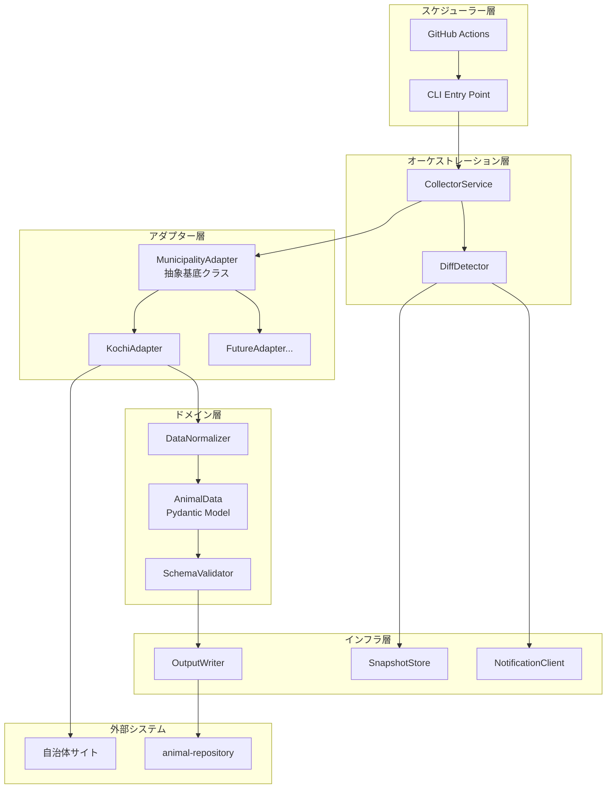
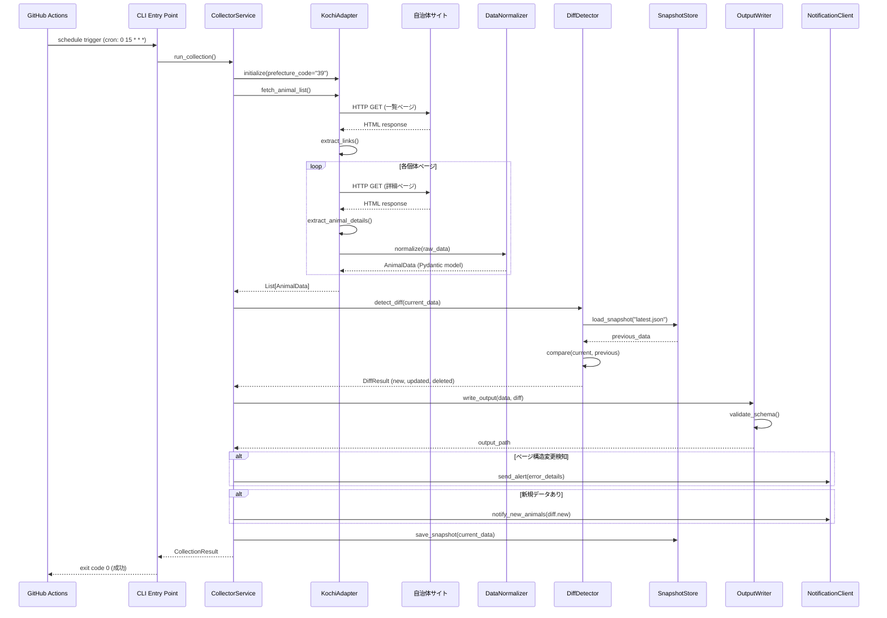
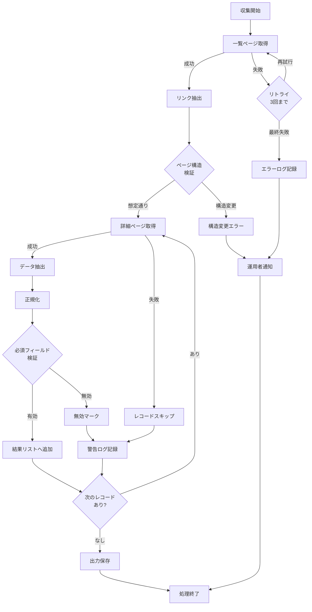

# Technical Design: data-collector

## Overview

Data Collector は、自治体の保護動物情報サイトから情報を自動収集し、統一フォーマットに変換するデータ収集エンジンです。高知県を第1対象として実装し、将来的な都道府県追加を容易にするアダプターアーキテクチャを採用します。収集した情報は animal-repository へ JSON 形式で提供され、差分検知により新規・更新・削除候補を識別します。

**Purpose**: 散在する自治体サイトの保護動物情報を統合し、手動収集作業を削減。毎日の自動更新により、迷子犬猫の早期発見と里親マッチングを促進。

**Users**: システム運用者、animal-repository（下流コンポーネント）、notification-manager（差分情報の消費者）

**Impact**: ゼロからの新規実装（greenfield）。既存システムへの影響なし。

### Goals

- 高知県の自治体サイトから保護動物情報を毎日自動収集
- 自治体間の形式差異を吸収し、統一スキーマに正規化
- 将来の都道府県追加を既存コードへの影響なく実現
- 差分検知により新規収容動物と情報更新を識別
- 型安全性とデータ品質を保証

### Non-Goals

- 画像ファイルのダウンロード・保存（画像 URL のみを収集）
- animal-repository への直接書き込み（JSON 出力のみ、永続化は animal-repository の責務）
- リアルタイム収集（毎日1回のバッチ処理のみ）
- 通知機能の実装（notification-manager の責務）
- Web UI の提供（public-web-portal の責務）

## Architecture

### Architecture Pattern & Boundary Map

**選定パターン**: Adapter Pattern + Layered Architecture

**ドメイン境界**:
- **Adapter Layer**: 自治体ごとの HTML スクレイピング・データ抽出ロジック（技術依存を吸収）
- **Domain Layer**: データ正規化・差分検知・バリデーションロジック（ビジネスルール）
- **Infrastructure Layer**: ファイル I/O・スケジューラー連携（外部システム依存）



**アーキテクチャ統合**:
- **選定パターン**: Adapter Pattern（自治体ごとの差異を抽象化）+ Layered Architecture（責務分離）
- **ドメイン境界**: Adapter Layer は自治体サイトの技術的差異を吸収、Domain Layer はビジネスルール（正規化・検証）に専念
- **既存パターン継承**: なし（新規実装）
- **新コンポーネントの根拠**:
  - MunicipalityAdapter: 自治体追加の容易性（Requirement 3）
  - DiffDetector: 差分検知による通知トリガー（Requirement 4）
  - Pydantic Models: 型安全性とバリデーション（Requirement 2, 5）
- **Steering 準拠**: 型安全性（Type Safety）、段階的詳細化（Phase Separation）、パターン文書化（Documentation Granularity）

### Technology Stack

| Layer | Choice / Version | Role in Feature | Notes |
|-------|------------------|-----------------|-------|
| Language | Python 3.11+ | コア実装言語 | Type hints、Pydantic 互換性 |
| Web Scraping | BeautifulSoup4 4.12+, requests 2.31+ | HTML 取得・解析 | 単純・学習容易、静的 HTML 対応 |
| Data Validation | Pydantic 2.5+ | スキーマ定義・バリデーション | ランタイム型検証、JSON シリアライゼーション |
| Scheduling | GitHub Actions | 毎日自動実行 | 無料、サーバーレス、cron 構文 |
| Logging | Python logging + structlog | 構造化ログ出力 | JSON 形式、可観測性向上 |
| Storage | ファイルシステム（JSON） | スナップショット・出力保存 | Git 管理可能、シンプル |

**技術選定の根拠**:
- BeautifulSoup: 高知県サイトは静的 HTML が中心、Scrapy は過剰（[参照](https://scrapfly.io/blog/posts/best-web-scraping-tools-in-2026)）
- Pydantic: 外部データの型安全性・自動バリデーション必須（[参照](https://www.speakeasy.com/blog/pydantic-vs-dataclasses)）
- GitHub Actions: MVP フェーズでの無料インフラ活用、毎日1回実行に最適（[参照](https://betterprogramming.pub/schedule-cron-jobs-with-github-actions-d279e8519cec)）

詳細な技術比較と選定根拠は `research.md` を参照。

## System Flows

### 毎日の自動収集フロー



**キー決定事項**:
- スナップショット比較による差分検知（DB 依存なし）
- ページ構造変更時の即座通知（Requirement 1-5）
- アダプターのエラーは分離され、全体処理は継続（Requirement 3-6）

### エラーハンドリングフロー



## Requirements Traceability

| Requirement | Summary | Components | Interfaces | Flows |
|-------------|---------|------------|------------|-------|
| 1.1 | 自治体サイトアクセス | KochiAdapter | fetch_animal_list() | 自動収集フロー |
| 1.2 | HTML 解析・リンク抽出 | KochiAdapter | extract_links() | 自動収集フロー |
| 1.3 | 個体情報抽出 | KochiAdapter | extract_animal_details() | 自動収集フロー |
| 1.4 | アクセス失敗時リトライ | CollectorService | run_collection() | エラーハンドリングフロー |
| 1.5 | 構造変更時の即座通知 | NotificationClient | send_alert() | エラーハンドリングフロー |
| 1.6 | JSON 形式保持 | AnimalData (Pydantic) | model_dump_json() | 自動収集フロー |
| 2.1 - 2.5 | データ正規化 | DataNormalizer | normalize() | 自動収集フロー |
| 2.6 | 必須フィールド検証 | SchemaValidator | validate() | 自動収集フロー |
| 2.7 | 統一スキーマ出力 | OutputWriter | write_output() | 自動収集フロー |
| 3.1 - 3.6 | アダプター構造 | MunicipalityAdapter, KochiAdapter | Interface 全体 | 自動収集フロー |
| 4.1 - 4.6 | 差分検知 | DiffDetector, SnapshotStore | detect_diff(), save_snapshot() | 自動収集フロー |
| 5.1 - 5.6 | エラーハンドリング・可観測性 | CollectorService, Logging | run_collection() | エラーハンドリングフロー |
| 6.1 - 6.6 | スケジューリング・冪等性 | CLI, GitHub Actions | CLI entry point | 自動収集フロー |
| 7.1 - 7.6 | 画像URL取り扱い | KochiAdapter, DataNormalizer | extract_image_urls(), normalize() | 自動収集フロー |

## Components and Interfaces

### コンポーネント概要

| Component | Domain/Layer | Intent | Req Coverage | Key Dependencies (P0/P1) | Contracts |
|-----------|--------------|--------|--------------|--------------------------|-----------|
| MunicipalityAdapter | Adapter | 自治体別スクレイピング抽象化 | 3.1-3.6 | BeautifulSoup (P0) | Service |
| KochiAdapter | Adapter | 高知県サイト具象実装 | 1.1-1.3, 7.1-7.6 | MunicipalityAdapter (P0) | Service |
| DataNormalizer | Domain | データ正規化ロジック | 2.1-2.5 | Pydantic (P0) | Service |
| SchemaValidator | Domain | スキーマ検証 | 2.6 | Pydantic (P0) | Service |
| AnimalData | Domain | 統一データモデル | 1.6, 2.7 | Pydantic (P0) | State |
| DiffDetector | Domain | 差分検知ロジック | 4.1-4.6 | SnapshotStore (P0) | Service |
| SnapshotStore | Infrastructure | スナップショット永続化 | 4.6 | ファイルシステム (P0) | Service |
| OutputWriter | Infrastructure | JSON 出力 | 2.7 | ファイルシステム (P0) | Service |
| NotificationClient | Infrastructure | 運用者通知 | 1.5 | 外部通知サービス (P1) | Service |
| CollectorService | Orchestration | 収集オーケストレーション | 5.1-5.6, 6.3-6.5 | 全コンポーネント (P0) | Service |
| CLI | Infrastructure | コマンドラインインターフェース | 6.1, 6.4 | CollectorService (P0) | API |

### Adapter Layer

#### MunicipalityAdapter

| Field | Detail |
|-------|--------|
| Intent | 自治体ごとの HTML 構造差異を吸収する抽象基底クラス |
| Requirements | 3.1, 3.2, 3.3, 3.6 |

**Responsibilities & Constraints**
- 自治体サイトの HTML スクレイピング・データ抽出インターフェース定義
- 新規自治体追加時の実装ガイドライン提供
- エラーハンドリングの標準化（アダプター単位でのエラー分離）

**Dependencies**
- Outbound: BeautifulSoup, requests — HTML 解析・HTTP 通信 (P0)
- Outbound: DataNormalizer — 正規化処理呼び出し (P0)

**Contracts**: Service [x]

##### Service Interface

```python
from abc import ABC, abstractmethod
from typing import List, Optional
from pydantic import BaseModel

class RawAnimalData(BaseModel):
    """自治体サイトから抽出した生データ"""
    species: str
    sex: str
    age: str
    color: str
    size: str
    shelter_date: str
    location: str
    phone: str
    image_urls: List[str]
    source_url: str

class MunicipalityAdapter(ABC):
    """自治体別スクレイピングアダプター抽象基底クラス"""

    def __init__(self, prefecture_code: str, municipality_name: str):
        """
        Preconditions: prefecture_code は2桁数字文字列、municipality_name は非空文字列
        """
        self.prefecture_code = prefecture_code
        self.municipality_name = municipality_name

    @abstractmethod
    def fetch_animal_list(self) -> List[str]:
        """
        一覧ページから個体詳細ページの URL リストを取得

        Returns:
            List[str]: 個体詳細ページの絶対 URL リスト

        Raises:
            NetworkError: HTTP エラー発生時
            ParsingError: HTML 構造が想定と異なる時
        """
        pass

    @abstractmethod
    def extract_animal_details(self, detail_url: str) -> RawAnimalData:
        """
        個体詳細ページから動物情報を抽出

        Args:
            detail_url: 個体詳細ページの URL

        Returns:
            RawAnimalData: 抽出した生データ

        Raises:
            NetworkError: HTTP エラー発生時
            ParsingError: HTML 構造が想定と異なる時
            ValidationError: 必須フィールド欠損時
        """
        pass

    @abstractmethod
    def normalize(self, raw_data: RawAnimalData) -> "AnimalData":
        """
        生データを統一スキーマに正規化

        Args:
            raw_data: 自治体サイトから抽出した生データ

        Returns:
            AnimalData: 正規化済みデータ（Pydantic モデル）

        Raises:
            ValidationError: 正規化失敗時
        """
        pass
```

**Implementation Notes**
- **Integration**: 具象アダプター（KochiAdapter）は fetch_animal_list, extract_animal_details, normalize を実装
- **Validation**: HTML 構造検証ロジックを各メソッドに含め、想定外構造時は ParsingError をスロー
- **Risks**: 自治体サイトの頻繁な構造変更リスク → 構造検証 + 即座通知で軽減

#### KochiAdapter

| Field | Detail |
|-------|--------|
| Intent | 高知県自治体サイト向けの具象スクレイピング実装 |
| Requirements | 1.1, 1.2, 1.3, 1.5, 3.5, 7.1, 7.2, 7.3, 7.4, 7.5, 7.6 |

**Responsibilities & Constraints**
- 高知県の保護動物情報ページの HTML 構造に特化した解析
- 一覧ページからのリンク抽出、詳細ページからの情報抽出
- 画像 URL の検証・相対パス変換

**Dependencies**
- Inbound: CollectorService — 収集実行トリガー (P0)
- Outbound: BeautifulSoup, requests — HTML 解析・HTTP 通信 (P0)
- Outbound: DataNormalizer — 正規化処理委譲 (P0)

**Contracts**: Service [x]

##### Service Interface

```python
from typing import List
from .municipality_adapter import MunicipalityAdapter, RawAnimalData

class KochiAdapter(MunicipalityAdapter):
    """高知県自治体サイト向けスクレイピング実装"""

    BASE_URL = "https://example-kochi-prefecture.jp/animals"  # 実際の URL に置換

    def __init__(self):
        super().__init__(prefecture_code="39", municipality_name="高知県")

    def fetch_animal_list(self) -> List[str]:
        """
        高知県の一覧ページから個体詳細 URL リストを抽出

        Preconditions: インターネット接続可能
        Postconditions: 個体詳細ページの絶対 URL リストを返す
        Invariants: URL は BASE_URL から始まる
        """
        pass

    def extract_animal_details(self, detail_url: str) -> RawAnimalData:
        """
        高知県の詳細ページから動物情報を抽出

        Preconditions: detail_url は有効な HTTP(S) URL
        Postconditions: RawAnimalData を返す（必須フィールドを含む）
        Invariants: source_url == detail_url
        """
        pass

    def normalize(self, raw_data: RawAnimalData) -> "AnimalData":
        """
        DataNormalizer に委譲
        """
        from ..domain.normalizer import DataNormalizer
        return DataNormalizer.normalize(raw_data)

    def _validate_page_structure(self, soup: BeautifulSoup, expected_selectors: List[str]) -> bool:
        """
        ページ構造が想定通りか検証

        Args:
            soup: BeautifulSoup オブジェクト
            expected_selectors: 期待される CSS セレクターリスト

        Returns:
            bool: すべてのセレクターが存在すれば True
        """
        pass
```

**Implementation Notes**
- **Integration**: BASE_URL は実装時に高知県の実際の URL に置換。_validate_page_structure で構造検証を実施
- **Validation**: HTML 構造変更時は ParsingError をスローし、CollectorService が NotificationClient 経由で即座通知
- **Risks**: 高知県サイトの JavaScript レンダリング必要性 → 実装時確認、必要なら Selenium 統合を検討

### Domain Layer

#### DataNormalizer

| Field | Detail |
|-------|--------|
| Intent | 自治体間で異なる形式のデータを統一スキーマに正規化 |
| Requirements | 2.1, 2.2, 2.3, 2.4, 2.5 |

**Responsibilities & Constraints**
- 動物種別・性別・年齢・収容日・電話番号の正規化ロジック
- Pydantic field_validator を使用した宣言的バリデーション
- ドメインルール（3値正規化、ISO 8601 変換等）の集約

**Dependencies**
- Inbound: KochiAdapter — 正規化要求 (P0)
- Outbound: AnimalData (Pydantic) — 正規化済みモデル生成 (P0)

**Contracts**: Service [x]

##### Service Interface

```python
from typing import Optional
from .models import AnimalData
from ..adapters.municipality_adapter import RawAnimalData

class DataNormalizer:
    """データ正規化ロジック"""

    @staticmethod
    def normalize(raw_data: RawAnimalData) -> AnimalData:
        """
        生データを統一スキーマに正規化

        Args:
            raw_data: 自治体サイトから抽出した生データ

        Returns:
            AnimalData: 正規化済みデータ

        Raises:
            ValidationError: 必須フィールド欠損または不正な値

        Preconditions: raw_data.source_url は非空
        Postconditions: AnimalData は必須フィールドを含み、型安全
        Invariants: species は "犬", "猫", "その他" のいずれか
        """
        return AnimalData(
            species=DataNormalizer._normalize_species(raw_data.species),
            sex=DataNormalizer._normalize_sex(raw_data.sex),
            age_months=DataNormalizer._normalize_age(raw_data.age),
            color=raw_data.color,
            size=raw_data.size,
            shelter_date=DataNormalizer._normalize_date(raw_data.shelter_date),
            location=raw_data.location,
            phone=DataNormalizer._normalize_phone(raw_data.phone),
            image_urls=raw_data.image_urls,
            source_url=raw_data.source_url
        )

    @staticmethod
    def _normalize_species(raw_species: str) -> str:
        """動物種別を "犬", "猫", "その他" に正規化"""
        pass

    @staticmethod
    def _normalize_sex(raw_sex: str) -> str:
        """性別を "男の子", "女の子", "不明" に正規化"""
        pass

    @staticmethod
    def _normalize_age(raw_age: str) -> Optional[int]:
        """年齢を月単位の数値に変換（例: "2歳" → 24）"""
        pass

    @staticmethod
    def _normalize_date(raw_date: str) -> str:
        """日付を ISO 8601 形式 (YYYY-MM-DD) に変換"""
        pass

    @staticmethod
    def _normalize_phone(raw_phone: str) -> str:
        """電話番号をハイフン含む標準形式に正規化（例: 088-XXX-XXXX）"""
        pass
```

**Implementation Notes**
- **Integration**: Pydantic の field_validator を併用して、正規化ロジックをモデル定義に統合可能
- **Validation**: 各正規化メソッドは不正な値に対して ValueError をスロー、Pydantic が ValidationError に変換
- **Risks**: 自治体間での表記ゆれ（例: "オス" vs "♂" vs "雄"）→ パターンマッチングで吸収、不明分は "不明" にフォールバック

#### AnimalData

| Field | Detail |
|-------|--------|
| Intent | 統一された保護動物データモデル（Pydantic） |
| Requirements | 1.6, 2.6, 2.7 |

**Responsibilities & Constraints**
- 正規化済みデータの型安全な表現
- 必須フィールドの自動検証
- JSON シリアライゼーション・デシリアライゼーション

**Dependencies**
- Outbound: Pydantic — ランタイム型検証 (P0)

**Contracts**: State [x]

##### State Management

```python
from typing import List, Optional
from pydantic import BaseModel, Field, field_validator, HttpUrl
from datetime import date

class AnimalData(BaseModel):
    """統一された保護動物データモデル"""

    # 必須フィールド
    species: str = Field(..., description="動物種別 ('犬', '猫', 'その他')")
    shelter_date: date = Field(..., description="収容日 (ISO 8601)")
    source_url: HttpUrl = Field(..., description="元ページ URL")

    # 準必須フィールド（不明値許容）
    sex: str = Field(default="不明", description="性別 ('男の子', '女の子', '不明')")
    age_months: Optional[int] = Field(default=None, description="推定年齢（月単位）")
    color: Optional[str] = Field(default=None, description="毛色")
    size: Optional[str] = Field(default=None, description="体格")
    location: Optional[str] = Field(default=None, description="収容場所")
    phone: Optional[str] = Field(default=None, description="電話番号 (ハイフン含む)")
    image_urls: List[HttpUrl] = Field(default_factory=list, description="画像 URL リスト")

    @field_validator("species")
    @classmethod
    def validate_species(cls, v: str) -> str:
        if v not in ["犬", "猫", "その他"]:
            raise ValueError(f"Invalid species: {v}. Must be '犬', '猫', or 'その他'")
        return v

    @field_validator("sex")
    @classmethod
    def validate_sex(cls, v: str) -> str:
        if v not in ["男の子", "女の子", "不明"]:
            raise ValueError(f"Invalid sex: {v}. Must be '男の子', '女の子', or '不明'")
        return v

    @field_validator("age_months")
    @classmethod
    def validate_age_months(cls, v: Optional[int]) -> Optional[int]:
        if v is not None and v < 0:
            raise ValueError(f"Age cannot be negative: {v}")
        return v

    class Config:
        # JSON シリアライゼーション時のエイリアス
        json_schema_extra = {
            "example": {
                "species": "犬",
                "sex": "男の子",
                "age_months": 24,
                "color": "茶色",
                "size": "中型",
                "shelter_date": "2026-01-05",
                "location": "高知県動物愛護センター",
                "phone": "088-123-4567",
                "image_urls": ["https://example.com/image1.jpg"],
                "source_url": "https://example-kochi.jp/animals/123"
            }
        }
```

**State Management**:
- **State model**: Immutable data model（Pydantic BaseModel）
- **Persistence & consistency**: animal-repository への JSON 出力により永続化（data-collector 自体は永続化責務なし）
- **Concurrency strategy**: 不要（シングルスレッド・バッチ処理）

**Implementation Notes**
- **Integration**: OutputWriter が model_dump_json() を呼び出して JSON 出力
- **Validation**: Pydantic が自動的に型検証・フィールド検証を実行、ValidationError をスロー
- **Risks**: なし（Pydantic の実績ある検証機構）

#### DiffDetector

| Field | Detail |
|-------|--------|
| Intent | 前回収集時からの差分を検知し、新規・更新・削除候補を識別 |
| Requirements | 4.1, 4.2, 4.3, 4.4, 4.5 |

**Responsibilities & Constraints**
- 前回スナップショットとの比較ロジック
- 新規・更新・削除候補の分類
- 差分情報の構造化（DiffResult）

**Dependencies**
- Inbound: CollectorService — 差分検知要求 (P0)
- Outbound: SnapshotStore — スナップショット読み込み (P0)

**Contracts**: Service [x]

##### Service Interface

```python
from typing import List, Dict
from pydantic import BaseModel
from .models import AnimalData

class DiffResult(BaseModel):
    """差分検知結果"""
    new: List[AnimalData] = Field(default_factory=list, description="新規個体リスト")
    updated: List[AnimalData] = Field(default_factory=list, description="更新個体リスト")
    deleted_candidates: List[str] = Field(default_factory=list, description="削除候補の source_url リスト")

class DiffDetector:
    """差分検知ロジック"""

    def __init__(self, snapshot_store: "SnapshotStore"):
        self.snapshot_store = snapshot_store

    def detect_diff(self, current_data: List[AnimalData]) -> DiffResult:
        """
        前回スナップショットとの差分を検知

        Args:
            current_data: 今回収集したデータ

        Returns:
            DiffResult: 新規・更新・削除候補の分類結果

        Preconditions: current_data は空でない
        Postconditions: DiffResult を返す
        Invariants: new + updated + deleted_candidates が全差分を網羅
        """
        previous_data = self.snapshot_store.load_snapshot()
        previous_dict = {animal.source_url: animal for animal in previous_data}
        current_dict = {animal.source_url: animal for animal in current_data}

        result = DiffResult()

        for url, animal in current_dict.items():
            if url not in previous_dict:
                result.new.append(animal)
            elif animal != previous_dict[url]:
                result.updated.append(animal)

        for url in previous_dict:
            if url not in current_dict:
                result.deleted_candidates.append(url)

        return result
```

**Implementation Notes**
- **Integration**: CollectorService が detect_diff() を呼び出し、DiffResult を NotificationClient へ渡す
- **Validation**: source_url をユニークキーとして使用（自治体が URL を変更しない前提）
- **Risks**: 自治体が同一個体の URL を変更した場合、削除+新規として検知される → 許容（URL が識別子として最適）

### Infrastructure Layer

#### SnapshotStore

| Field | Detail |
|-------|--------|
| Intent | 前回収集結果のスナップショットをファイルシステムに永続化 |
| Requirements | 4.6 |

**Responsibilities & Constraints**
- スナップショット JSON ファイルの読み書き
- Git 管理可能なフォーマット（human-readable JSON）
- ファイルロック（重複実行防止の一環）

**Dependencies**
- Inbound: DiffDetector — スナップショット読み込み要求 (P0)
- Inbound: CollectorService — スナップショット保存要求 (P0)
- Outbound: ファイルシステム — JSON ファイル I/O (P0)

**Contracts**: Service [x]

##### Service Interface

```python
from typing import List
from pathlib import Path
import json
from .models import AnimalData

class SnapshotStore:
    """スナップショット永続化"""

    SNAPSHOT_DIR = Path("snapshots")
    LATEST_SNAPSHOT_FILE = SNAPSHOT_DIR / "latest.json"

    def __init__(self):
        self.SNAPSHOT_DIR.mkdir(exist_ok=True)

    def load_snapshot(self) -> List[AnimalData]:
        """
        最新スナップショットを読み込み

        Returns:
            List[AnimalData]: 前回収集したデータ（存在しない場合は空リスト）

        Preconditions: なし
        Postconditions: AnimalData のリストを返す
        """
        if not self.LATEST_SNAPSHOT_FILE.exists():
            return []

        with open(self.LATEST_SNAPSHOT_FILE, "r", encoding="utf-8") as f:
            data = json.load(f)
            return [AnimalData(**item) for item in data]

    def save_snapshot(self, data: List[AnimalData]) -> None:
        """
        今回の収集結果をスナップショットとして保存

        Args:
            data: 今回収集したデータ

        Preconditions: data は空でない
        Postconditions: latest.json が更新される
        """
        with open(self.LATEST_SNAPSHOT_FILE, "w", encoding="utf-8") as f:
            json_data = [animal.model_dump() for animal in data]
            json.dump(json_data, f, ensure_ascii=False, indent=2)
```

**Implementation Notes**
- **Integration**: Git リポジトリに snapshots/ ディレクトリを含め、履歴追跡可能
- **Validation**: JSON パース失敗時は FileNotFoundError または JSONDecodeError をスロー
- **Risks**: 同時実行によるファイル競合 → Requirement 6.4 でロックファイル実装により防止

#### OutputWriter

| Field | Detail |
|-------|--------|
| Intent | 正規化済みデータを animal-repository 向け JSON として出力 |
| Requirements | 2.7 |

**Responsibilities & Constraints**
- AnimalData リストを JSON ファイルに書き込み
- スキーマバリデーション（Pydantic による自動検証）
- 出力先ディレクトリ管理

**Dependencies**
- Inbound: CollectorService — 出力要求 (P0)
- Outbound: ファイルシステム — JSON ファイル I/O (P0)

**Contracts**: Service [x]

##### Service Interface

```python
from typing import List
from pathlib import Path
import json
from .models import AnimalData

class OutputWriter:
    """JSON 出力"""

    OUTPUT_DIR = Path("output")
    OUTPUT_FILE = OUTPUT_DIR / "animals.json"

    def __init__(self):
        self.OUTPUT_DIR.mkdir(exist_ok=True)

    def write_output(self, data: List[AnimalData], diff_result: "DiffResult") -> Path:
        """
        正規化済みデータを JSON ファイルに出力

        Args:
            data: 今回収集したデータ
            diff_result: 差分検知結果（メタデータとして含める）

        Returns:
            Path: 出力ファイルパス

        Preconditions: data は空でない
        Postconditions: animals.json が生成される
        """
        output_data = {
            "collected_at": self._get_current_timestamp(),
            "total_count": len(data),
            "diff": {
                "new_count": len(diff_result.new),
                "updated_count": len(diff_result.updated),
                "deleted_count": len(diff_result.deleted_candidates)
            },
            "animals": [animal.model_dump() for animal in data]
        }

        with open(self.OUTPUT_FILE, "w", encoding="utf-8") as f:
            json.dump(output_data, f, ensure_ascii=False, indent=2)

        return self.OUTPUT_FILE

    def _get_current_timestamp(self) -> str:
        """現在時刻を ISO 8601 形式で取得"""
        from datetime import datetime
        return datetime.utcnow().isoformat() + "Z"
```

**Implementation Notes**
- **Integration**: animal-repository は output/animals.json を定期的に読み込み、DB に格納
- **Validation**: Pydantic の model_dump() により型安全性を保証
- **Risks**: ファイルサイズ肥大化 → 高知県単独では数百 KB 程度、問題なし

#### NotificationClient

| Field | Detail |
|-------|--------|
| Intent | ページ構造変更・新規データ検知時に運用者へ通知 |
| Requirements | 1.5 |

**Responsibilities & Constraints**
- エラーアラートの送信（ページ構造変更時）
- 新規データ通知（オプション、notification-manager への委譲も検討）
- 通知先の設定管理（環境変数）

**Dependencies**
- Inbound: CollectorService — 通知要求 (P0)
- Outbound: 外部通知サービス（Email, Slack, etc.） — 通知配信 (P1)

**Contracts**: Service [x]

##### Service Interface

```python
from typing import Dict, Any
from enum import Enum

class NotificationLevel(str, Enum):
    INFO = "info"
    WARNING = "warning"
    ERROR = "error"
    CRITICAL = "critical"

class NotificationClient:
    """運用者通知クライアント"""

    def __init__(self, notification_config: Dict[str, Any]):
        """
        Args:
            notification_config: 通知先設定（email, slack_webhook_url など）
        """
        self.config = notification_config

    def send_alert(self, level: NotificationLevel, message: str, details: Dict[str, Any]) -> None:
        """
        運用者にアラートを送信

        Args:
            level: 通知レベル
            message: 通知メッセージ
            details: 詳細情報（URL, エラー内容等）

        Preconditions: config に有効な通知先が設定されている
        Postconditions: 通知が送信される（best-effort）
        """
        # 実装例: Email, Slack webhook, etc.
        pass

    def notify_new_animals(self, new_animals: List["AnimalData"]) -> None:
        """
        新規収容動物を通知（オプション機能）

        Args:
            new_animals: 新規個体リスト

        Note: Phase 2 では notification-manager に委譲予定
        """
        pass
```

**Implementation Notes**
- **Integration**: 環境変数（NOTIFICATION_EMAIL, SLACK_WEBHOOK_URL）から設定読み込み
- **Validation**: 通知失敗時はログ記録のみ（収集処理自体は継続）
- **Risks**: 通知サービスダウン時の通知漏れ → ログに記録し、手動確認可能

### Orchestration Layer

#### CollectorService

| Field | Detail |
|-------|--------|
| Intent | 収集プロセス全体のオーケストレーション |
| Requirements | 5.1, 5.2, 5.5, 6.3, 6.4, 6.5 |

**Responsibilities & Constraints**
- アダプター呼び出し、差分検知、出力書き込みの調整
- エラーハンドリング・リトライロジック
- 構造化ログ出力
- 重複実行防止（ロックファイル）

**Dependencies**
- Outbound: MunicipalityAdapter — スクレイピング実行 (P0)
- Outbound: DiffDetector — 差分検知 (P0)
- Outbound: OutputWriter — JSON 出力 (P0)
- Outbound: NotificationClient — 通知送信 (P1)
- Outbound: SnapshotStore — スナップショット保存 (P0)

**Contracts**: Service [x]

##### Service Interface

```python
from typing import List
from pathlib import Path
import logging
from .adapters.municipality_adapter import MunicipalityAdapter
from .domain.diff_detector import DiffDetector, DiffResult
from .infrastructure.output_writer import OutputWriter
from .infrastructure.notification_client import NotificationClient, NotificationLevel
from .infrastructure.snapshot_store import SnapshotStore

class CollectionResult(BaseModel):
    """収集結果サマリー"""
    success: bool
    total_collected: int
    new_count: int
    updated_count: int
    deleted_count: int
    errors: List[str]
    execution_time_seconds: float

class CollectorService:
    """収集オーケストレーション"""

    LOCK_FILE = Path(".collector.lock")

    def __init__(
        self,
        adapter: MunicipalityAdapter,
        diff_detector: DiffDetector,
        output_writer: OutputWriter,
        notification_client: NotificationClient,
        snapshot_store: SnapshotStore
    ):
        self.adapter = adapter
        self.diff_detector = diff_detector
        self.output_writer = output_writer
        self.notification_client = notification_client
        self.snapshot_store = snapshot_store
        self.logger = logging.getLogger(__name__)

    def run_collection(self) -> CollectionResult:
        """
        収集処理を実行

        Returns:
            CollectionResult: 収集結果サマリー

        Preconditions: ロックファイルが存在しない（重複実行防止）
        Postconditions: 収集完了、スナップショット更新、出力ファイル生成
        Invariants: エラー発生時もログ記録とクリーンアップは実行
        """
        if self._is_running():
            self.logger.warning("Collection already running, skipping...")
            return CollectionResult(success=False, errors=["Already running"])

        self._acquire_lock()
        start_time = time.time()
        errors = []

        try:
            # ログ記録: 開始
            self.logger.info(f"Starting collection for {self.adapter.municipality_name}", extra={
                "prefecture_code": self.adapter.prefecture_code,
                "execution_id": self._generate_execution_id()
            })

            # 収集実行
            collected_data = self._collect_with_retry()

            # 差分検知
            diff_result = self.diff_detector.detect_diff(collected_data)

            # ページ構造変更検知時の通知
            if self._structure_changed:
                self.notification_client.send_alert(
                    NotificationLevel.CRITICAL,
                    "Page structure changed",
                    {"prefecture": self.adapter.municipality_name}
                )

            # 新規データ通知
            if diff_result.new:
                self.notification_client.notify_new_animals(diff_result.new)

            # 出力
            output_path = self.output_writer.write_output(collected_data, diff_result)

            # スナップショット保存
            self.snapshot_store.save_snapshot(collected_data)

            # ログ記録: 完了
            execution_time = time.time() - start_time
            self.logger.info(f"Collection completed", extra={
                "total_count": len(collected_data),
                "new_count": len(diff_result.new),
                "updated_count": len(diff_result.updated),
                "deleted_count": len(diff_result.deleted_candidates),
                "errors_count": len(errors),
                "execution_time_seconds": execution_time
            })

            return CollectionResult(
                success=True,
                total_collected=len(collected_data),
                new_count=len(diff_result.new),
                updated_count=len(diff_result.updated),
                deleted_count=len(diff_result.deleted_candidates),
                errors=errors,
                execution_time_seconds=execution_time
            )

        except Exception as e:
            self.logger.error(f"Collection failed: {str(e)}", exc_info=True)
            errors.append(str(e))
            return CollectionResult(success=False, errors=errors)

        finally:
            self._release_lock()

    def _collect_with_retry(self, max_retries: int = 3) -> List["AnimalData"]:
        """リトライ付き収集"""
        pass

    def _is_running(self) -> bool:
        """ロックファイルの存在確認"""
        return self.LOCK_FILE.exists()

    def _acquire_lock(self) -> None:
        """ロックファイル作成"""
        self.LOCK_FILE.touch()

    def _release_lock(self) -> None:
        """ロックファイル削除"""
        if self.LOCK_FILE.exists():
            self.LOCK_FILE.unlink()

    def _generate_execution_id(self) -> str:
        """実行 ID 生成（UUID）"""
        import uuid
        return str(uuid.uuid4())
```

**Implementation Notes**
- **Integration**: CLI が run_collection() を呼び出し、CollectionResult を受け取る
- **Validation**: ロックファイルにより重複実行を防止（Requirement 6.4）
- **Risks**: ロックファイル削除失敗時の永続ロック → finally ブロックで確実にクリーンアップ

### CLI Entry Point

#### CLI

| Field | Detail |
|-------|--------|
| Intent | コマンドラインインターフェース |
| Requirements | 6.1, 6.4 |

**Responsibilities & Constraints**
- コマンドライン引数パース（手動実行時のオプション）
- CollectorService の初期化と実行
- 終了コード設定（0: 成功, 1: 失敗）

**Dependencies**
- Outbound: CollectorService — 収集実行 (P0)

**Contracts**: API [x]

##### API Contract

```bash
# 基本実行
python -m data_collector

# オプション（将来拡張）
python -m data_collector --prefecture=39  # 都道府県コード指定
python -m data_collector --dry-run        # ドライラン（出力なし）
```

**CLI コード構造**:

```python
import sys
import logging
from .orchestration.collector_service import CollectorService
from .adapters.kochi_adapter import KochiAdapter
from .domain.diff_detector import DiffDetector
from .infrastructure.snapshot_store import SnapshotStore
from .infrastructure.output_writer import OutputWriter
from .infrastructure.notification_client import NotificationClient

def main():
    """CLI エントリーポイント"""
    # ロギング設定
    logging.basicConfig(level=logging.INFO, format="%(asctime)s - %(name)s - %(levelname)s - %(message)s")

    # 依存関係の初期化
    adapter = KochiAdapter()
    snapshot_store = SnapshotStore()
    diff_detector = DiffDetector(snapshot_store)
    output_writer = OutputWriter()
    notification_client = NotificationClient(config={})

    service = CollectorService(
        adapter=adapter,
        diff_detector=diff_detector,
        output_writer=output_writer,
        notification_client=notification_client,
        snapshot_store=snapshot_store
    )

    # 収集実行
    result = service.run_collection()

    # 終了コード
    sys.exit(0 if result.success else 1)

if __name__ == "__main__":
    main()
```

**Implementation Notes**
- **Integration**: GitHub Actions が `python -m data_collector` を実行
- **Validation**: 引数パース失敗時は usage メッセージを表示して終了
- **Risks**: なし（標準的な CLI パターン）

## Data Models

### Domain Model

**Aggregates and Transactional Boundaries**:
- **AnimalData Aggregate**: 単一の保護動物個体を表す。トランザクション境界は個体単位（data-collector 内では永続化なし）

**Entities, Value Objects, Domain Events**:
- **Entity**: AnimalData（source_url がユニーク識別子）
- **Value Objects**: RawAnimalData（自治体サイトからの生データ、正規化前）
- **Domain Events**: なし（差分検知結果は DiffResult として表現、イベント駆動なし）

**Business Rules & Invariants**:
- 動物種別は "犬", "猫", "その他" のいずれか（3値制約）
- 性別は "男の子", "女の子", "不明" のいずれか（3値制約）
- 収容日は過去の日付（未来日は無効）
- source_url は HTTP(S) スキームの有効な URL

### Logical Data Model

**Structure Definition**:
- **AnimalData**: 保護動物個体
  - **Attributes**: species (str), sex (str), age_months (int?), color (str?), size (str?), shelter_date (date), location (str?), phone (str?), image_urls (List[HttpUrl]), source_url (HttpUrl)
  - **Natural Key**: source_url（自治体が変更しない限り安定）
  - **Cardinality**: N:1 (多対1) で自治体に紐づく（ただし data-collector は関係を管理しない）

**Consistency & Integrity**:
- **Transaction boundaries**: 単一個体単位（data-collector は永続化しないため、トランザクション不要）
- **Cascading rules**: なし（animal-repository の責務）
- **Temporal aspects**: なし（バージョニング・監査は animal-repository の責務）

### Physical Data Model

data-collector 自体はデータベースを持たず、ファイルシステムのみを使用。

**ファイル構造**:

```
data-collector/
├── snapshots/
│   └── latest.json       # 前回収集結果スナップショット
├── output/
│   └── animals.json      # animal-repository 向け出力
└── .collector.lock       # 重複実行防止ロックファイル
```

**snapshots/latest.json**:
```json
[
  {
    "species": "犬",
    "sex": "男の子",
    "age_months": 24,
    "color": "茶色",
    "size": "中型",
    "shelter_date": "2026-01-05",
    "location": "高知県動物愛護センター",
    "phone": "088-123-4567",
    "image_urls": ["https://example.com/image1.jpg"],
    "source_url": "https://example-kochi.jp/animals/123"
  }
]
```

**output/animals.json**:
```json
{
  "collected_at": "2026-01-06T15:00:00Z",
  "total_count": 42,
  "diff": {
    "new_count": 3,
    "updated_count": 1,
    "deleted_count": 0
  },
  "animals": [...]
}
```

### Data Contracts & Integration

**API Data Transfer**:
- data-collector → animal-repository: JSON ファイル経由（`output/animals.json`）
- スキーマ: AnimalData の Pydantic モデル定義に準拠
- バリデーション: Pydantic による自動検証

**Event Schemas**:
- なし（現時点でイベント駆動なし、Phase 2 で notification-manager 連携時に検討）

**Cross-Service Data Management**:
- **疎結合**: data-collector は animal-repository の DB に直接アクセスしない
- **ファイルベース連携**: animal-repository が output/animals.json を定期的にポーリング・取り込み
- **冪等性**: 同一データの複数回取り込みに備え、animal-repository 側で source_url をユニークキーとして重複排除

## Error Handling

### Error Strategy

**エラー分類と対応パターン**:

| Error Category | Detection | Recovery | Notification |
|----------------|-----------|----------|--------------|
| Network Error (HTTP 4xx/5xx) | requests ライブラリの例外 | 3回リトライ（指数バックオフ） | ERROR レベルログ |
| Parsing Error (HTML構造変更) | _validate_page_structure() | スキップ + 即座通知 | CRITICAL レベルログ + 運用者通知 |
| Validation Error (必須フィールド欠損) | Pydantic ValidationError | 無効レコードマーク + スキップ | WARNING レベルログ |
| File I/O Error | OS 例外（FileNotFoundError 等） | 処理中断 | ERROR レベルログ |
| Concurrent Execution | ロックファイル存在 | 実行拒否 | WARNING レベルログ |

### Error Categories and Responses

**User Errors (4xx)**:
- 該当なし（data-collector はユーザー入力を受け付けない）

**System Errors (5xx)**:
- **Network failures**: HTTP 500, 502, 503 → 指数バックオフで3回リトライ、最終失敗時は ERROR ログ + 運用者通知
- **Timeouts**: requests.Timeout → リトライ、タイムアウト時間を段階的に延長（5s → 10s → 20s）
- **File I/O failures**: ディスク容量不足、権限エラー → 処理中断、CRITICAL ログ + 運用者通知

**Business Logic Errors (422)**:
- **Parsing failures**: HTML 構造が想定と異なる → ParsingError スロー、CRITICAL ログ + 即座通知（Requirement 1-5）
- **Validation failures**: 必須フィールド欠損 → ValidationError スロー、WARNING ログ、該当レコードをスキップして処理継続
- **Duplicate execution**: ロックファイル存在 → 実行拒否、WARNING ログ

### Monitoring

**ログ戦略**:
- **構造化ログ**: JSON 形式（structlog 使用）、ログレベル（DEBUG, INFO, WARNING, ERROR, CRITICAL）適用
- **ログ内容**:
  - INFO: 開始・完了時刻、収集件数、新規件数、実行時間
  - WARNING: パース失敗、バリデーション失敗、画像 URL アクセス不可
  - ERROR: ネットワークエラー、リトライ失敗
  - CRITICAL: ページ構造変更、ファイル I/O 失敗

**メトリクス**（将来拡張）:
- 収集成功率、平均実行時間、エラー発生率、新規個体数推移

## Testing Strategy

### Unit Tests

1. **DataNormalizer**:
   - 動物種別正規化（"いぬ" → "犬", "DOG" → "犬", "鳥" → "その他"）
   - 性別正規化（"オス" → "男の子", "♂" → "男の子", "?" → "不明"）
   - 年齢変換（"2歳" → 24, "6ヶ月" → 6, "不明" → None）
   - 日付変換（"令和8年1月5日" → "2026-01-05", "2026/01/05" → "2026-01-05"）
   - 電話番号正規化（"0881234567" → "088-123-4567", "088-123-4567" → "088-123-4567"）

2. **DiffDetector**:
   - 新規検知（前回スナップショットに存在しない URL）
   - 更新検知（既存 URL の情報変更）
   - 削除候補検知（今回リストに存在しない URL）
   - 空スナップショット時の初回実行（全件が新規）

3. **AnimalData (Pydantic)**:
   - フィールドバリデーション（species, sex の3値制約）
   - 必須フィールド欠損時の ValidationError
   - JSON シリアライゼーション・デシリアライゼーション

### Integration Tests

1. **KochiAdapter + BeautifulSoup**:
   - モック HTML からのリンク抽出
   - モック詳細ページからの個体情報抽出
   - HTML 構造変更時の ParsingError スロー

2. **CollectorService + 全コンポーネント**:
   - エンドツーエンド収集フロー（モックアダプター使用）
   - 差分検知 + スナップショット保存
   - エラーハンドリング（リトライ、通知）

3. **SnapshotStore + OutputWriter**:
   - ファイル書き込み・読み込みの正確性
   - JSON フォーマット検証

### E2E Tests

1. **GitHub Actions 統合テスト**:
   - cron トリガーによる自動実行（テスト環境）
   - workflow_dispatch による手動実行
   - 終了コード 0（成功）/ 1（失敗）の確認

2. **実際の高知県サイト（テスト環境）**:
   - スクレイピング成功・データ取得
   - 構造変更検知（意図的に壊れた HTML でテスト）

### Performance Tests

1. **スクレイピング速度**:
   - 100件の個体ページ取得・解析時間（目標: 5分以内）
   - リトライ時のオーバーヘッド測定

2. **差分検知パフォーマンス**:
   - 1000件のスナップショット比較時間（目標: 1秒以内）

## Security Considerations

### 認証・認可

- 該当なし（公開情報のスクレイピング、認証不要）

### データ保護

- **個人情報**: 電話番号は自治体の問い合わせ先（公開情報）、個人情報は含まれない
- **画像 URL**: 外部 URL を収集するのみ、ダウンロード・保存なし

### スクレイピング倫理

- **アクセス頻度**: 毎日1回のみ、サーバー負荷を最小化
- **User-Agent**: 適切な User-Agent 設定（例: "PetRescueApp/1.0 (+https://example.com/about)"）
- **robots.txt 遵守**: 高知県サイトの robots.txt を確認、クロール許可を検証

### 脆弱性対策

- **SQLインジェクション**: 該当なし（DB 使用なし）
- **XSS**: 該当なし（HTML 出力なし）
- **Command Injection**: 外部コマンド実行なし
- **Dependency Vulnerabilities**: 定期的な依存ライブラリ更新（Dependabot 有効化）

## Performance & Scalability

### Target Metrics

- **収集時間**: 高知県単独で 5分以内（100件想定）
- **差分検知**: 1000件で 1秒以内
- **メモリ使用量**: 100MB 以内（Python プロセス全体）

### Scaling Approaches

**水平スケーリング**:
- 都道府県追加時は GitHub Actions の並列ジョブで実行
- 各アダプターは独立実行可能（アダプター単位でのエラー分離）

**垂直スケーリング**:
- 現時点では不要（高知県のみ、軽量処理）

### Caching Strategies

- **HTTP キャッシュ**: requests-cache ライブラリで同一 URL の重複取得を防止（開発時のみ）
- **Production**: キャッシュなし（毎日最新情報を取得）

---
_設計完了日: 2026-01-06_
