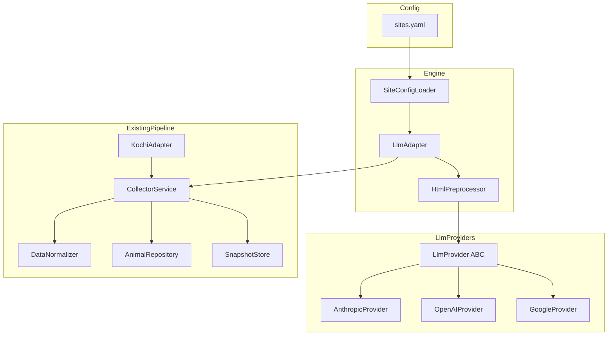
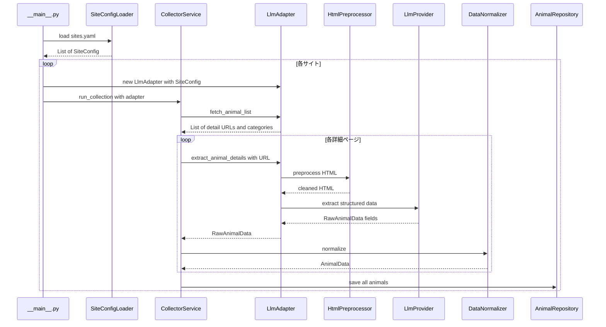

# Design Document: LLM Extraction Engine

## Overview

**Purpose**: 本機能は、LLMベースの汎用データ抽出エンジンを提供し、任意の自治体保護動物サイトからRawAnimalDataスキーマに準拠した構造化データを抽出する。YAML設定ファイルのみで新規サイトを追加可能にし、サイト固有のアダプターコードを不要にする。

**Users**: onecoの開発者（サイト追加時）および運営者（収集実行・監視時）が利用する。

**Impact**: 現在の高知県固定のルールベースパイプラインを、設定駆動の汎用パイプラインに拡張する。既存のDB・API・フロントエンドは変更しない。

### Goals
- YAML設定のみで新規自治体サイトを追加可能にする
- Claude API（tool_use）を使った汎用的なHTML→構造化データ抽出
- LLMプロバイダーの差し替えを設定変更のみで実現
- 四国4県（徳島・香川・高松・愛媛・松山）を初期対応
- APIコストを最小限に抑える（HTML前処理、Haikuモデル、差分更新）

### Non-Goals
- 既存の高知県アダプター（KochiAdapter）の置き換え（共存する）
- フロントエンド・API・DBスキーマの変更
- SaaS化・自治体向け管理画面（Phase 4の範囲）
- 定期実行スケジューラーの実装（別specで対応）

## Architecture

### Existing Architecture Analysis

現在のパイプライン:
```
__main__.py → CollectorService → KochiAdapter → DataNormalizer → AnimalRepository
                                     ↓
                               SnapshotStore (差分検知)
```

維持すべきパターン:
- `MunicipalityAdapter` ABC インターフェース（fetch_animal_list, extract_animal_details, normalize）
- `CollectorService` のオーケストレーション
- `DataNormalizer` の共通正規化ロジック
- `SnapshotStore` のスナップショット差分検知

### Architecture Pattern & Boundary Map



**Architecture Integration**:
- Selected pattern: **Adapter + Strategy**（MunicipalityAdapter継承でパイプライン互換 + Strategy Pattern でLLMプロバイダー差し替え）
- Domain boundaries: 抽出エンジン（Engine）はLLMプロバイダー（LlmProviders）と疎結合。既存パイプライン（ExistingPipeline）との接続は MunicipalityAdapter インターフェースで統一
- Existing patterns preserved: MunicipalityAdapter ABC、CollectorService オーケストレーション、DataNormalizer 共通ロジック
- New components rationale: SiteConfigLoader（YAML読み込み）、LlmAdapter（汎用アダプター）、HtmlPreprocessor（コスト最適化）、LlmProvider（プロバイダー抽象化）

### Technology Stack

| Layer | Choice / Version | Role in Feature | Notes |
|-------|------------------|-----------------|-------|
| Backend | Python 3.9+ | 抽出エンジン本体 | 既存スタックに合わせる |
| LLM SDK | anthropic >= 0.40.0 | Anthropic API アクセス | 初期プロバイダー |
| LLM SDK | openai >= 1.50.0 | OpenAI API アクセス | 追加プロバイダー（optional） |
| Config | PyYAML >= 6.0 | YAML設定ファイル読み込み | |
| Validation | pydantic >= 2.5.0 | 設定・抽出結果のバリデーション | 既存依存 |
| HTML処理 | beautifulsoup4 >= 4.12.0 | HTML前処理（不要要素除去） | 既存依存 |
| HTTP | requests >= 2.31.0 | サイトHTMLの取得 | 既存依存 |

## System Flows

### メインデータ収集フロー



**Key Decisions**:
- サイトごとに LlmAdapter インスタンスを生成（サイト設定をコンストラクタで受け取る）
- HTML前処理はLLM呼び出し前に実施（トークン削減）
- 各サイトの処理は独立しており、1サイトの失敗が他に影響しない

## Requirements Traceability

| Requirement | Summary | Components | Interfaces | Flows |
|-------------|---------|------------|------------|-------|
| 1.1-1.5 | YAML設定によるサイト定義 | SiteConfigLoader | SiteConfig型 | Config読み込み |
| 2.1-2.6 | 一覧ページからのURL収集 | LlmAdapter.fetch_animal_list | MunicipalityAdapter | メインフロー |
| 3.1-3.8 | LLMによる構造化抽出 | LlmAdapter, HtmlPreprocessor, LlmProvider | LlmProvider.extract | メインフロー |
| 4.1-4.5 | 既存パイプライン統合 | LlmAdapter | MunicipalityAdapter | メインフロー |
| 5.1-5.5 | APIコスト管理 | HtmlPreprocessor, LlmAdapter | CostTracker | メインフロー |
| 6.1-6.5 | エラー耐性と監視 | LlmAdapter, CollectorService | CollectionResult | メインフロー |
| 7.1-7.7 | 四国4県対応 | sites.yaml | SiteConfig | メインフロー |
| 8.1-8.6 | プロバイダー抽象化 | LlmProvider, AnthropicProvider | LlmProvider ABC | メインフロー |

## Components and Interfaces

| Component | Domain/Layer | Intent | Req Coverage | Key Dependencies | Contracts |
|-----------|--------------|--------|--------------|------------------|-----------|
| SiteConfigLoader | Config | YAML設定の読み込みとバリデーション | 1.1-1.5 | PyYAML, Pydantic (P0) | Service |
| LlmAdapter | Engine | MunicipalityAdapter準拠の汎用LLMアダプター | 2.1-2.6, 3.1-3.8, 4.1-4.5, 5.3-5.5, 6.1-6.5 | SiteConfig (P0), LlmProvider (P0), HtmlPreprocessor (P1) | Service |
| HtmlPreprocessor | Engine | HTML不要要素除去によるトークン削減 | 5.1 | BeautifulSoup (P0) | Service |
| LlmProvider | LlmProviders | LLMプロバイダー抽象インターフェース | 8.1, 8.4 | なし | Service |
| AnthropicProvider | LlmProviders | Anthropic Claude API実装 | 3.1-3.6, 8.3 | anthropic SDK (P0) | Service |
| OpenAIProvider | LlmProviders | OpenAI API実装（optional） | 8.2 | openai SDK (P1) | Service |

### Config Layer

#### SiteConfigLoader

| Field | Detail |
|-------|--------|
| Intent | YAML設定ファイルからサイト定義を読み込み、Pydanticモデルでバリデーション |
| Requirements | 1.1, 1.2, 1.3, 1.4, 1.5 |

**Responsibilities & Constraints**
- `sites.yaml` からサイト定義リストを読み込む
- 必須フィールド（name, prefecture, list_url）のバリデーション
- プロバイダー設定（グローバルデフォルト + サイト別オーバーライド）の解決

**Dependencies**
- External: PyYAML — YAML読み込み (P0)
- External: Pydantic — バリデーション (P0)

**Contracts**: Service [x]

##### Service Interface
```python
class SiteConfig(BaseModel):
    """サイト定義"""
    name: str
    prefecture: str
    list_url: str
    list_link_pattern: Optional[str] = None
    category: str = "adoption"
    extraction: str = "llm"
    max_pages: Optional[int] = None
    provider: Optional[str] = None
    model: Optional[str] = None
    request_interval: float = 1.0

class ExtractionConfig(BaseModel):
    """グローバル抽出設定"""
    default_provider: str = "anthropic"
    default_model: str = "claude-haiku-4-5-20251001"
    sites: List[SiteConfig]

class SiteConfigLoader:
    @staticmethod
    def load(config_path: Path) -> ExtractionConfig:
        """YAML設定ファイルを読み込みバリデーション"""
        ...
```
- Preconditions: config_path が存在する有効なYAMLファイル
- Postconditions: 全サイト定義がバリデーション済み
- Invariants: 必須フィールド（name, prefecture, list_url）は非空

### Engine Layer

#### LlmAdapter

| Field | Detail |
|-------|--------|
| Intent | MunicipalityAdapter準拠の汎用LLMベースアダプター |
| Requirements | 2.1-2.6, 3.1-3.8, 4.1-4.5, 5.3-5.5, 6.1-6.5, 7.1-7.7 |

**Responsibilities & Constraints**
- MunicipalityAdapter ABC を継承し、fetch_animal_list / extract_animal_details / normalize を実装
- サイト設定に基づいて一覧ページからURLを収集（CSS selector or LLM推定）
- 詳細ページHTMLを前処理し、LlmProviderに構造化抽出を委譲
- リクエスト間隔の制御（robots.txt尊重、最低1秒）
- 差分更新（source_urlベースで既存データとの比較）

**Dependencies**
- Inbound: CollectorService — run_collection から呼び出される (P0)
- Outbound: LlmProvider — 構造化抽出 (P0)
- Outbound: HtmlPreprocessor — HTML前処理 (P1)
- Outbound: DataNormalizer — 正規化 (P0)
- External: requests — HTTP (P0)
- External: BeautifulSoup — HTML解析 (P0)

**Contracts**: Service [x]

##### Service Interface
```python
class LlmAdapter(MunicipalityAdapter):
    def __init__(
        self,
        site_config: SiteConfig,
        provider: LlmProvider,
        preprocessor: Optional[HtmlPreprocessor] = None,
    ) -> None: ...

    def fetch_animal_list(self) -> List[Tuple[str, str]]:
        """一覧ページから (detail_url, category) リストを返す"""
        ...

    def extract_animal_details(
        self, detail_url: str, category: str = "adoption"
    ) -> RawAnimalData:
        """詳細ページからLLMで構造化データを抽出"""
        ...

    def normalize(self, raw_data: RawAnimalData) -> AnimalData:
        """DataNormalizerに委譲"""
        ...
```
- Preconditions: site_config が有効、provider が初期化済み
- Postconditions: RawAnimalData の全フィールドが設定済み（空文字許容）
- Invariants: source_url は常に元ページのURL

**Implementation Notes**
- fetch_animal_list: list_link_pattern がある場合はCSSセレクターで抽出、ない場合はLlmProviderでリンク推定
- ページネーション: `a[href]` のパターンから次ページリンクを検出、max_pages で制限
- normalize: `DataNormalizer.normalize()` に委譲（高知アダプターのような特別ルールは不要 — LLMが文脈で処理済み）

#### HtmlPreprocessor

| Field | Detail |
|-------|--------|
| Intent | HTMLから不要要素を除去してLLMトークン数を削減 |
| Requirements | 5.1 |

**Responsibilities & Constraints**
- script, style, nav, footer, header, iframe 等の要素を除去
- img タグは保持（画像URL抽出に必要）
- テキストの空白・改行の正規化

**Contracts**: Service [x]

##### Service Interface
```python
class HtmlPreprocessor:
    REMOVE_TAGS: List[str] = [
        "script", "style", "nav", "footer", "header",
        "iframe", "noscript", "svg", "meta", "link"
    ]

    @staticmethod
    def preprocess(html: str, base_url: str) -> str:
        """HTMLを前処理してLLM向けに最適化"""
        ...

    @staticmethod
    def estimate_tokens(text: str) -> int:
        """テキストの推定トークン数（日本語: 文字数 * 1.5）"""
        ...
```

### LlmProviders Layer

#### LlmProvider (ABC)

| Field | Detail |
|-------|--------|
| Intent | LLMプロバイダーの統一インターフェース |
| Requirements | 8.1, 8.4 |

**Contracts**: Service [x]

##### Service Interface
```python
from abc import ABC, abstractmethod
from typing import Dict, Any

class ExtractionResult:
    """LLM抽出結果"""
    fields: Dict[str, Any]  # RawAnimalData フィールド
    input_tokens: int
    output_tokens: int

class LlmProvider(ABC):
    @abstractmethod
    def extract_animal_data(
        self,
        html_content: str,
        source_url: str,
        category: str,
    ) -> ExtractionResult:
        """HTMLから動物情報を構造化抽出"""
        ...

    @abstractmethod
    def extract_detail_links(
        self,
        html_content: str,
        base_url: str,
    ) -> List[str]:
        """HTMLから動物詳細ページへのリンクを推定抽出"""
        ...
```
- Preconditions: html_content は前処理済みHTML
- Postconditions: ExtractionResult.fields は RawAnimalData のフィールドを含む
- Invariants: input_tokens, output_tokens は0以上

#### AnthropicProvider

| Field | Detail |
|-------|--------|
| Intent | Anthropic Claude API を使った構造化抽出の実装 |
| Requirements | 3.1-3.6, 8.3 |

**Dependencies**
- External: anthropic SDK — Claude API (P0)

**Contracts**: Service [x]

##### Service Interface
```python
class AnthropicProvider(LlmProvider):
    def __init__(
        self,
        model: str = "claude-haiku-4-5-20251001",
        api_key: Optional[str] = None,  # 未指定時は ANTHROPIC_API_KEY 環境変数
        max_retries: int = 3,
    ) -> None: ...

    def extract_animal_data(
        self,
        html_content: str,
        source_url: str,
        category: str,
    ) -> ExtractionResult: ...

    def extract_detail_links(
        self,
        html_content: str,
        base_url: str,
    ) -> List[str]: ...
```

**Implementation Notes**
- `extract_animal_data`: tool_use with `strict: true` で RawAnimalData スキーマを定義し、`tool_choice: {"type": "tool", "name": "extract_animal_data"}` で強制呼び出し
- プロンプトに抽出指示を含める（種別判定、年齢推定、日付変換、画像フィルタ）
- リトライ: 指数バックオフ（1s, 2s, 4s）、`anthropic.RateLimitError` と `anthropic.APIStatusError` をキャッチ

## Data Models

### Domain Model

既存の `RawAnimalData` と `AnimalData` は変更なし。新規追加はサイト設定モデルのみ。

### Logical Data Model

#### サイト設定（YAML → Pydantic）

```yaml
# sites.yaml
extraction:
  default_provider: anthropic
  default_model: claude-haiku-4-5-20251001

sites:
  - name: "徳島県動物愛護管理センター"
    prefecture: "徳島県"
    prefecture_code: "36"
    list_url: "https://douai-tokushima.com/"
    list_link_pattern: "a[href*='detail']"
    category: "adoption"

  - name: "香川県東讃保健福祉事務所"
    prefecture: "香川県"
    prefecture_code: "37"
    list_url: "https://www.pref.kagawa.lg.jp/eisei/joto/tosan.html"
    category: "lost"

  - name: "高松市 わんにゃん高松"
    prefecture: "香川県"
    prefecture_code: "37"
    list_url: "https://www.city.takamatsu.kagawa.jp/udanimo/ani_top.html"
    category: "adoption"

  - name: "愛媛県動物愛護センター"
    prefecture: "愛媛県"
    prefecture_code: "38"
    list_url: "https://www.pref.ehime.jp/page/16976.html"
    category: "lost"

  - name: "松山市 はぴまるの丘"
    prefecture: "愛媛県"
    prefecture_code: "38"
    list_url: "https://www.city.matsuyama.ehime.jp/kurashi/kurashi/aigo/hogoinu/pet-jyouto.html"
    category: "adoption"

  # 既存の高知県はルールベース（KochiAdapter）で運用継続
```

DBスキーマの変更は不要（AnimalData モデルは共通）。

### Data Contracts

#### LLM抽出ツール定義（Anthropic tool_use 用 JSON Schema）

```json
{
  "name": "extract_animal_data",
  "description": "保護動物の詳細ページから動物情報を構造化抽出する",
  "input_schema": {
    "type": "object",
    "properties": {
      "species": {
        "type": "string",
        "description": "動物種別。犬か猫かを判定して '犬' または '猫' を返す。品種名（雑種等）からも推定する。判定不能な場合は 'その他'"
      },
      "sex": {
        "type": "string",
        "description": "性別。オス/メス等の表記を正規化して返す"
      },
      "age": {
        "type": "string",
        "description": "年齢。テキスト表記（高齢、成犬、生年月日等）をそのまま返す。数値変換はnormalizerが行う"
      },
      "color": {
        "type": "string",
        "description": "毛色"
      },
      "size": {
        "type": "string",
        "description": "体格（大型、中型、小型等）"
      },
      "shelter_date": {
        "type": "string",
        "description": "収容日・保護日。ISO 8601形式（YYYY-MM-DD）に変換して返す。令和表記や年なし日付も変換する"
      },
      "location": {
        "type": "string",
        "description": "収容場所・保護場所"
      },
      "phone": {
        "type": "string",
        "description": "連絡先電話番号"
      },
      "image_urls": {
        "type": "array",
        "items": {"type": "string"},
        "description": "動物の写真URLのみ。サイトテンプレート画像（ロゴ、アイコン、装飾画像）は除外する"
      }
    },
    "required": ["species", "sex", "age", "color", "size", "shelter_date", "location", "phone", "image_urls"]
  }
}
```

## Error Handling

### Error Strategy

3層のエラーハンドリング:
1. **サイト層**: 1サイトのエラーで他サイトに影響しない（Req 6.2）
2. **ページ層**: 1ページの抽出失敗で他ページに影響しない（Req 3.8）
3. **バリデーション層**: 抽出結果の必須フィールドチェック（Req 6.3）

### Error Categories and Responses

**Network Errors**: HTTP接続失敗、タイムアウト → ログ記録、当該ページスキップ
**LLM API Errors**: レート制限、サーバーエラー → 指数バックオフリトライ（最大3回）、失敗時スキップ
**Extraction Errors**: LLM出力がスキーマに不適合 → バリデーション失敗ログ、当該レコードスキップ
**Config Errors**: YAML設定不正 → 起動時にエラー出力して中断

### Monitoring

各実行で以下をログ出力（Req 6.5）:
- サイト名、処理時間、成功件数、失敗件数、スキップ件数
- API呼び出し回数、合計トークン数、推定コスト（Req 5.3）
- エラー詳細（URL、エラー種別、メッセージ）

## Testing Strategy

### Unit Tests
- `SiteConfigLoader`: YAML読み込み、バリデーション成功/失敗、デフォルト値
- `HtmlPreprocessor`: 不要要素除去、img保持、トークン推定
- `AnthropicProvider`: tool_use リクエスト構築、レスポンスパース（モック使用）
- `LlmAdapter.normalize`: DataNormalizer への委譲

### Integration Tests
- `LlmAdapter` + モックLlmProvider: fetch_animal_list → extract_animal_details → normalize の一連フロー
- `LlmAdapter` + `CollectorService`: 既存パイプラインとの統合動作
- エラーケース: サイト接続失敗時の継続、API失敗時のリトライとスキップ

### E2E Tests
- 四国各サイトに対する実際のHTTP + LLM抽出（CI では skip、手動実行）
- 抽出結果の品質チェック（species が "犬"/"猫"、shelter_date が有効な日付）

## Performance & Scalability

- **HTML前処理**: 70-80%のトークン削減（20,000tok → 5,000tok/ページ）
- **コスト目標**: Haiku で 1ページあたり約 $0.001 → 四国60ページで約 $0.06/回
- **リクエスト間隔**: サイトへは最低1秒間隔、API呼び出しは並列不要（コスト制御優先）
- **差分更新**: source_url ベースで前回スナップショットと比較、変更なしページはスキップ
- **スケール**: 100+サイト × 平均50ページ = 5,000 API呼び出し/回 → Haiku で約 $5/回
