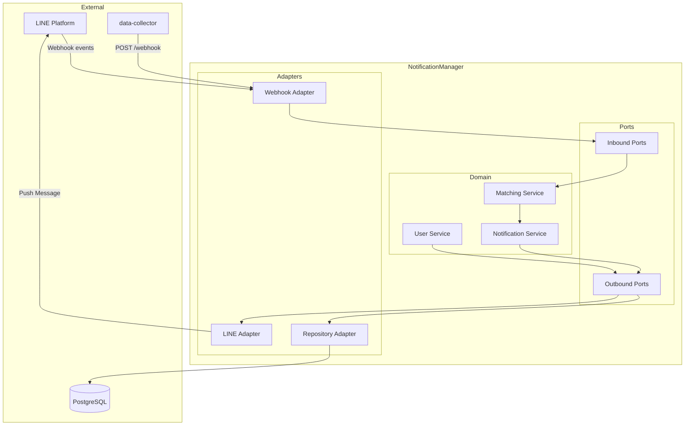
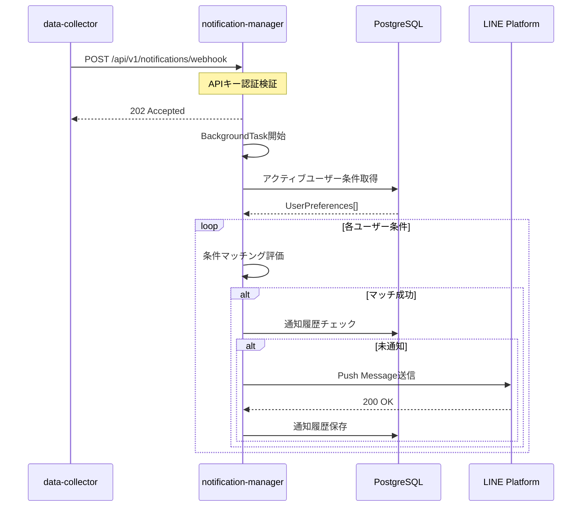
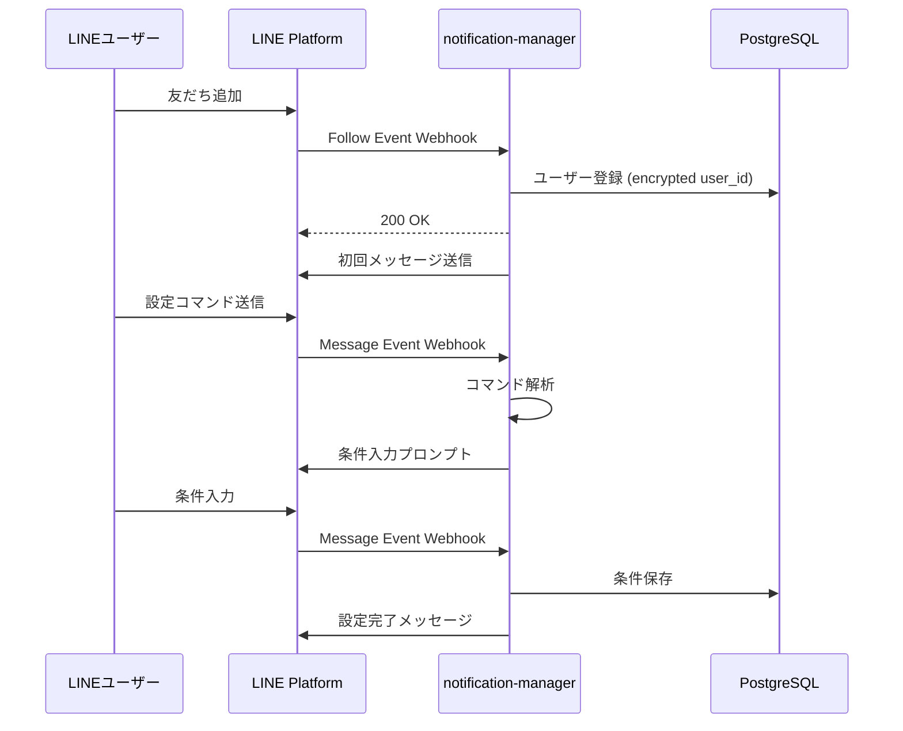
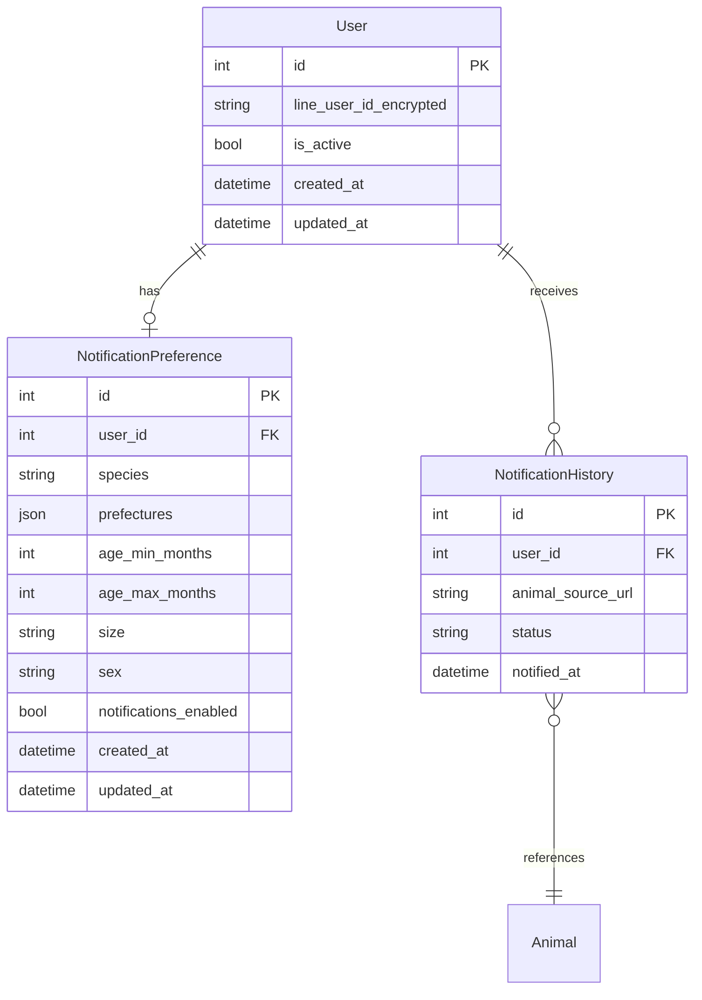

# Technical Design: notification-manager

## Overview

**Purpose**: notification-managerは、LINE Messaging API連携による条件付きパーソナライズ通知システムを提供する。ユーザーが設定した通知条件（犬/猫、都道府県、年齢、サイズ、性別）に基づき、data-collectorの新着検知をトリガーとして、条件にマッチする新着動物情報をLINEプッシュ通知で配信する。

**Users**: 保護犬・保護猫の里親希望者が、希望条件に合致する動物の新着情報を即座に受け取る。運用者はシステム状態を監視し、異常時に対応する。

**Impact**: 既存のdata-collectorシステムに新着通知のWebhookトリガーを追加し、notification-managerへのHTTP API連携を実現する。

### Goals
- ユーザーがLINE上で通知条件を登録・管理できる対話型インターフェース
- data-collectorからの新着動物データを受信し、条件マッチングを実行
- 条件に合致するユーザーへのLINEプッシュ通知配信
- 通知履歴管理による重複防止と監査証跡
- レート制限遵守とエラーハンドリング

### Non-Goals
- LINE以外の通知チャネル（Email、SMS、アプリ内通知）への対応（将来検討）
- リッチメニューやFlexMessageによる高度なUI（Phase 2以降）
- 複数のdata-collectorインスタンスからの同時Webhook受信（シングルインスタンス前提）
- タスクキュー（Celery）による分散処理（Phase 2で対応予定）

## Architecture

### Existing Architecture Analysis

既存システムとの連携ポイント:
- **data-collector**: `NotificationClient.notify_new_animals()` が新着通知のトリガーポイント。コメントに「Phase 2では notification-manager に委譲予定」と記載
- **AnimalData**: 統一スキーマとしてPydanticで定義済み、notification-managerでそのまま受け入れ可能
- **データベース**: PostgreSQL + SQLAlchemy 2.0 async + Repository パターン
- **API**: FastAPI + Pydantic スキーマ

### Architecture Pattern & Boundary Map

**Selected Pattern**: Hexagonal Architecture（ポート&アダプター）

既存のdata-collectorと同様のパターンを採用し、プロジェクト全体の一貫性を確保。外部依存（LINE API、data-collector Webhook、データベース）をアダプターとして実装し、ドメインロジックと分離。



**Architecture Integration**:
- 選択パターン: Hexagonal Architecture（既存data-collectorとの整合性）
- ドメイン境界: User管理、条件マッチング、通知配信の3つの責務を分離
- 既存パターン維持: Repository パターン、Pydantic スキーマ、FastAPI ルーティング
- 新規コンポーネント: LINE Adapter、Matching Service、Notification Service

### Technology Stack

| Layer | Choice / Version | Role in Feature | Notes |
|-------|------------------|-----------------|-------|
| Backend | FastAPI 0.104+ | REST API、Webhook受信、バックグラウンドタスク | 既存data-collectorと統一 |
| ORM | SQLAlchemy 2.0 async | データベースアクセス | asyncioサポート |
| Database | PostgreSQL 15+ | ユーザー条件、通知履歴の永続化 | 既存インフラ活用 |
| LINE SDK | line-bot-sdk 3.22.0 | LINE Messaging API連携 | Python >= 3.10必須 |
| 暗号化 | cryptography (Fernet) | LINE User ID暗号化 | AES-128 + HMAC |
| バリデーション | Pydantic v2 | リクエスト/レスポンススキーマ | 既存パターン踏襲 |

## System Flows

### 新着動物通知フロー



### LINE友だち追加・条件設定フロー



## Requirements Traceability

| Requirement | Summary | Components | Interfaces | Flows |
|-------------|---------|------------|------------|-------|
| 1.1 | 友だち追加時のユーザー登録 | UserService, UserRepository | LINE Webhook | 友だち追加フロー |
| 1.2 | 条件設定コマンド対話 | UserService, ConversationHandler | LINE Webhook, LINE Push | 条件設定フロー |
| 1.3 | 条件項目（種別、都道府県等） | NotificationPreference | UserPreferenceSchema | - |
| 1.4 | 条件の永続化 | UserRepository | - | - |
| 1.5-1.7 | 条件変更・停止・再開 | UserService | LINE Webhook | - |
| 2.1 | 新着動物受信API | WebhookController | POST /webhook | 新着通知フロー |
| 2.2 | 処理キュー追加 | NotificationService | BackgroundTasks | - |
| 2.3-2.5 | バリデーション、エラー、HTTP 202 | WebhookController | POST /webhook | - |
| 3.1-3.5 | 条件マッチング処理 | MatchingService | - | 新着通知フロー |
| 4.1-4.6 | LINE通知配信・リトライ | LineNotificationAdapter | LINE Push API | 新着通知フロー |
| 5.1-5.5 | 通知履歴管理・重複防止 | NotificationHistoryRepository | - | 新着通知フロー |
| 6.1-6.6 | エラーハンドリング・監視 | 各コンポーネント | GET /health, メトリクス | - |
| 7.1-7.6 | セキュリティ・プライバシー | UserRepository, APIキー認証 | - | - |
| 8.1-8.5 | スケーラビリティ・パフォーマンス | NotificationService | バッチ処理、並列送信 | - |

## Components and Interfaces

### Summary Table

| Component | Domain/Layer | Intent | Req Coverage | Key Dependencies | Contracts |
|-----------|--------------|--------|--------------|------------------|-----------|
| WebhookController | API | data-collectorおよびLINEからのWebhook受信 | 2.1-2.5 | FastAPI (P0) | API |
| UserService | Domain | ユーザー登録・条件管理 | 1.1-1.7, 7.5 | UserRepository (P0) | Service |
| MatchingService | Domain | 新着動物と条件のマッチング | 3.1-3.5 | UserRepository (P0) | Service |
| NotificationService | Domain | 通知配信オーケストレーション | 4.1-4.6, 8.1-8.5 | LineAdapter (P0), HistoryRepo (P0) | Service |
| LineNotificationAdapter | Adapter | LINE Messaging API連携 | 4.1-4.6 | line-bot-sdk (P0) | - |
| UserRepository | Adapter | ユーザー・条件の永続化 | 1.4, 7.1 | SQLAlchemy (P0) | - |
| NotificationHistoryRepository | Adapter | 通知履歴の永続化 | 5.1-5.5 | SQLAlchemy (P0) | - |

### API Layer

#### WebhookController

| Field | Detail |
|-------|--------|
| Intent | data-collectorおよびLINEプラットフォームからのWebhookリクエストを受信し、バックグラウンド処理を起動 |
| Requirements | 2.1, 2.2, 2.3, 2.4, 2.5, 6.1, 6.6, 7.2, 7.3 |

**Responsibilities & Constraints**
- data-collectorからの新着動物Webhookを受信（APIキー認証）
- LINEプラットフォームからのイベントWebhookを受信（署名検証）
- リクエストバリデーション後、即座にHTTP 202を返却
- バックグラウンドタスクで通知処理を非同期実行

**Dependencies**
- Inbound: data-collector — 新着動物通知 (P0)
- Inbound: LINE Platform — ユーザーイベント (P0)
- Outbound: NotificationService — 通知処理委譲 (P0)
- Outbound: UserService — ユーザー管理委譲 (P0)

**Contracts**: API [x]

##### API Contract

| Method | Endpoint | Request | Response | Errors |
|--------|----------|---------|----------|--------|
| POST | /api/v1/notifications/webhook | NewAnimalWebhookRequest | 202 Accepted | 400, 401, 422 |
| POST | /api/v1/line/webhook | LINE Webhook Event | 200 OK | 400, 401 |
| GET | /health | - | HealthResponse | 503 |

```python
class NewAnimalWebhookRequest(BaseModel):
    """data-collectorからの新着動物通知リクエスト"""
    animals: List[AnimalData]
    source: str  # "data-collector"
    timestamp: datetime

class HealthResponse(BaseModel):
    """ヘルスチェックレスポンス"""
    status: Literal["healthy", "degraded", "unhealthy"]
    database: bool
    line_api: bool
    timestamp: datetime
```

**Implementation Notes**
- APIキー認証: `X-API-Key` ヘッダーで検証
- LINE署名検証: `X-Line-Signature` ヘッダーをSDKで検証
- 不正リクエストはログ記録後にエラーレスポンス

### Domain Layer

#### UserService

| Field | Detail |
|-------|--------|
| Intent | LINEユーザーの登録、通知条件の管理、対話フローの制御 |
| Requirements | 1.1, 1.2, 1.3, 1.4, 1.5, 1.6, 1.7, 7.5 |

**Responsibilities & Constraints**
- 友だち追加時のユーザー登録（暗号化User ID）
- 条件設定コマンドの解釈と対話フロー制御
- 通知条件のCRUD操作
- ブロック/削除時の通知無効化

**Dependencies**
- Inbound: WebhookController — イベント処理要求 (P0)
- Outbound: UserRepository — ユーザーデータ永続化 (P0)
- Outbound: LineNotificationAdapter — メッセージ送信 (P1)

**Contracts**: Service [x]

##### Service Interface

```python
class UserServiceProtocol(Protocol):
    async def register_user(self, line_user_id: str) -> User:
        """新規ユーザー登録（友だち追加時）"""
        ...

    async def update_preferences(
        self, user_id: int, preferences: NotificationPreferenceInput
    ) -> NotificationPreference:
        """通知条件の更新"""
        ...

    async def get_preferences(self, user_id: int) -> Optional[NotificationPreference]:
        """通知条件の取得"""
        ...

    async def deactivate_user(self, line_user_id: str) -> None:
        """ユーザー無効化（ブロック/削除時）"""
        ...

    async def toggle_notifications(self, user_id: int, enabled: bool) -> None:
        """通知の有効/無効切り替え"""
        ...
```

#### MatchingService

| Field | Detail |
|-------|--------|
| Intent | 新着動物データとユーザー通知条件のマッチング評価 |
| Requirements | 3.1, 3.2, 3.3, 3.4, 3.5 |

**Responsibilities & Constraints**
- アクティブなユーザー条件の一括取得
- 各条件項目（種別、都道府県、年齢、サイズ、性別）の評価
- すべてのAND条件が一致した場合のみマッチと判定
- マッチング結果のログ記録

**Dependencies**
- Inbound: NotificationService — マッチング要求 (P0)
- Outbound: UserRepository — 条件データ取得 (P0)

**Contracts**: Service [x]

##### Service Interface

```python
class MatchingServiceProtocol(Protocol):
    async def find_matching_users(
        self, animal: AnimalData
    ) -> List[MatchResult]:
        """動物データに対してマッチするユーザーを検索"""
        ...

class MatchResult(BaseModel):
    """マッチング結果"""
    user_id: int
    line_user_id_encrypted: str
    preference_id: int
    match_score: float  # 1.0 = 完全マッチ
```

**Implementation Notes**
- 早期リターン: 最初の不一致条件で即座にスキップ
- 条件未設定項目は「すべて許可」として扱う

#### NotificationService

| Field | Detail |
|-------|--------|
| Intent | 通知配信プロセス全体のオーケストレーション |
| Requirements | 4.1, 4.2, 4.3, 4.4, 4.5, 4.6, 5.2, 5.3, 8.1, 8.2, 8.3, 8.4, 8.5 |

**Responsibilities & Constraints**
- 新着動物データの受信と処理開始
- マッチング → 重複チェック → 配信の一連フロー制御
- バッチ処理（100件/バッチ）と並列送信（最大10並列）
- 送信結果の記録とエラー処理

**Dependencies**
- Inbound: WebhookController — 処理開始トリガー (P0)
- Outbound: MatchingService — マッチング実行 (P0)
- Outbound: NotificationHistoryRepository — 履歴管理 (P0)
- Outbound: LineNotificationAdapter — LINE送信 (P0)

**Contracts**: Service [x]

##### Service Interface

```python
class NotificationServiceProtocol(Protocol):
    async def process_new_animals(
        self, animals: List[AnimalData]
    ) -> NotificationResult:
        """新着動物の通知処理を実行"""
        ...

class NotificationResult(BaseModel):
    """通知処理結果"""
    total_animals: int
    total_matches: int
    sent_count: int
    skipped_count: int  # 重複による
    failed_count: int
    processing_time_seconds: float
```

**Implementation Notes**
- asyncio.gather で並列送信
- レート制限: 2,000 req/sec に対して安全マージン確保
- 送信失敗時は最大3回リトライ（指数バックオフ）

### Adapter Layer

#### LineNotificationAdapter

| Field | Detail |
|-------|--------|
| Intent | LINE Messaging APIとの通信を担当 |
| Requirements | 4.1, 4.2, 4.3, 4.4, 4.5, 4.6 |

**Responsibilities & Constraints**
- LINE Push Message APIの呼び出し
- Channel Access Tokenの管理
- Webhook署名検証
- エラーハンドリングとリトライ

**Dependencies**
- External: LINE Messaging API — プッシュ通知送信 (P0)
- External: line-bot-sdk 3.22.0 — SDK (P0)

**Contracts**: なし（アダプター実装）

```python
class LineNotificationAdapterProtocol(Protocol):
    async def send_push_message(
        self, line_user_id: str, message: NotificationMessage
    ) -> SendResult:
        """プッシュメッセージ送信"""
        ...

    def verify_signature(self, body: bytes, signature: str) -> bool:
        """Webhook署名検証"""
        ...

class NotificationMessage(BaseModel):
    """通知メッセージ内容"""
    species: str
    sex: str
    age_months: Optional[int]
    size: Optional[str]
    location: str
    source_url: str
    category: str

class SendResult(BaseModel):
    """送信結果"""
    success: bool
    error_code: Optional[str] = None
    retry_after: Optional[int] = None  # レート制限時
```

## Data Models

### Domain Model



### Logical Data Model

**Entity Relationships**:
- User : NotificationPreference = 1:0..1（ユーザーは条件を0または1つ持つ）
- User : NotificationHistory = 1:N（ユーザーは複数の通知履歴を持つ）
- NotificationHistory は animal_source_url で動物を参照（外部キーではなく文字列）

**Consistency & Integrity**:
- User削除時はNotificationPreference, NotificationHistoryをカスケード削除
- (user_id, animal_source_url) にユニーク制約で重複通知防止
- 通知履歴は90日間保持、超過分は自動削除

### Physical Data Model

**Users Table**:
```sql
CREATE TABLE users (
    id SERIAL PRIMARY KEY,
    line_user_id_encrypted VARCHAR(255) NOT NULL UNIQUE,
    is_active BOOLEAN DEFAULT TRUE,
    created_at TIMESTAMP WITH TIME ZONE DEFAULT NOW(),
    updated_at TIMESTAMP WITH TIME ZONE DEFAULT NOW()
);

CREATE INDEX idx_users_active ON users(is_active) WHERE is_active = TRUE;
```

**Notification Preferences Table**:
```sql
CREATE TABLE notification_preferences (
    id SERIAL PRIMARY KEY,
    user_id INTEGER NOT NULL REFERENCES users(id) ON DELETE CASCADE,
    species VARCHAR(20),  -- '犬', '猫', NULL=両方
    prefectures JSONB DEFAULT '[]',  -- ["高知県", "愛媛県"]
    age_min_months INTEGER,
    age_max_months INTEGER,
    size VARCHAR(20),  -- '小型', '中型', '大型', NULL=すべて
    sex VARCHAR(20),  -- '男の子', '女の子', NULL=不問
    notifications_enabled BOOLEAN DEFAULT TRUE,
    created_at TIMESTAMP WITH TIME ZONE DEFAULT NOW(),
    updated_at TIMESTAMP WITH TIME ZONE DEFAULT NOW(),
    UNIQUE(user_id)
);

CREATE INDEX idx_preferences_active ON notification_preferences(notifications_enabled)
    WHERE notifications_enabled = TRUE;
```

**Notification History Table**:
```sql
CREATE TABLE notification_history (
    id SERIAL PRIMARY KEY,
    user_id INTEGER NOT NULL REFERENCES users(id) ON DELETE CASCADE,
    animal_source_url VARCHAR(500) NOT NULL,
    status VARCHAR(20) NOT NULL,  -- 'sent', 'failed', 'skipped'
    notified_at TIMESTAMP WITH TIME ZONE DEFAULT NOW(),
    UNIQUE(user_id, animal_source_url)
);

CREATE INDEX idx_history_user_url ON notification_history(user_id, animal_source_url);
CREATE INDEX idx_history_notified_at ON notification_history(notified_at);
```

## Error Handling

### Error Strategy

| Error Type | Detection | Response | Recovery |
|------------|-----------|----------|----------|
| LINE API 401 | SDK例外 | ログ記録、運用者通知 | トークン再取得 |
| LINE API 429 | retry_after ヘッダー | 待機後リトライ | 指数バックオフ |
| LINE API 5xx | SDK例外 | リトライ（最大3回） | 指数バックオフ |
| DB接続エラー | SQLAlchemy例外 | ログ記録、運用者通知 | 再接続 |
| 無効APIキー | ヘッダー検証 | 401 Unauthorized | - |
| バリデーションエラー | Pydantic | 422 Unprocessable Entity | - |

### Monitoring

**記録するメトリクス** (Requirement 6.4):
- 1時間あたりの通知送信数
- API応答時間（p50, p95, p99）
- エラー発生率
- マッチング処理時間

**アラート閾値** (Requirement 6.5):
- エラー率 > 5%: 警告アラート
- エラー率 > 20%: 緊急アラート
- API応答時間 p95 > 5秒: 警告アラート

## Testing Strategy

### Unit Tests
- UserService: ユーザー登録、条件更新、無効化
- MatchingService: 各条件項目のマッチングロジック、早期リターン
- NotificationService: バッチ処理、リトライロジック
- 暗号化/復号: Fernet暗号化の正確性

### Integration Tests
- WebhookController: APIキー認証、LINE署名検証
- Repository: CRUD操作、ユニーク制約
- LINE Adapter: モックSDKでの送信テスト

### E2E Tests
- 新着動物Webhook → マッチング → LINE送信の全フロー
- 友だち追加 → 条件設定 → 確認メッセージの対話フロー
- 重複通知防止の動作確認

## Security Considerations

- **LINE User ID暗号化**: Fernet（AES-128 + HMAC）で暗号化保存、環境変数で鍵管理 (7.1)
- **APIキー認証**: data-collectorからのWebhookに`X-API-Key`ヘッダー必須 (7.2)
- **署名検証**: LINEからのWebhookは`X-Line-Signature`で検証 (7.4)
- **HTTPS必須**: すべてのAPI通信はHTTPS (7.4)
- **アクセスログ**: 個人データアクセスをログに記録 (7.6)

## Performance & Scalability

**Target Metrics**:
- 通知処理の平均応答時間: 5秒以内 (8.4)
- LINE Push API: 2,000 req/sec の制限内で運用

**Scaling Approach**:
- Phase 1: FastAPI BackgroundTasks（〜数百ユーザー）
- Phase 2: Celery + Redis（数千ユーザー以上）
- バッチサイズ: 100件/バッチ (8.2)
- 並列送信: 最大10並列 (8.3)
