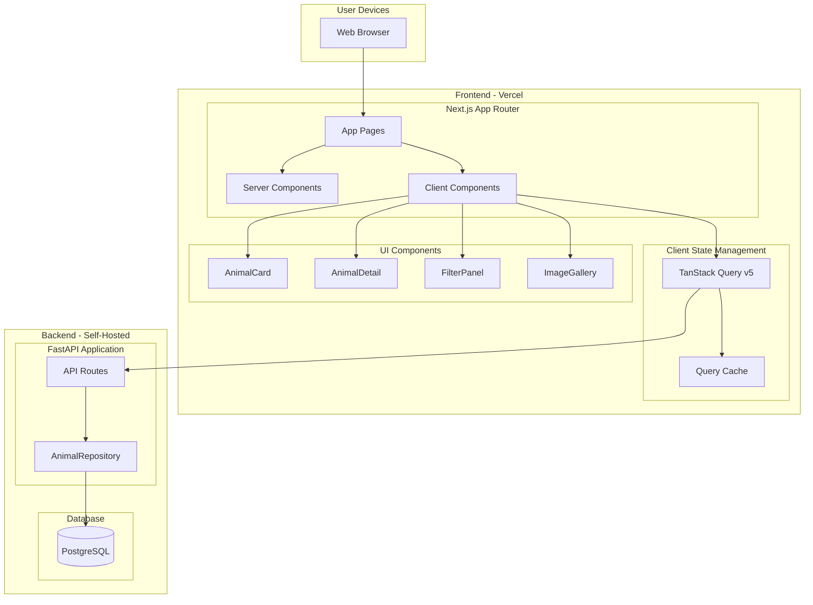
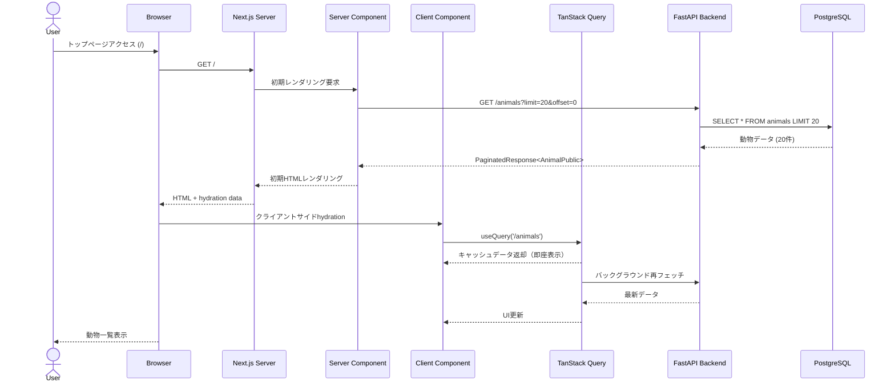
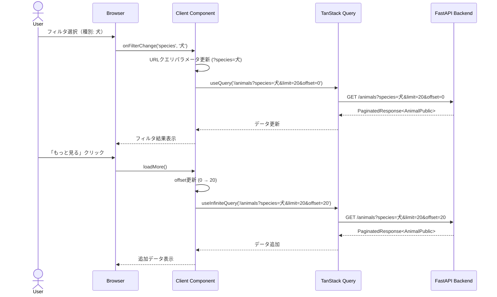

# 技術設計書

## 概要

本機能は、保護動物情報を一般ユーザーに分かりやすく提供するWebフロントエンドです。既存のFastAPIバックエンド（`GET /animals`, `GET /animals/{id}`）から動物データを取得し、レスポンシブでアクセシブルなUIを通じて表示します。

**Purpose**: 一般ユーザーが保護動物情報を簡単に閲覧・検索でき、自治体への連絡を促進することで、迷子動物の早期発見と里親マッチングを支援します。

**Users**: 一般ユーザー（保護動物の検索・閲覧）、視覚・運動機能に制限のあるユーザー（アクセシブルなインターフェース利用）

**Impact**: 新規フロントエンド実装（greenfield）。既存バックエンドAPI（FastAPI）には変更を加えず、CORS設定を活用して統合します。

### Goals

- Next.js 15 App Routerによる高速・SEO最適化された動物一覧・詳細ページ
- レスポンシブデザイン（モバイル、タブレット、デスクトップ対応）
- WCAG 2.1 レベルAA準拠のアクセシビリティ
- パフォーマンス目標達成（初期ロード3秒以内、LCP 2.5秒以内）
- フィルタリング・ページネーション機能による効率的な動物検索

### Non-Goals

- バックエンドAPIの修正・拡張（既存の `GET /animals`, `GET /animals/{id}` を使用）
- ユーザー認証・認可機能（公開Webポータルのため不要）
- 動物データの直接編集機能（閲覧専用）
- リアルタイム通知機能（notification-managerの責務）
- 管理UI（別機能として実装予定）

## Architecture

### Existing Architecture Analysis

**既存バックエンドAPI**:
- **FastAPI アプリケーション**: `src/data_collector/infrastructure/api/app.py`
- **エンドポイント**:
  - `GET /animals`: フィルタリング（`species`, `sex`, `location`, `category`, `shelter_date_from`, `shelter_date_to`）、ページネーション（`limit`, `offset`）対応
  - `GET /animals/{id}`: 個別動物データ取得
  - `GET /health`: ヘルスチェック
- **スキーマ**: `AnimalPublic` - `id`, `species`, `sex`, `age_months`, `color`, `size`, `shelter_date`, `location`, `phone`, `image_urls`, `source_url`, `category`
- **CORS設定**: `CORSMiddleware` 設定済み（`allow_origins`, `allow_credentials`, `allow_methods`, `allow_headers`）

**統合ポイント**:
- フロントエンドから直接FastAPI `/animals` エンドポイントを呼び出し（CORS許可済み）
- TypeScript型定義を `AnimalPublic` Pydanticスキーマに対応させて作成
- TanStack Queryでクライアントサイドキャッシングと再フェッチ戦略を実装

### Architecture Pattern & Boundary Map



**Architecture Integration**:
- **選定パターン**: Next.js App Router + React Server Components (RSC) + TanStack Query v5
- **ドメイン境界**:
  - **Server Components**: 初期データフェッチ、SEO最適化、静的サイト生成（SSG/ISR）
  - **Client Components**: インタラクティブ機能（フィルタリング、ページネーション、画像ギャラリー）
  - **TanStack Query**: クライアントサイドAPIデータキャッシング、Stale-While-Revalidate戦略
- **既存パターン保持**: バックエンドのレイヤードアーキテクチャ（domain, infrastructure, orchestration）に変更なし
- **新コンポーネントの根拠**:
  - **Next.js App Router**: React Server Components、SSG/ISR、自動画像最適化によるパフォーマンス最適化（Requirement 7）
  - **TanStack Query**: クライアントサイドキャッシング、Infinite scrolling、Optimistic UI（Requirement 1, 3）
  - **Tailwind CSS**: レスポンシブデザイン、WCAG準拠カラーパレット設計（Requirement 5, 6）
- **Steering準拠**: 型安全性（TypeScript）、段階的詳細化（Server/Client Components分離）、パターン文書化（研究.mdで選定根拠を記録）

### Technology Stack

| Layer | Choice / Version | Role in Feature | Notes |
|-------|------------------|-----------------|-------|
| **Frontend Framework** | Next.js 15+ (App Router) | SSG/ISR、ルーティング、React Server Components | 2026年ベストプラクティス、SEO最適化、画像自動最適化 |
| **UI Library** | React 19+ | コンポーネントベースUI | Server Components対応 |
| **Language** | TypeScript 5+ | 型安全性、バックエンドスキーマとの型同期 | `any` 型禁止、明示的型定義 |
| **Styling** | Tailwind CSS v4 | レスポンシブデザイン、ユーティリティファースト | WCAG 2.1 AA準拠カラーパレット設計 |
| **State Management** | TanStack Query v5 | サーバー状態管理、APIキャッシング | Stale-While-Revalidate、React Server Components対応 |
| **Image Optimization** | Next.js Image Component | 自動WebP変換、レスポンシブ画像、lazy loading | Sharp圧縮、外部URL最適化 |
| **Testing** | Vitest + React Testing Library | ユニットテスト、コンポーネントテスト | 高速、TypeScript対応 |
| **Accessibility Testing** | axe-core + Lighthouse | WCAG 2.1 AA準拠検証 | CI/CD統合 |
| **Deployment** | Vercel | Next.js最適化ホスティング、Edge Functions | ISR、自動画像最適化、環境変数管理 |

**選定根拠** (`research.md` 参照):
- **Next.js 15 App Router**: React Server Componentsによる初期JavaScript削減とLCP改善、SSGによる初期ロード3秒以内達成
- **TanStack Query v5**: サーバー初期ロード + クライアントキャッシングのハイブリッドアーキテクチャ（2026年ベストプラクティス）
- **Tailwind CSS v4**: レスポンシブユーティリティ、WCAG準拠カラーパレット設計の容易性
- **Vercel**: Next.js公式推奨ホスティング、自動最適化（ISR、Edge Functions、画像最適化）

## System Flows

### 動物一覧表示フロー



### フィルタリング・ページネーションフロー



**フロー決定事項**:
- Server Componentsで初期データフェッチ（SEO最適化、高速初期ロード）
- Client Components + TanStack QueryでインタラクティブなフィルタリングとページネーションTQ: Stale-While-Revalidate戦略により、キャッシュデータ即座表示 + バックグラウンド再フェッチ
- URLクエリパラメータでフィルタ状態を管理（ブラウザバック・フォワード対応、共有可能なURL）

## Requirements Traceability

| Requirement | Summary | Components | Interfaces | Flows |
|-------------|---------|------------|------------|-------|
| 1.1 | トップページで動物一覧表示 | HomePage (Server), AnimalListClient (Client) | `GET /animals` API | 動物一覧表示フロー |
| 1.2 | 動物カードに種別・性別・年齢・場所・カテゴリ・画像表示 | AnimalCard (Client) | AnimalPublic型 | - |
| 1.3 | カテゴリラベル表示 | CategoryBadge (Client) | - | - |
| 1.4 | ページネーション（1ページ20件） | AnimalListClient (Client) | `limit=20` パラメータ | - |
| 1.5 | 「もっと見る」で次ページ読み込み | AnimalListClient (Client) | `offset` パラメータ | フィルタリング・ページネーションフロー |
| 1.6 | 空状態メッセージ表示 | EmptyState (Client) | - | - |
| 1.7 | 収容日降順ソート | - | APIデフォルト | - |
| 2.1 | 動物カードクリックで詳細ページ遷移 | AnimalCard (Client) | Next.js Link | - |
| 2.2 | 詳細ページでカテゴリ表示 | AnimalDetailPage (Server), CategoryBadge (Client) | - | - |
| 2.3 | 詳細ページで動物情報表示 | AnimalDetailClient (Client) | AnimalPublic型 | - |
| 2.4 | 画像ギャラリー表示 | ImageGallery (Client) | image_urls配列 | - |
| 2.5 | 画像クリックで拡大表示 | ImageModal (Client) | - | - |
| 2.6 | 「元のページを見る」リンク | ExternalLink (Client) | source_url | - |
| 2.7 | 「一覧に戻る」ナビゲーション | BackButton (Client) | Next.js useRouter | - |
| 2.8 | 404エラーページ | NotFoundPage (Server) | - | - |
| 3.1-3.4 | カテゴリ・種別・性別・地域フィルタ | FilterPanel (Client) | `category`, `species`, `sex`, `location` パラメータ | フィルタリング・ページネーションフロー |
| 3.5 | フィルタ変更で動物表示更新 | AnimalListClient (Client) | TanStack Query refetch | フィルタリング・ページネーションフロー |
| 3.6 | 複数フィルタAND条件 | - | APIクエリパラメータ | - |
| 3.7 | フィルタ条件視覚的表示 | FilterPanel (Client) | - | - |
| 3.8 | 「フィルタをクリア」ボタン | FilterPanel (Client) | - | - |
| 3.9 | フィルタ結果総件数表示 | AnimalListClient (Client) | PaginationMeta.total_count | - |
| 4.1 | 収容場所・電話番号表示 | ContactInfo (Client) | location, phone | - |
| 4.2 | 電話番号タップ可能リンク | PhoneLink (Client) | `tel:` スキーム | - |
| 4.3-4.4 | カテゴリ別案内文表示 | CategoryMessage (Client) | category | - |
| 4.5 | 「元のページを見る」ボタン | ExternalLink (Client) | source_url | - |
| 4.6 | フッターに利用規約・免責事項 | Footer (Server) | - | - |
| 5.1 | レスポンシブブレークポイント | - | Tailwind CSS: sm, md, lg | - |
| 5.2-5.4 | デバイス別カラム数 | AnimalListClient (Client) | Tailwind Grid | - |
| 5.5 | タッチ対応ボタンサイズ | - | Tailwind: min-h-[44px], min-w-[44px] | - |
| 5.6 | 画像lazy loading | - | Next.js Image loading="lazy" | - |
| 6.1 | 画像alt属性 | - | Next.js Image alt | - |
| 6.2 | キーボードナビゲーション | 全インタラクティブ要素 | tabIndex, onKeyDown | - |
| 6.3 | フォーカス状態表示 | - | Tailwind: focus:ring | - |
| 6.4 | 見出し構造 | - | h1-h6階層 | - |
| 6.5 | WCAG 2.1 AAコントラスト比 | - | カスタムカラーパレット | - |
| 6.6 | ランドマーク要素 | - | header, nav, main, footer | - |
| 7.1 | 初期ロード3秒以内 | - | Next.js SSG | - |
| 7.2 | LCP 2.5秒以内 | - | Next.js Image + 画像最適化 | - |
| 7.3 | 画像WebP最適化 | - | Next.js Image 自動変換 | - |
| 7.4 | キャッシュヘッダー | - | Vercel自動設定 | - |
| 7.5 | ローディングインジケーター | LoadingSpinner (Client) | TanStack Query isLoading | - |
| 7.6 | APIエラーハンドリング | ErrorBoundary (Client) | TanStack Query error | - |

## Components and Interfaces

### Component Summary

| Component | Domain/Layer | Intent | Req Coverage | Key Dependencies | Contracts |
|-----------|--------------|--------|--------------|------------------|-----------|
| **HomePage** | Pages/Server | トップページ、初期動物一覧データフェッチ | 1.1 | FastAPI `/animals` (P0) | API |
| **AnimalDetailPage** | Pages/Server | 動物詳細ページ、個別データフェッチ | 2.1, 2.2 | FastAPI `/animals/{id}` (P0) | API |
| **NotFoundPage** | Pages/Server | 404エラーページ | 2.8 | - | - |
| **AnimalListClient** | UI/Client | 動物一覧表示、フィルタリング、ページネーション | 1.1-1.7, 3.1-3.9 | TanStack Query (P0), FilterPanel (P1) | State |
| **AnimalCard** | UI/Client | 動物カード表示 | 1.2, 1.3, 2.1 | CategoryBadge (P1), Next.js Image (P0) | - |
| **FilterPanel** | UI/Client | フィルタUI、フィルタ状態管理 | 3.1-3.9 | URLクエリパラメータ (P0) | State |
| **AnimalDetailClient** | UI/Client | 動物詳細表示、画像ギャラリー | 2.3-2.7, 4.1-4.5 | ImageGallery (P1), ContactInfo (P1) | - |
| **ImageGallery** | UI/Client | 画像ギャラリー、拡大表示 | 2.4, 2.5 | ImageModal (P1), Next.js Image (P0) | - |
| **CategoryBadge** | UI/Client | カテゴリラベル（譲渡/迷子） | 1.3, 2.2 | - | - |
| **Footer** | Layout/Server | フッター、利用規約・免責事項 | 4.6 | - | - |
| **ErrorBoundary** | Error Handling/Client | エラーキャッチ、再試行UI | 7.6 | TanStack Query error (P0) | - |
| **LoadingSpinner** | UI/Client | ローディングインジケーター | 7.5 | - | - |

### Pages (Server Components)

#### HomePage

| Field | Detail |
|-------|--------|
| Intent | トップページで初期動物一覧データをサーバーサイドフェッチし、SEO最適化されたHTMLを生成 |
| Requirements | 1.1 |

**Responsibilities & Constraints**
- 初期動物一覧データ（`GET /animals?limit=20&offset=0`）をサーバーサイドでフェッチ
- Server Componentとして静的サイト生成（SSG）またはIncremental Static Regeneration（ISR）でレンダリング
- クライアントサイドhydration用にデータを渡す

**Dependencies**
- Outbound: FastAPI `/animals` エンドポイント — 初期動物一覧取得 (P0)
- Outbound: AnimalListClient — クライアントサイドレンダリング委譲 (P0)

**Contracts**: API [x]

##### API Contract

| Method | Endpoint | Request | Response | Errors |
|--------|----------|---------|----------|--------|
| GET | /animals | `limit=20, offset=0` | PaginatedResponse<AnimalPublic> | 500 (Internal Server Error) |

**Implementation Notes**
- **Integration**: Next.js App Router `app/page.tsx` で実装、`fetch()` でサーバーサイドデータフェッチ
- **Validation**: レスポンスデータの型検証（TypeScript型定義）
- **Risks**: FastAPI障害時のフォールバック（ErrorBoundaryで処理）

#### AnimalDetailPage

| Field | Detail |
|-------|--------|
| Intent | 動物詳細ページで個別動物データをサーバーサイドフェッチし、SEO最適化されたHTMLを生成 |
| Requirements | 2.1, 2.2 |

**Responsibilities & Constraints**
- 個別動物データ（`GET /animals/{id}`）をサーバーサイドでフェッチ
- 存在しないIDの場合、404エラーページ（NotFoundPage）にリダイレクト
- Server Componentとして動的ルーティング（`app/animals/[id]/page.tsx`）で実装

**Dependencies**
- Outbound: FastAPI `/animals/{id}` エンドポイント — 個別動物データ取得 (P0)
- Outbound: AnimalDetailClient — クライアントサイドレンダリング委譲 (P0)
- Outbound: NotFoundPage — 404エラー時のリダイレクト (P1)

**Contracts**: API [x]

##### API Contract

| Method | Endpoint | Request | Response | Errors |
|--------|----------|---------|----------|--------|
| GET | /animals/{id} | Path parameter: `id` (number) | AnimalPublic | 404 (Not Found), 500 (Internal Server Error) |

**Implementation Notes**
- **Integration**: Next.js App Router `app/animals/[id]/page.tsx` で実装、動的ルーティング
- **Validation**: 404エラー時は `notFound()` 関数でNotFoundPageにリダイレクト
- **Risks**: IDパラメータの型安全性確保（TypeScript number型）

### UI Components (Client Components)

#### AnimalListClient

| Field | Detail |
|-------|--------|
| Intent | 動物一覧表示、フィルタリング、ページネーション、TanStack Queryによるキャッシング管理 |
| Requirements | 1.1-1.7, 3.1-3.9 |

**Responsibilities & Constraints**
- TanStack Queryで `/animals` エンドポイントをクエリ、クライアントサイドキャッシング
- フィルタ状態をURLクエリパラメータで管理（`useSearchParams`）
- Infinite Scrolling（「もっと見る」ボタン）でページネーション実装
- 空状態（EmptyState）、ローディング（LoadingSpinner）、エラー（ErrorBoundary）の表示制御

**Dependencies**
- Inbound: HomePage — 初期データ受け取り (P0)
- Outbound: FastAPI `/animals` エンドポイント — フィルタリング・ページネーションデータ取得 (P0)
- Outbound: TanStack Query — クライアントサイドキャッシング (P0)
- Outbound: FilterPanel — フィルタ状態管理 (P1)
- Outbound: AnimalCard — 動物カード表示 (P0)
- Outbound: EmptyState, LoadingSpinner, ErrorBoundary — UI状態表示 (P1)

**Contracts**: State [x]

##### State Management

- **State model**: `filters: FilterState`, `offset: number`, `animals: AnimalPublic[]`
- **Persistence & consistency**: URLクエリパラメータでフィルタ状態永続化、TanStack Queryキャッシュ
- **Concurrency strategy**: TanStack Query deduplication、Stale-While-Revalidate

**TypeScript Interface**:
```typescript
interface FilterState {
  category?: 'adoption' | 'lost';
  species?: '犬' | '猫';
  sex?: '男の子' | '女の子' | '不明';
  location?: string;
}

interface AnimalListClientProps {
  initialAnimals: AnimalPublic[];
  initialMeta: PaginationMeta;
}
```

**Implementation Notes**
- **Integration**: TanStack Query `useInfiniteQuery` でInfinite Scrolling実装、`getNextPageParam` でoffset計算
- **Validation**: フィルタ値のバリデーション（TypeScript型定義）、URLクエリパラメータのサニタイズ
- **Risks**: キャッシュ効率低下（`staleTime` 設定最適化）、URLクエリパラメータの長さ制限

#### FilterPanel

| Field | Detail |
|-------|--------|
| Intent | フィルタUI提供、フィルタ状態管理、URLクエリパラメータ同期 |
| Requirements | 3.1-3.9 |

**Responsibilities & Constraints**
- カテゴリ、種別、性別、地域フィルタのUIコンポーネント
- フィルタ変更時にURLクエリパラメータ更新（`useRouter`, `useSearchParams`）
- 「フィルタをクリア」ボタンで全フィルタリセット
- 現在適用中のフィルタ条件を視覚的に表示

**Dependencies**
- Inbound: AnimalListClient — フィルタ状態受け取り (P0)
- Outbound: URLクエリパラメータ — フィルタ状態永続化 (P0)

**Contracts**: State [x]

##### State Management

- **State model**: `FilterState` (category, species, sex, location)
- **Persistence & consistency**: URLクエリパラメータ同期
- **Concurrency strategy**: debounce（地域フィルタテキスト入力）

**TypeScript Interface**:
```typescript
interface FilterPanelProps {
  filters: FilterState;
  onFilterChange: (key: keyof FilterState, value: string | undefined) => void;
  onClearFilters: () => void;
  resultCount: number;
}
```

**Implementation Notes**
- **Integration**: React Hook Form（フォーム状態管理）、debounce（地域フィルタテキスト入力で500ms遅延）
- **Validation**: フィルタ値のホワイトリスト検証（TypeScript enum）
- **Risks**: URLクエリパラメータの長さ制限（地域フィルタが長い場合）

#### AnimalCard

| Field | Detail |
|-------|--------|
| Intent | 動物カード表示、Next.js Linkでルーティング、レスポンシブデザイン |
| Requirements | 1.2, 1.3, 2.1 |

**Responsibilities & Constraints**
- 動物データ（種別、性別、年齢、場所、カテゴリ、画像）をカード形式で表示
- CategoryBadgeでカテゴリラベル表示
- Next.js Imageで代表画像を最適化表示（lazy loading、WebP変換）
- Next.js Linkで詳細ページ（`/animals/{id}`）へのルーティング

**Dependencies**
- Inbound: AnimalListClient — 動物データ受け取り (P0)
- Outbound: CategoryBadge — カテゴリラベル表示 (P1)
- Outbound: Next.js Image — 画像最適化 (P0)
- Outbound: Next.js Link — ルーティング (P0)

**TypeScript Interface**:
```typescript
interface AnimalCardProps {
  animal: AnimalPublic;
}

interface AnimalPublic {
  id: number;
  species: string;
  sex: string;
  age_months: number | null;
  color: string | null;
  size: string | null;
  shelter_date: string; // ISO 8601
  location: string;
  phone: string | null;
  image_urls: string[];
  source_url: string;
  category: 'adoption' | 'lost';
}
```

**Implementation Notes**
- **Integration**: Tailwind CSSでレスポンシブグリッド、モバイル1列・タブレット2列・デスクトップ3-4列
- **Validation**: `image_urls[0]` 存在チェック、フォールバック画像設定
- **Risks**: 画像URL不正・欠損時のエラーハンドリング

#### ImageGallery

| Field | Detail |
|-------|--------|
| Intent | 画像ギャラリー表示、画像クリックで拡大モーダル表示 |
| Requirements | 2.4, 2.5 |

**Responsibilities & Constraints**
- 全画像をギャラリー形式で表示（Next.js Image）
- 画像クリックでImageModal起動、拡大表示
- キーボードナビゲーション（矢印キー）でギャラリー内移動

**Dependencies**
- Inbound: AnimalDetailClient — 画像URL配列受け取り (P0)
- Outbound: ImageModal — 拡大表示 (P1)
- Outbound: Next.js Image — 画像最適化 (P0)

**Contracts**: State [x]

##### State Management

- **State model**: `selectedImageIndex: number | null`
- **Persistence & consistency**: ローカル状態（React useState）
- **Concurrency strategy**: シングルスレッド（モーダル排他制御）

**TypeScript Interface**:
```typescript
interface ImageGalleryProps {
  imageUrls: string[];
  alt: string;
}
```

**Implementation Notes**
- **Integration**: Next.js Imageでギャラリー表示、モーダルはPortalでbody直下にマウント
- **Validation**: `imageUrls` 配列空チェック
- **Risks**: 大量画像（10枚以上）のパフォーマンス最適化（Virtualization検討）

### Shared Types & Utilities

#### TypeScript型定義（バックエンドスキーマ対応）

```typescript
// API Response Types
interface PaginatedResponse<T> {
  items: T[];
  meta: PaginationMeta;
}

interface PaginationMeta {
  total_count: number;
  limit: number;
  offset: number;
  current_page: number;
  total_pages: number;
  has_next: boolean;
}

interface AnimalPublic {
  id: number;
  species: string;
  sex: string;
  age_months: number | null;
  color: string | null;
  size: string | null;
  shelter_date: string; // ISO 8601
  location: string;
  phone: string | null;
  image_urls: string[];
  source_url: string;
  category: 'adoption' | 'lost';
}

// Filter State
interface FilterState {
  category?: 'adoption' | 'lost';
  species?: '犬' | '猫';
  sex?: '男の子' | '女の子' | '不明';
  location?: string;
}
```

## Data Models

### Domain Model

**Entities**:
- **Animal**: 保護動物エンティティ（バックエンドから取得、フロントエンドでは読み取り専用）

**Value Objects**:
- **FilterState**: フィルタ条件（category, species, sex, location）
- **PaginationMeta**: ページネーションメタデータ（total_count, offset, has_next）

**Business Rules**:
- カテゴリは「譲渡」（adoption）または「迷子」（lost）のみ
- 種別は「犬」「猫」「その他」のみ（フィルタ条件は「犬」「猫」）
- 性別は「男の子」「女の子」「不明」のみ

**Invariants**:
- `age_months` は負の値を取らない（バックエンドで保証）
- `image_urls` は配列（空配列許可）
- `shelter_date` はISO 8601形式（バックエンドで保証）

### Data Contracts & Integration

**API Data Transfer**:
- **Request**: URLクエリパラメータ（`species`, `sex`, `location`, `category`, `limit`, `offset`）
- **Response**: JSON形式（`PaginatedResponse<AnimalPublic>`）
- **Serialization**: JSON（Next.js標準）

**TypeScript型定義とバックエンドスキーマの同期**:
- Pydantic `AnimalPublic` スキーマをTypeScript型定義にマニュアル同期
- 将来的に自動生成ツール（openapi-typescript、quicktype）の導入を検討

## Error Handling

### Error Strategy

**User Errors (4xx)**:
- **404 Not Found**: 動物ID不正 → NotFoundPage表示、「一覧に戻る」リンク提供
- **400 Bad Request**: フィルタパラメータ不正 → フィルタリセット、デフォルト一覧表示

**System Errors (5xx)**:
- **500 Internal Server Error**: FastAPI障害 → ErrorBoundaryでキャッチ、「再試行」ボタン表示
- **Network Error**: API接続失敗 → TanStack Query自動リトライ（3回、exponential backoff）

**Business Logic Errors**:
- **Empty State**: 動物データ0件 → EmptyState表示、「フィルタをクリア」ボタン提供

### Error Categories and Responses

**User Errors (4xx)**:
- **Invalid input**: フィルタパラメータ不正 → フィルタリセット、デフォルト一覧表示、エラーメッセージ非表示（ユーザーフレンドリー）
- **Not found**: 動物ID不正 → NotFoundPage表示、「一覧に戻る」リンク提供

**System Errors (5xx)**:
- **Infrastructure failures**: FastAPI障害 → ErrorBoundaryでキャッチ、「APIに接続できませんでした。しばらくしてから再試行してください。」メッセージ + 「再試行」ボタン
- **Timeouts**: API接続タイムアウト → TanStack Query自動リトライ（3回、exponential backoff: 1秒、2秒、4秒）、リトライ失敗後はErrorBoundary表示
- **Exhaustion**: レート制限 → 429エラーハンドリング、「アクセスが集中しています。しばらくしてから再試行してください。」メッセージ

### Monitoring

- **Error tracking**: Vercel Analytics、Sentry統合（エラーログ収集）
- **Logging**: TanStack Query `onError` コールバックでエラーログ出力（console.error）
- **Health monitoring**: FastAPI `/health` エンドポイントで定期的なヘルスチェック（フロントエンドから直接呼び出しは不要、バックエンド監視）

## Testing Strategy

### Unit Tests (Vitest + React Testing Library)

- **AnimalCard コンポーネント**: 動物データ表示、CategoryBadge表示、Next.js Link動作検証
- **FilterPanel コンポーネント**: フィルタ変更時のonFilterChange呼び出し、「フィルタをクリア」ボタン動作
- **ImageGallery コンポーネント**: 画像クリックでモーダル表示、キーボードナビゲーション（矢印キー）
- **TypeScript型定義**: `AnimalPublic`, `FilterState` の型安全性検証（型エラーがコンパイル時に検出されることを確認）

### Integration Tests

- **AnimalListClient + TanStack Query**: `/animals` エンドポイント呼び出し、キャッシュ動作、フィルタリング・ページネーション
- **FilterPanel + URLクエリパラメータ**: フィルタ変更時のURLクエリパラメータ更新、ブラウザバック・フォワード動作
- **ErrorBoundary + TanStack Query**: APIエラー時のErrorBoundary表示、「再試行」ボタン動作

### E2E/UI Tests (Playwright)

- **動物一覧表示フロー**: トップページアクセス → 動物一覧表示 → 「もっと見る」クリック → 追加データ表示
- **フィルタリングフロー**: フィルタ選択（種別: 犬） → フィルタ結果表示 → 「フィルタをクリア」 → 全件表示
- **動物詳細表示フロー**: 動物カードクリック → 詳細ページ遷移 → 画像ギャラリー表示 → 画像クリックで拡大
- **アクセシビリティフロー**: キーボードナビゲーション（Tab, Enter, Space）で全機能操作、スクリーンリーダー（VoiceOver/NVDA）で読み上げ確認

### Performance/Load Tests

- **Lighthouse CI**: LCP 2.5秒以内、CLS 0.1以下、FID 100ms以下の目標達成確認（CI/CDパイプラインで自動実行）
- **画像最適化検証**: Next.js Image WebP変換、レスポンシブ画像サイズ、lazy loading動作確認
- **キャッシュ効率**: TanStack Query Stale-While-Revalidate動作確認、キャッシュヒット率測定
- **高負荷シミュレーション**: 1000件の動物データで Infinite Scrolling パフォーマンス確認（フロントエンド側の検証のみ、バックエンド負荷テストは別タスク）

## Security Considerations

### 認証・認可

- **公開Webポータルのため認証不要**: 全ユーザーが動物データを閲覧可能
- **将来的な拡張**: 管理UI実装時に認証機能を追加（Phase 2）

### データ保護

- **個人情報**: 動物データに個人情報は含まれない（自治体連絡先のみ）
- **HTTPS強制**: Vercel自動HTTPS設定、HTTP→HTTPS自動リダイレクト
- **CORS設定**: バックエンドCORS設定により、許可されたオリジンからのみAPI呼び出し可能

### XSS対策

- **React自動エスケープ**: React DOMがデフォルトでXSSエスケープ
- **dangerouslySetInnerHTML禁止**: HTMLインジェクション防止
- **CSP (Content Security Policy)**: Vercel設定でCSPヘッダー追加（スクリプト、画像、スタイルのソース制限）

## Performance & Scalability

### Target Metrics

- **初期ページ読み込み時間**: 3秒以内（3G回線相当） — Requirement 7.1
- **Largest Contentful Paint (LCP)**: 2.5秒以内 — Requirement 7.2
- **Cumulative Layout Shift (CLS)**: 0.1以下
- **First Input Delay (FID)**: 100ms以下

### Scaling Approaches

- **フロントエンド**: Vercelエッジデプロイ、CDN自動配信、ISRによる静的ページキャッシュ
- **画像最適化**: Next.js Image自動最適化（Sharp圧縮、WebP/AVIF変換）、外部URLキャッシュ
- **APIキャッシング**: TanStack Query `staleTime: 5分` でクライアントサイドキャッシュ、重複リクエスト削減

### Caching Strategies

- **ブラウザキャッシュ**: Vercel自動設定（静的アセット: 1年、HTML: no-cache）
- **TanStack Query キャッシュ**: Stale-While-Revalidate、`cacheTime: 10分` でメモリキャッシュ保持
- **ISR (Incremental Static Regeneration)**: 動物一覧ページを10分ごとに再生成（`revalidate: 600`）

### Optimization Techniques

- **Code Splitting**: Next.js自動コード分割、ページごとにJavaScriptチャンク生成
- **Tree Shaking**: 未使用コード削除（Tailwind CSS Purge、Next.js自動最適化）
- **Image Lazy Loading**: Next.js Image `loading="lazy"`、スクロール位置に応じた遅延読み込み
- **Font Optimization**: Next.js Font自動最適化（`next/font`）、フォントサブセット生成

---

## Supporting References

### Tailwind CSS カスタムカラーパレット（WCAG 2.1 AA準拠）

```typescript
// tailwind.config.ts
const colors = {
  primary: {
    50: '#f0f9ff',   // 背景色
    500: '#0ea5e9',  // プライマリボタン（白テキストとのコントラスト比: 4.52:1）
    700: '#0369a1',  // ホバー状態（白テキストとのコントラスト比: 7.21:1）
  },
  text: {
    primary: '#1f2937',   // 通常テキスト（白背景とのコントラスト比: 16.11:1）
    secondary: '#6b7280', // サブテキスト（白背景とのコントラスト比: 4.54:1）
  },
  category: {
    adoption: '#10b981',  // 譲渡（白テキストとのコントラスト比: 4.56:1）
    lost: '#f59e0b',      // 迷子（黒テキストとのコントラスト比: 4.63:1）
  },
};
```

**検証**: WebAIMコントラストチェッカー、InclusiveColorsで全カラーコンビネーション確認

### Next.js 設定（外部画像URL最適化）

```typescript
// next.config.js
module.exports = {
  images: {
    remotePatterns: [
      {
        protocol: 'https',
        hostname: '**.kochi-apc.com', // 高知県動物愛護センター
        pathname: '/images/**',
      },
      // 将来的に他の都道府県ドメインを追加
    ],
    formats: ['image/webp', 'image/avif'], // WebP/AVIF自動変換
  },
  async headers() {
    return [
      {
        source: '/:path*',
        headers: [
          {
            key: 'Content-Security-Policy',
            value: "default-src 'self'; img-src 'self' https://*.kochi-apc.com; script-src 'self' 'unsafe-inline' 'unsafe-eval';",
          },
        ],
      },
    ];
  },
};
```

### TanStack Query デフォルト設定

```typescript
// lib/queryClient.ts
import { QueryClient } from '@tanstack/react-query';

export const queryClient = new QueryClient({
  defaultOptions: {
    queries: {
      staleTime: 5 * 60 * 1000, // 5分間はstaleとして扱わない（動物データ更新頻度に応じて調整）
      cacheTime: 10 * 60 * 1000, // 10分間メモリキャッシュ保持
      retry: 3, // エラー時3回リトライ
      retryDelay: (attemptIndex) => Math.min(1000 * 2 ** attemptIndex, 30000), // exponential backoff
    },
  },
});
```
