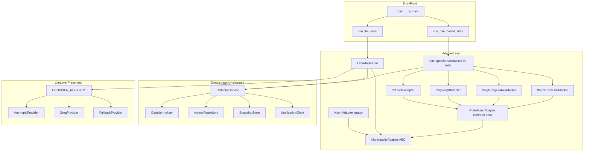
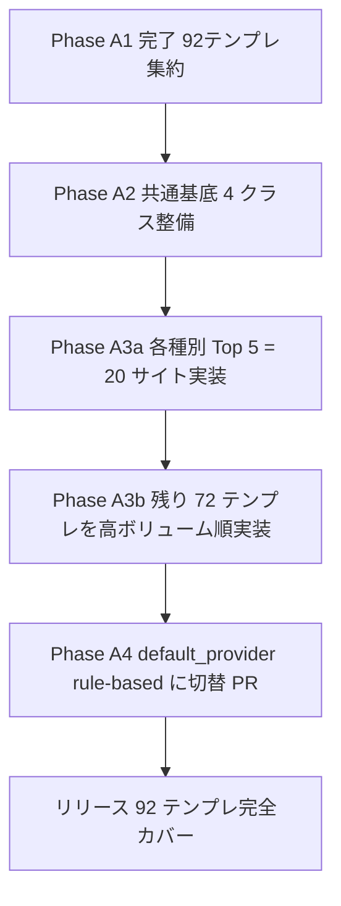
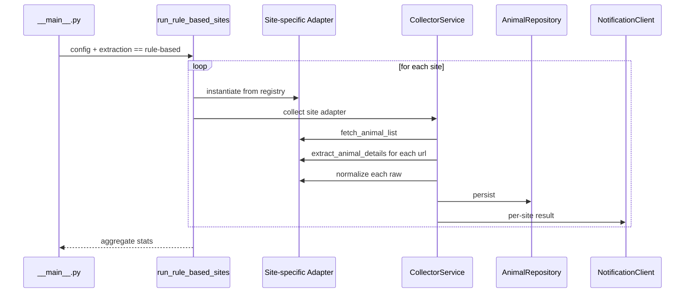
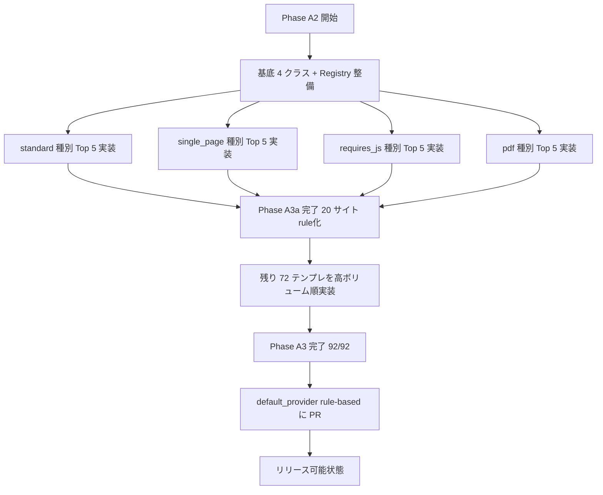

# Technical Design — rule-based-extraction-engine

## Overview

**Purpose**: 既存 oneco データコレクターの抽出方式を、外部 LLM API 依存型から **完全 rule-based 抽出** に移行することで、(a) 月次 LLM API コストを $0 化、(b) 抽出精度の決定論性向上、(c) 個人開発者の燃え尽きリスクを抑える。

**Users**: oneco の運用者本人（プロダクトオーナー兼開発者）と、将来のメンテナンス担当者。

**Impact**: 209 サイト分のデータ収集パイプラインで、`MunicipalityAdapter` ABC を継承する rule-based 派生クラス群が新たに追加される。`CollectorService`、`DataNormalizer`、`AnimalRepository`、通知層など下流コンポーネントは無変更。LLM プロバイダ層 (`anthropic_provider.py` 等) はコード/テスト共に温存され、収益化後の完全 LLM 復帰や rule 破損時のフォールバックに利用可能な状態を維持する。

### Goals
- 92 ユニークテンプレートに対応する rule-based アダプターの実装基盤を整備する
- 既存パイプライン（DB / API / 通知 / フロントエンド）への影響ゼロで段階的に切替可能にする
- LLM プロバイダの復帰経路を 1 PR で完結する状態に保つ
- TDD（HTML スナップショットテスト）で各アダプターの動作を継続的に保証する

### Non-Goals
- LLM プロバイダコードの削除・リファクタリング（温存方針）
- 209 サイトを超える新規サイト対応（既存設定対象に限定）
- フロントエンド・API 層の変更（既存維持）
- robots.txt 対応の新規導入（既存仕様継承）
- データスキーマの変更（`RawAnimalData` / `AnimalData` 既存維持）

## Architecture

### Existing Architecture Analysis

| 層 | 既存実装 | 新仕様での扱い |
|----|---------|---------------|
| Adapter Layer | `MunicipalityAdapter` (ABC) + `KochiAdapter` + `LlmAdapter` | ABC 維持、rule-based 派生群を追加 |
| LLM Layer | `providers/{anthropic,groq,fallback}_provider.py` | 温存、デフォルト降格、必要時 fallback |
| Domain Layer | `DataNormalizer`, `RawAnimalData`, `AnimalData` | 無変更 |
| Orchestration | `CollectorService` | 無変更（ABC 経由で polymorphic） |
| Infrastructure | `AnimalRepository`, `SnapshotStore`, `NotificationClient` | 無変更 |
| Entry Point | `__main__.py` の `run_llm_sites()` | `run_rule_based_sites()` を追加、振り分けロジック更新 |
| Config | `sites.yaml`, `config.py` (`SitesConfig`) | `extraction: "rule-based"` を新値として追加 |

### Architecture Pattern & Boundary Map



**Architecture Integration**:
- **Selected pattern**: Template Method（基底クラスがアルゴリズム骨格、派生がサイト固有 selector を実装）
- **Domain boundaries**: Adapter Layer のみ拡張、Downstream は不変
- **Existing patterns preserved**: `MunicipalityAdapter` ABC、`PROVIDER_REGISTRY` パターン、`extraction: "llm" | "rule-based"` 切替フラグ
- **New components rationale**: 4 つの rule-based 基底クラスは (a) HTTP/HTML/PDF/JS の取得方式の根本的差異、(b) サイト共通処理の重複削減
- **Steering compliance**: `structure.md` の階層的知識管理に準拠、`product.md` の Phase 1 (データアグリゲーション) 範囲内

### Technology Stack

| Layer | Choice / Version | Role in Feature | Notes |
|-------|------------------|-----------------|-------|
| Backend / Services | Python 3.9+ + BeautifulSoup4 | rule-based 抽出主処理 | 既存依存 |
| Backend / Services | Playwright (既存導入済) | requires_js サイト用 | LlmAdapter から移植 |
| Backend / Services | pypdf / pdfplumber (既存導入済) | PDF 抽出用 | LlmAdapter から移植 |
| Data / Storage | Pydantic 2.x | RawAnimalData / AnimalData バリデーション | 既存依存 |
| Infrastructure / Runtime | GitHub Actions | 既存 cron 実行基盤 | 無変更 |
| Tests | pytest + responses | HTML スナップショットテスト | 既存パターン踏襲 |

技術選定の根拠詳細は `research.md` 参照。新規外部依存はゼロ。

## System Flows

### マイグレーション全体フロー



### サイト別実行フロー（rule-based 経路）



抽出失敗時の fallback 経路は per-site `fallback_to_llm: true` がある場合のみ起動し、当該サイトを `LlmAdapter` で再試行する。

## Requirements Traceability

| Requirement | Summary | Components | Interfaces | Flows |
|-------------|---------|------------|------------|-------|
| 1.1 | 4 種類の基底アダプタークラス | RuleBasedAdapter + 4 base | MunicipalityAdapter ABC | — |
| 1.2 | 既存 ABC インターフェース実装 | RuleBasedAdapter | fetch_animal_list / extract_animal_details / normalize | — |
| 1.3 | 共通処理を基底に集約 | RuleBasedAdapter | _http_get / _normalize_url / _normalize_phone | — |
| 1.4 | 派生はサイト固有 selector のみ | Site-specific subclasses | サブクラス変数 | — |
| 1.5 | KochiAdapter 維持 | KochiAdapter (既存) | (変更なし) | — |
| 2.1 | 92 ユニーク全実装 | Site-specific subclasses (92) | — | サイト別実行フロー |
| 2.2 | 同一テンプレート複数サイト共有 | SiteAdapterRegistry | site_key → adapter_class | — |
| 2.3 | サイト別パラメータ切替 | SiteConfig | YAML attribute (list_url, list_link_pattern 等) | — |
| 2.4 | 種別ごとの実装数 | Site-specific subclasses | — | — |
| 2.5 | 新規サイトは sites.yaml 1 行で対応 | SiteConfigLoader, SiteAdapterRegistry | sites.yaml | — |
| 3.1 | サイト別 extraction 指定 | SiteConfig | extraction field | — |
| 3.2 | RawAnimalData 出力 | RuleBasedAdapter | normalize 戻り値 | — |
| 3.3 | 後段処理を変更しない | (Downstream 既存) | — | — |
| 3.4 | default_provider rule-based でデフォルト rule | __main__.py / SitesConfig | extraction.default_provider | — |
| 3.5 | per-site llm 指定で個別 LLM | __main__.py 振り分け | site.extraction == llm | — |
| 3.6 | スナップショット互換 | (SnapshotStore 既存) | — | — |
| 4.1 | LLM プロバイダコード削除しない | anthropic/groq/fallback_provider | (保持) | — |
| 4.2 | PROVIDER_REGISTRY 保持 | __main__.py | PROVIDER_REGISTRY | — |
| 4.3 | LLM 復帰可能 | sites.yaml + __main__.py | extraction.default_provider | マイグレーション全体フロー |
| 4.4 | rule失敗時 LLM フォールバック | RuleBasedAdapter + LlmAdapter | site.fallback_to_llm | — |
| 4.5 | 復帰手順ドキュメント化 | docs/llm-restore.md | — | — |
| 5.1 | HTML スナップショットテスト | tests/adapters/fixtures + tests/adapters/rule_based/ | pytest | — |
| 5.2 | 全フィールド検証 | tests/adapters/fixtures/expected.json | — | — |
| 5.3 | 新規アダプターは fixture 必須 | CONTRIBUTING.md (規約) | — | — |
| 5.4 | CI で全テスト PASS | .github/workflows/data-collector.yml | pytest | — |
| 5.5 | バリデーション失敗で test fail | RawAnimalData (Pydantic) | (既存) | — |
| 6.1 | エラーログに詳細 | RuleBasedAdapter | logger | — |
| 6.2 | 50%未満で Slack 通知 | NotificationClient (既存) | per-site Warning/Critical | — |
| 6.3 | 部分失敗で job 成功 | (run_rule_based_sites 既存準拠) | exit 0 | — |
| 6.4 | 連続 3 回失敗で要修正リスト | RuleBasedAdapter + state file | broken_sites.yaml | — |
| 6.5 | 実行サマリ出力 | run_rule_based_sites | stdout JSON | — |
| 7.1 | 実装済み/未実装混在運用 | __main__.py 振り分け | — | マイグレーション全体フロー |
| 7.2 | 未実装サイトは LLM 継続 | __main__.py | site.extraction default | — |
| 7.3 | 進捗追跡 | scripts/migration_progress.py | — | — |
| 7.4 | PR 単位で段階的ロールアウト | sites.yaml 編集 | — | — |
| 7.5 | リリース達成後の最終 PR | sites.yaml | extraction.default_provider | — |
| 8.1 | rule は LLM より高速 | RuleBasedAdapter | — | — |
| 8.2 | サイトあたり時間上限 | (既存 SITE_TIMEOUT_*) | — | — |
| 8.3 | 既存タイムアウト継承 | (既存 site_timeout) | — | — |
| 8.4 | 6 時間内完了 | run_rule_based_sites | — | — |
| 8.5 | LLM 呼び出し 0 回 | (デフォルト rule-based 時) | — | — |
| 9.1 | 基底クラスドキュメント | docstring + docs/ | — | — |
| 9.2 | 新規サイト追加手順 | docs/add-new-site.md | — | — |
| 9.3 | LLM 復帰手順 | docs/llm-restore.md | — | — |
| 9.4 | テンプレート集約解析の最新化 | scripts/template_analysis_*.md | — | — |
| 9.5 | アダプターにサイト名コメント | site-specific subclass docstring | — | — |

## Components and Interfaces

### Components Summary

| Component | Domain/Layer | Intent | Req Coverage | Key Dependencies (P0/P1) | Contracts |
|-----------|--------------|--------|--------------|--------------------------|-----------|
| RuleBasedAdapter | Adapter base | rule-based 共通処理ハブ | 1.1, 1.2, 1.3 | MunicipalityAdapter (P0), BeautifulSoup (P0) | Service |
| WordPressListAdapter | Adapter base | list+detail 型 WordPress 系基底 | 1.1, 2.4 | RuleBasedAdapter (P0), requests (P0) | Service |
| SinglePageTableAdapter | Adapter base | 1ページ複数動物 (テーブル/カード) | 1.1, 2.4 | RuleBasedAdapter (P0), BeautifulSoup (P0) | Service |
| PlaywrightAdapter | Adapter base | JS必須サイト基底 | 1.1, 2.4 | RuleBasedAdapter (P0), Playwright (P0) | Service |
| PdfTableAdapter | Adapter base | PDF 抽出基底 | 1.1, 2.4 | RuleBasedAdapter (P0), pypdf/pdfplumber (P0) | Service |
| SiteAdapterRegistry | Adapter wiring | site_key → adapter_class マッピング | 2.2, 2.5, 7.4 | site-specific classes (P0) | Service |
| Site-specific subclass × 92 | Adapter impl | サイト固有 selector 定義 | 2.1, 2.4, 9.5 | 4 base classes (P0) | Service |
| run_rule_based_sites | Entry orchestration | rule-based サイト実行ループ | 3.4, 6.3, 6.5, 7.1, 8.4 | SiteAdapterRegistry (P0), CollectorService (P0) | Batch |
| BrokenSitesTracker | Observability | 連続失敗サイト追跡 | 6.4 | — | State |
| (Downstream: CollectorService, DataNormalizer, AnimalRepository, NotificationClient) | (既存) | (無変更) | 3.3, 3.6, 6.2 | — | — |
| (LLM Layer: anthropic/groq/fallback_provider) | (既存・温存) | フォールバック / 復帰用 | 4.1-4.5 | — | — |

### Adapter Base Layer

#### RuleBasedAdapter

| Field | Detail |
|-------|--------|
| Intent | rule-based アダプター群の共通基底（HTTP/HTML/正規化ヘルパー） |
| Requirements | 1.1, 1.2, 1.3 |

**Responsibilities & Constraints**
- 4 つの基底クラス（WordPressList / SinglePageTable / Playwright / PdfTable）の親
- 既存 `MunicipalityAdapter` ABC を継承し抽象メソッドの一部にデフォルト実装を提供
- HTTP/エラー処理 / URL正規化 / 電話番号正規化等の共通ヘルパーを提供
- データ責務はサブクラスに委譲（具体的な抽出ロジックは持たない）

**Dependencies**
- Inbound: 4 つの rule-based 基底クラス — 継承元 (P0)
- Outbound: `MunicipalityAdapter` ABC — 既存インターフェース継承 (P0)
- External: requests (HTTP), BeautifulSoup4 (HTML パース) — (P0)

**Contracts**: Service [x]

##### Service Interface
```python
class RuleBasedAdapter(MunicipalityAdapter):
    """rule-based アダプター共通基底。サイト固有派生はここを継承する。"""

    site_config: SiteConfig

    def __init__(self, site_config: SiteConfig) -> None: ...

    # MunicipalityAdapter の抽象メソッド（派生で具体実装）
    def fetch_animal_list(self) -> list[tuple[str, str]]: ...
    def extract_animal_details(self, detail_url: str, category: str = "adoption") -> RawAnimalData: ...
    def normalize(self, raw_data: RawAnimalData) -> AnimalData: ...

    # 共通ヘルパー（protected）
    def _http_get(self, url: str, *, timeout: int = 30) -> str: ...
    def _absolute_url(self, href: str, base: str | None = None) -> str: ...
    def _normalize_phone(self, raw: str) -> str: ...
    def _filter_image_urls(self, urls: list[str], base_url: str) -> list[str]: ...
```
- Preconditions: `site_config` は `SiteConfigLoader` でバリデーション済み
- Postconditions: `_http_get` 失敗時は `NetworkError` を raise
- Invariants: 子クラスは `super().__init__(site_config)` を必ず呼ぶ

**Implementation Notes**
- Integration: 既存 `KochiAdapter` の private 関数（`_filter_kochi_image_urls` 等）から汎用部分を抽出して移植
- Validation: `RawAnimalData` の Pydantic バリデーションは派生の `extract_animal_details` で必ず呼ぶ
- Risks: 共通ヘルパーが増えすぎてサブクラス可読性が落ちる可能性 → Phase A3 中盤でレビュー

#### WordPressListAdapter

| Field | Detail |
|-------|--------|
| Intent | list ページから detail URL を抽出 → detail ページから RawAnimalData を抽出する典型 WordPress 系の基底 |
| Requirements | 1.1, 2.4 |

**Responsibilities & Constraints**
- 一覧ページの取得 + ページネーション巡回 + detail URL 抽出
- 詳細ページの取得 + サブクラス定義の selector で各フィールドを抽出
- 派生は `LIST_LINK_SELECTOR` / `FIELD_SELECTORS` クラス変数を定義するだけで動作

**Dependencies**
- Inbound: 約 44 個のサイト派生クラス (standard 種別) (P0)
- Outbound: `RuleBasedAdapter` (P0)
- External: BeautifulSoup4, requests (P0)

**Contracts**: Service [x]

##### Service Interface
```python
class WordPressListAdapter(RuleBasedAdapter):
    """list+detail 構造の汎用基底。"""

    LIST_LINK_SELECTOR: str        # detail page link CSS selector
    FIELD_SELECTORS: dict[str, str | list[str]]  # field name -> selector
    PAGINATION_NEXT_SELECTOR: str | None = None

    def fetch_animal_list(self) -> list[tuple[str, str]]: ...
    def extract_animal_details(self, detail_url: str, category: str = "adoption") -> RawAnimalData: ...
    def normalize(self, raw_data: RawAnimalData) -> AnimalData: ...
```
- Preconditions: `LIST_LINK_SELECTOR` と `FIELD_SELECTORS` がサブクラスで定義されている
- Postconditions: 抽出失敗時は `ParsingError` raise（必須フィールドが取れない場合）

**Implementation Notes**
- Integration: `KochiAdapter` の `_extract_from_definition_list` / `_extract_from_table` を共通化
- Validation: `FIELD_SELECTORS` のキーが `RawAnimalData` のフィールド名と一致することを `__init_subclass__` でチェック
- Risks: ページネーション形式の多様性 → Phase A3 で実例追加時に基底拡張

#### SinglePageTableAdapter

| Field | Detail |
|-------|--------|
| Intent | 1 ページに複数動物がテーブル/カードで並ぶ形式（detail ページなし） |
| Requirements | 1.1, 2.4 |

**Responsibilities & Constraints**
- 一覧ページ取得後、テーブル行 or カード要素を反復
- 各要素から RawAnimalData を直接抽出（detail fetch 不要）
- 129 サイトが該当する最大ボリューム種別

**Dependencies**
- Inbound: 約 129 個のサイト派生クラス (single_page 種別) (P0)
- Outbound: `RuleBasedAdapter` (P0)
- External: BeautifulSoup4 (P0)

**Contracts**: Service [x]

##### Service Interface
```python
class SinglePageTableAdapter(RuleBasedAdapter):
    """single_page 形式の汎用基底。"""

    ROW_SELECTOR: str          # 各動物に対応する行/カード要素
    FIELD_SELECTORS: dict[str, str]  # ROW_SELECTOR の中で適用する各フィールド selector

    def fetch_animal_list(self) -> list[tuple[str, str]]: ...  # 仮想 URL を返す
    def extract_animal_details(self, virtual_url: str, category: str = "adoption") -> RawAnimalData: ...
    def normalize(self, raw_data: RawAnimalData) -> AnimalData: ...
```
- Preconditions: `ROW_SELECTOR` で複数要素が取れる
- Postconditions: `fetch_animal_list` は `<list_url>#row=N` 形式の仮想 URL を返す

**Implementation Notes**
- Integration: `LlmAdapter._fetch_page` のキャッシュ機構を流用（同一ページ複数行取得時の HTTP 重複回避）
- Validation: 抽出 0 件は `ParsingError`
- Risks: 各サイトの「ヘッダ行除外」方法が多様 → サブクラスで `SKIP_FIRST_ROW` / `HEADER_FILTER` を定義可能に

#### PlaywrightAdapter

| Field | Detail |
|-------|--------|
| Intent | JS 描画必須サイト用基底（既存 PageFetcher の Playwright 機能を利用） |
| Requirements | 1.1, 2.4 |

**Responsibilities & Constraints**
- 25 サイトが対象
- ブラウザ起動コストを共有（同一 process 内で 1 instance）
- WordPressList / SinglePageTable のいずれかと組合せ可能（mixin 的に）

**Dependencies**
- Inbound: 25 個のサイト派生クラス (P0)
- Outbound: `RuleBasedAdapter` (P0), 既存 `PageFetcher` (P0)
- External: Playwright (P0)

**Contracts**: Service [x]

##### Service Interface
```python
class PlaywrightAdapter(RuleBasedAdapter):
    """JS 必須サイトの汎用基底。"""

    WAIT_SELECTOR: str | None = None  # 描画完了待ち selector

    def fetch_animal_list(self) -> list[tuple[str, str]]: ...
    def extract_animal_details(self, detail_url: str, category: str = "adoption") -> RawAnimalData: ...
    def normalize(self, raw_data: RawAnimalData) -> AnimalData: ...

    def _fetch_with_js(self, url: str) -> str: ...  # Playwright 経由で fetch
```
- Preconditions: Playwright がインストール済み（CI/local 共通）
- Postconditions: 描画完了 or タイムアウト後の HTML 文字列を返す

**Implementation Notes**
- Integration: `LlmAdapter` の `_fetch_page` 内 Playwright 呼出ロジックを `RuleBasedAdapter._fetch_with_js` に移植
- Validation: `WAIT_SELECTOR` がある場合は描画確認、なければ `networkidle` 状態を待つ
- Risks: ブラウザ起動失敗時の挙動 → 既存 `SITE_TIMEOUT_JS_SEC` 仕様に従う

#### PdfTableAdapter

| Field | Detail |
|-------|--------|
| Intent | PDF 内のテーブル/テキストから複数動物情報を抽出 |
| Requirements | 1.1, 2.4 |

**Responsibilities & Constraints**
- 11 サイトが対象（うち pdf_multi_animal=true は 1 PDF から複数動物）
- PDF ダウンロード + テキスト抽出 + 行/列パース

**Dependencies**
- Inbound: 11 個のサイト派生クラス (P0)
- Outbound: `RuleBasedAdapter` (P0)
- External: pypdf or pdfplumber (P0), requests (P0)

**Contracts**: Service [x]

##### Service Interface
```python
class PdfTableAdapter(RuleBasedAdapter):
    """PDF 抽出の汎用基底。"""

    PDF_LINK_SELECTOR: str             # 一覧ページから PDF リンクを取る
    PDF_PARSER: type[PdfParserBase]    # サブクラスごとの解析戦略

    def fetch_animal_list(self) -> list[tuple[str, str]]: ...
    def extract_animal_details(self, pdf_virtual_url: str, category: str = "adoption") -> RawAnimalData: ...

    def _download_pdf(self, url: str) -> bytes: ...
    def _parse_pdf_text(self, pdf_bytes: bytes) -> list[dict]: ...  # 1 PDF -> 動物 dict のリスト
```
- Preconditions: PDF が解析可能なテキスト形式（OCR 不要）
- Postconditions: `_parse_pdf_text` 失敗時は `ParsingError`

**Implementation Notes**
- Integration: 既存 `PdfFetcher` の取得ロジックは流用
- Validation: PDF 解析結果が 0 件 → `ParsingError`
- Risks: スキャン PDF（画像）への対応は範囲外（既存 LLM fallback で対応）

### Adapter Wiring

#### SiteAdapterRegistry

| Field | Detail |
|-------|--------|
| Intent | sites.yaml の各サイトに対応する rule-based 派生クラスを引く |
| Requirements | 2.2, 2.5, 7.4 |

**Responsibilities & Constraints**
- サイト名 → adapter_class のマッピング保持
- 未実装サイトは `KeyError` ではなく `None` を返し、呼出側で LLM fallback 判定可能に
- マッピング定義はモジュール import 時に静的に構築

**Dependencies**
- Inbound: `run_rule_based_sites` (P0)
- Outbound: 92 サイト派生クラス (P0)

**Contracts**: Service [x]

##### Service Interface
```python
class SiteAdapterRegistry:
    """site name -> rule-based adapter class マッピング。"""

    _registry: dict[str, type[RuleBasedAdapter]]

    @classmethod
    def register(cls, site_name: str, adapter_cls: type[RuleBasedAdapter]) -> None: ...

    @classmethod
    def get(cls, site_name: str) -> type[RuleBasedAdapter] | None: ...

    @classmethod
    def all_registered(cls) -> list[str]: ...

    @classmethod
    def coverage_stats(cls, all_site_names: list[str]) -> dict[str, int]: ...
    # returns: {"total": 209, "rule_based": 130, "llm_only": 79}
```
- Preconditions: 派生クラスが import されている（`adapters/rule_based/__init__.py` で集中 import）
- Postconditions: `register` は重複登録を `ValueError` で拒否

**Implementation Notes**
- Integration: 派生クラスは `@SiteAdapterRegistry.register("サイト名", MyAdapter)` decorator で登録、または `__init_subclass__` で自動登録
- Validation: site_name は `sites.yaml` の `name` と完全一致
- Risks: タイポによる未マッチ → Phase A3 終盤で `coverage_stats` を CI で検証

### Entry Orchestration

#### run_rule_based_sites

| Field | Detail |
|-------|--------|
| Intent | rule-based マークされたサイト群を順次実行する |
| Requirements | 3.4, 6.3, 6.5, 7.1, 8.4 |

**Responsibilities & Constraints**
- `__main__.py` に追加される関数
- 既存 `run_llm_sites` と並列、`extraction == "rule-based"` のサイトのみ処理
- 部分失敗で exit 0 維持
- per-site タイムアウト適用（既存 `site_timeout` 流用）
- 実行サマリ JSON を stdout に出力

**Dependencies**
- Inbound: `__main__.py` の `main()` (P0)
- Outbound: `SiteAdapterRegistry`, `CollectorService` (P0)
- External: 既存 `SnapshotStore` / `NotificationClient` (P0)

**Contracts**: Batch [x]

##### Batch / Job Contract
- **Trigger**: `__main__.py` の `main()` から呼出（既存 cron 経由）
- **Input / validation**: `SitesConfig`, `SnapshotStore`, `DiffDetector` 等を引数で受け取る
- **Output / destination**: site-by-site の `dict[str, int]` (新規/更新/削除候補) を返す
- **Idempotency & recovery**: 既存スナップショット差分検知の冪等性に依存

**Implementation Notes**
- Integration: `run_llm_sites` のシグネチャを真似る（戻り値も含めて互換）
- Validation: `extraction == "rule-based"` かつ `SiteAdapterRegistry.get(site.name)` is not None で実行対象
- Risks: 1 サイト失敗が全体を止めないよう `try/except` を per-site で必ず捕捉

#### BrokenSitesTracker

| Field | Detail |
|-------|--------|
| Intent | 連続失敗サイトの追跡（要修正リスト管理） |
| Requirements | 6.4 |

**Responsibilities & Constraints**
- ローカルファイル `data/broken_sites.yaml` で永続化
- 連続失敗回数 ≥ 3 のサイトを「要修正」マーク
- 1 回でも成功したらカウンタリセット

**Dependencies**
- Inbound: `run_rule_based_sites` (P0)
- Outbound: ファイルシステム (P1)

**Contracts**: State [x]

##### State Management
- **State model**: `{site_name: {consecutive_failures: int, last_error: str, last_failed_at: datetime}}`
- **Persistence & consistency**: YAML ファイルに同期書込（並行実行なしの前提）
- **Concurrency strategy**: collector は単一プロセス前提、並行制御不要

**Implementation Notes**
- Integration: 既存 Slack 通知と組み合わせ（連続 3 回で Critical 通知）
- Validation: 不正 YAML 検知時は空状態で初期化
- Risks: ファイル消失で履歴が失われるが許容（Snapshot に類似）

## Data Models

### Logical Data Model

新規データテーブル/スキーマ追加なし。既存 `RawAnimalData` / `AnimalData` を引き続き使用する。

新規ローカルファイル:

```yaml
# data/broken_sites.yaml
"高知県動物愛護センター":
  consecutive_failures: 0
  last_error: ""
  last_failed_at: null
"福岡県動物愛護協会（保健所収容犬）":
  consecutive_failures: 3
  last_error: "ParsingError: required field 'name' missing"
  last_failed_at: "2026-05-16T03:14:22+09:00"
```

`sites.yaml` への新規フィールド追加:

| Field | Type | Default | Purpose | Requirement |
|-------|------|---------|---------|-------------|
| `extraction` | enum: `"llm" \| "rule-based"` | `default_provider` の値で決まる | サイト別 extraction 方式上書き | 3.1 |
| `fallback_to_llm` | bool | `false` | rule失敗時に LLM 再試行 | 4.4 |

`SitesConfig.extraction.default_provider` に `"rule-based"` を追加（既存 `"anthropic" / "groq"` と並列の許容値）。

## Error Handling

### Error Strategy

rule-based 抽出のエラーは 4 段階で扱う:

1. **NetworkError** (HTTP 失敗): リトライ → 失敗時はサイトスキップ + ログ
2. **ParsingError** (selector 不一致): サイトスキップ + per-site Slack 通知 + BrokenSitesTracker++
3. **ValidationError** (RawAnimalData バリデーション失敗): 動物単位スキップ + ログ
4. **SiteCollectionTimeoutError** (タイムアウト): サイトスキップ + ログ（既存仕様）

### Error Categories and Responses

- **System Errors (NetworkError, Timeout)**: 既存 `CollectorService` のリトライ + skip ロジックに従う
- **Business Logic Errors (ParsingError)**: BrokenSitesTracker に記録、連続 3 回で Critical 通知
- **Data Validation Errors (ValidationError)**: 個別動物 skip、サイト全体は継続

### Monitoring

- ログレベル: `WARNING`（個別失敗） / `ERROR`（サイト全失敗） / `CRITICAL`（連続 3 回失敗）
- 既存 `NotificationClient` の Slack 連携をそのまま使用
- 実行サマリ JSON を CI ログに出力（grep で進捗確認可能）

## Testing Strategy

### Unit Tests
1. `RuleBasedAdapter._http_get` のリトライ + タイムアウト
2. `RuleBasedAdapter._normalize_phone` のフォーマット網羅
3. `WordPressListAdapter.fetch_animal_list` のページネーション挙動
4. `SinglePageTableAdapter.extract_animal_details` の row 解析（ヘッダ除外含む）
5. `PdfTableAdapter._parse_pdf_text` の複数動物分割

### Integration Tests
1. 各種別 1 サイト分の adapter で「fetch → normalize → AnimalData 出力」エンドツーエンド
2. `SiteAdapterRegistry` 経由で `run_rule_based_sites` を mock 環境で呼出
3. `extraction: "llm"` と `extraction: "rule-based"` 混在時の振り分け
4. `fallback_to_llm: true` で rule 失敗 → LLM 再試行の経路
5. BrokenSitesTracker の連続失敗カウント + 通知発火

### Adapter-Level Snapshot Tests
- 各 92 個の派生 adapter ごとに `tests/adapters/fixtures/{site_slug}/list.html` + `expected.json` を用意
- TDD で「fixture を用意 → 期待 JSON 定義 → adapter 実装 → test pass」サイクル
- HTTP は `responses` ライブラリで stub

### Performance Tests
1. 1 サイト平均処理時間が LLM 抽出比 50% 以下になること（標本: kochi, takamatsu, ehime）
2. 209 サイト全件で 6 時間以内完了（CI）
3. ブラウザ起動コスト（Playwright）が requires_js サイト 25 件で 1 時間以内

## Migration Strategy



**ロールバック条件**:
- ある adapter が本番環境で連続 3 回失敗 → 当該サイトを `extraction: "llm"` に戻す PR で即時救済
- 92/92 達成前にプロジェクト中止判断 → `default_provider: groq` に戻すだけで全件 LLM 抽出に戻る

**バリデーションチェックポイント**:
- 各種別 5 サイト実装時点で「全種別動く」を CI で確認
- 50/92 達成時点で snapshot test 全 PASS を確認
- 92/92 達成時点で 1 週間連続クリーンランを観察してからリリース最終 PR
