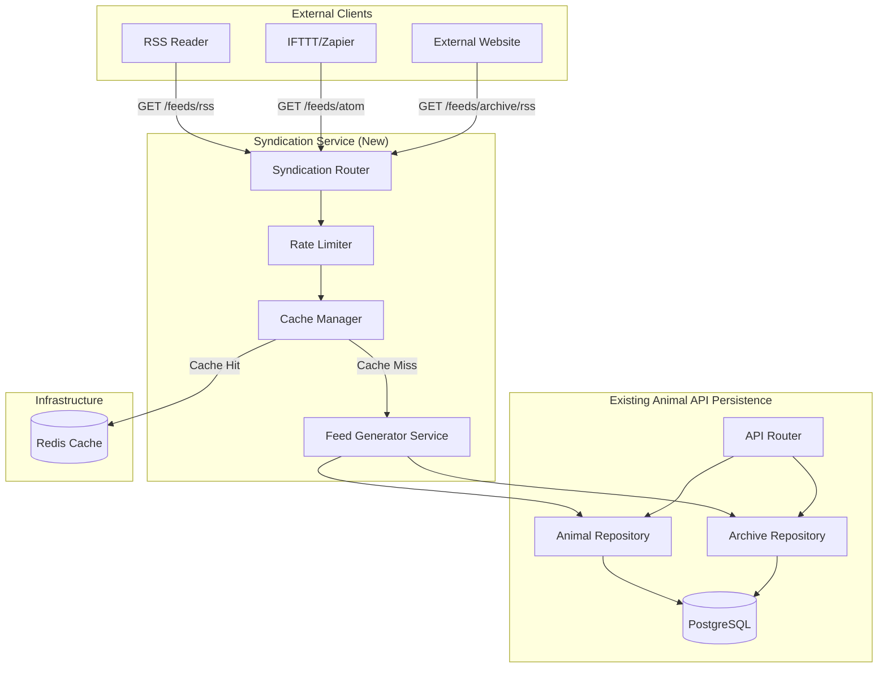
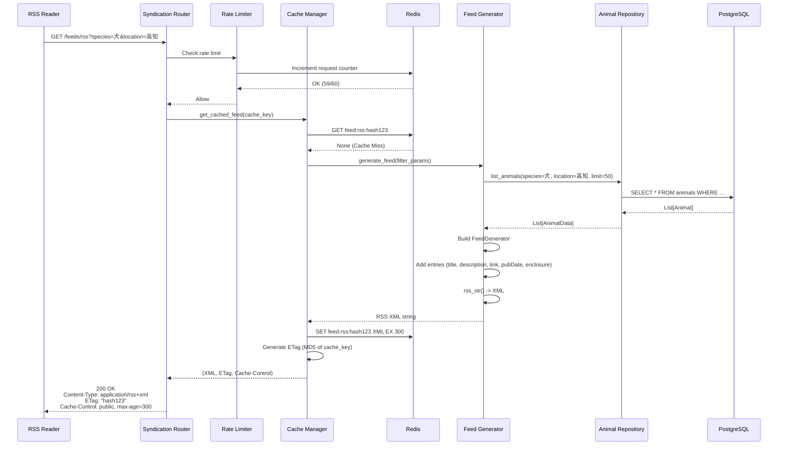
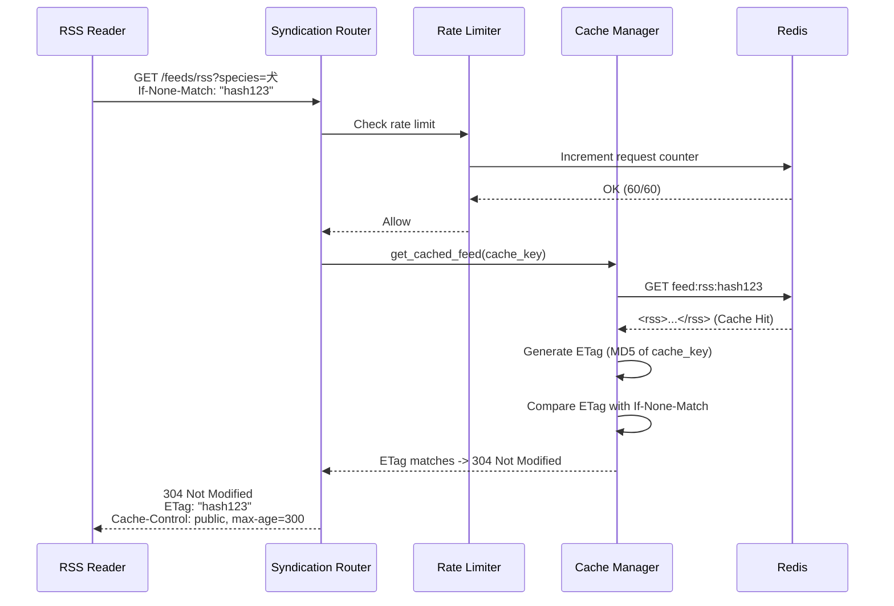

# Technical Design Document: syndication-service

## Overview

syndication-service は、既存の animal-api-persistence REST API を活用し、保護動物データを RSS 2.0 / Atom 1.0 フィード形式で外部配信するサービスです。ユーザーが指定したフィルタ条件（種別、カテゴリ、地域、ステータス等）に基づいて動的にフィードを生成し、RSS リーダーや外部サービス（IFTTT、Zapier 等）を通じた自動通知を可能にします。

**Purpose**: RSS/Atom フィード配信により、ユーザーが保護動物情報を自動購読し、外部サービス連携や他サイト埋め込みを実現します。

**Users**:
- **一般ユーザー**: RSS リーダーで特定条件（例: 高知県の犬）の新着情報を購読
- **外部サービス開発者**: IFTTT/Zapier 経由で自動通知フローを構築
- **ウェブサイト管理者**: 自サイトに特定条件のフィードを埋め込み

**Impact**: 既存の animal-api-persistence に `/feeds` エンドポイントを追加し、データ配信チャネルを拡張します。既存 API の動作には影響しません。

### Goals

- RSS 2.0 / Atom 1.0 標準準拠フィードの動的生成
- フィルタリング条件（種別、カテゴリ、地域、ステータス、性別）のサポート
- 5分間のサーバーサイドキャッシング + ETag による HTTP キャッシング
- アーカイブフィード（譲渡済み/返還済み動物）の生成
- レート制限（60 req/min）とセキュリティ対策
- パフォーマンス目標達成（キャッシュヒット: 50ms、キャッシュミス: 500ms）

### Non-Goals

- カスタムフィードフォーマット（JSON フィードは対象外）
- プッシュ通知機能（notification-manager の責務）
- フィード購読者管理機能（外部 RSS リーダーに委任）
- 過去データの遡及配信（現在のデータのみ、アーカイブは別エンドポイント）
- WebSub（PubSubHubbub）プロトコル対応（将来検討）

## Architecture

### Existing Architecture Analysis

**既存システム**:
- **animal-api-persistence**: FastAPI ベースの REST API
  - エンドポイント: `GET /animals`, `GET /animals/{id}`, `GET /archive/animals`
  - データベース: PostgreSQL（AsyncSession）
  - リポジトリパターン: `AnimalRepository`, `ArchiveRepository`
  - CORS 設定済み、構造化ログ実装済み

**統合ポイント**:
- 既存 FastAPI アプリに `/feeds` ルーターを追加
- AnimalRepository を直接使用（httpx 経由ではなく DB 直接アクセス）
- DatabaseConnection のライフサイクル管理を共有

**技術債への対応**:
- 既存の API エラーハンドリングパターンを踏襲
- 既存のログ設定（`src/data_collector/infrastructure/logging_config.py`）を再利用

### Architecture Pattern & Boundary Map

**選択パターン**: Layered Architecture + Repository Pattern（既存パターン踏襲）

**Domain/Feature Boundaries**:
- **Syndication Layer**: フィード生成とキャッシング（新規）
- **API Persistence Layer**: データ永続化と REST API（既存、変更なし）
- **Data Collection Layer**: データ収集（既存、変更なし）

**新規コンポーネント**:
- `FeedGenerator Service`: python-feedgen ラッパー、RSS/Atom XML 生成
- `CacheManager Service`: Redis キャッシング、ETag 管理
- `RateLimiter Middleware`: slowapi による IP ベースレート制限
- `SyndicationRouter`: FastAPI ルーター、エンドポイント定義



**Key Decisions**:
- 既存 FastAPI アプリに統合（別マイクロサービスではない）
- AnimalRepository を直接呼び出し（httpx 経由ではない）
- Redis による共有キャッシュストア（複数インスタンス対応）
- python-feedgen で標準準拠フィード生成

### Technology Stack

| Layer | Choice / Version | Role in Feature | Notes |
|-------|------------------|-----------------|-------|
| Backend / Services | FastAPI (既存) | HTTP フレームワーク、ルーティング | 既存 app に `/feeds` ルーター追加 |
| Feed Generation | python-feedgen 1.0.0+ | RSS 2.0 / Atom 1.0 XML 生成 | W3C / RFC 4287 準拠保証 |
| Data / Storage | PostgreSQL (既存) | 動物データ永続化 | AnimalRepository 経由でアクセス |
| Caching | Redis 7.x + fastapi-cache2 | フィードキャッシング（5分TTL） | 非同期対応、ETag サポート |
| Rate Limiting | slowapi | IP ベースレート制限（60 req/min） | X-RateLimit-* ヘッダー自動設定 |
| Infrastructure / Runtime | uvicorn (既存) | ASGI サーバー | 既存デプロイ環境を維持 |

**Rationale**:
- **python-feedgen**: RSS/Atom 両対応、標準準拠、活発なメンテナンス（詳細は `research.md` 参照）
- **fastapi-cache2**: 非同期 Redis サポート、デコレータベースで FastAPI と統合が自然
- **slowapi**: FastAPI 専用レート制限ライブラリ、Redis バックエンド対応

## System Flows

### フィード生成フロー（キャッシュミス時）



### フィード生成フロー（キャッシュヒット + ETag 一致時）



**Key Decisions**:
- キャッシュキー: `feed:{format}:{filter_hash}`（format: rss/atom、filter_hash: MD5(params)）
- ETag 生成: cache_key の MD5 ハッシュ（衝突確率は無視可能）
- Redis 障害時: キャッシュをスキップし、直接フィード生成（graceful degradation）

## Requirements Traceability

| Requirement | Summary | Components | Interfaces | Flows |
|-------------|---------|------------|------------|-------|
| 1.1 | RSS 2.0 フィード生成（/feeds/rss） | FeedGenerator, SyndicationRouter | Service, API | フィード生成フロー |
| 1.2 | Atom 1.0 フィード生成（/feeds/atom） | FeedGenerator, SyndicationRouter | Service, API | フィード生成フロー |
| 1.3 | item/entry メタデータ（タイトル、説明、リンク、pubDate、GUID） | FeedGenerator | Service | - |
| 1.4 | RSS チャンネル情報（title, description, link） | FeedGenerator | Service | - |
| 1.5 | Atom フィード情報（title, subtitle, link, id, updated） | FeedGenerator | Service | - |
| 1.6 | Content-Type ヘッダー設定 | SyndicationRouter | API | - |
| 1.7 | 画像埋め込み（enclosure タグ） | FeedGenerator | Service | - |
| 2.1~2.8 | フィルタリング（species, category, location, status, sex） | SyndicationRouter, AnimalRepository | API, Service | - |
| 3.1~3.6 | ページネーション（limit, offset, ソート、TTL） | SyndicationRouter, FeedGenerator | API, Service | - |
| 4.1~4.7 | キャッシング（Redis, ETag, Cache-Control, 304） | CacheManager | Service | キャッシュヒットフロー |
| 5.1~5.7 | エラーハンドリング（タイムアウト、5xx/4xx、ログ） | SyndicationRouter, ErrorHandler | API | - |
| 6.1~6.7 | アーカイブフィード（/feeds/archive/*） | FeedGenerator, ArchiveRepository | Service, API | フィード生成フロー |
| 7.1~7.7 | ヘルスチェック（/health、メトリクス） | HealthCheckRouter, MetricsCollector | API, Service | - |
| 8.1~8.7 | セキュリティ（レート制限、パラメータ検証、HTTPS） | RateLimiter, InputValidator | Middleware, Service | - |
| 9.1~9.7 | フィード検証（W3C/RFC準拠、XML エスケープ） | FeedGenerator | Service | - |
| 10.1~10.6 | パフォーマンス（50ms/500ms、同時100req） | CacheManager, AnimalRepository | Service | - |

## Components and Interfaces

### Component Summary

| Component | Domain/Layer | Intent | Req Coverage | Key Dependencies (P0/P1) | Contracts |
|-----------|--------------|--------|--------------|--------------------------|-----------|
| SyndicationRouter | API | フィードエンドポイント提供 | 1, 2, 3, 5, 6 | FeedGenerator (P0), CacheManager (P0), AnimalRepository (P0) | API |
| FeedGenerator | Service | RSS/Atom XML 生成 | 1, 2, 3, 6, 9 | python-feedgen (P0), AnimalRepository (P0) | Service |
| CacheManager | Service | Redis キャッシング + ETag 管理 | 4, 10 | Redis (P0), fastapi-cache2 (P0) | Service |
| RateLimiter | Middleware | IP ベースレート制限 | 8 | slowapi (P0), Redis (P0) | Middleware |
| HealthCheckRouter | API | ヘルスチェックエンドポイント | 7 | Redis (P1), AnimalRepository (P1) | API |
| MetricsCollector | Service | メトリクス記録 | 7 | - | Service |
| InputValidator | Service | クエリパラメータ検証 | 8 | - | Service |

### API Layer

#### SyndicationRouter

| Field | Detail |
|-------|--------|
| Intent | RSS/Atom フィードエンドポイントを提供し、フィルタリング、キャッシング、レート制限を統合 |
| Requirements | 1.1, 1.2, 1.6, 2.1, 2.2, 2.3, 2.4, 2.5, 2.6, 2.7, 2.8, 3.1, 3.2, 3.3, 5.1, 5.2, 5.3, 5.4, 6.1, 6.2 |

**Responsibilities & Constraints**
- `/feeds/rss`, `/feeds/atom`, `/feeds/archive/rss`, `/feeds/archive/atom` エンドポイントを定義
- クエリパラメータ（species, category, location, status, sex, limit）をバリデーション
- FeedGenerator を呼び出してフィード生成
- CacheManager を使用してキャッシュ制御と ETag 処理
- エラーレスポンス（400, 429, 502, 504）を返却

**Dependencies**
- Inbound: 外部クライアント（RSS Reader, IFTTT/Zapier） — HTTP リクエスト (P0)
- Outbound: FeedGenerator — フィード生成依頼 (P0)
- Outbound: CacheManager — キャッシュ取得/保存 (P0)
- Outbound: AnimalRepository — データ取得（CacheManager 経由） (P0)
- External: slowapi — レート制限適用 (P0)

**Contracts**: [x] API [ ] Event [ ] Batch [ ] State

##### API Contract

| Method | Endpoint | Request | Response | Errors |
|--------|----------|---------|----------|--------|
| GET | /feeds/rss | FeedQueryParams | RSS 2.0 XML (application/rss+xml) | 400, 429, 502, 504 |
| GET | /feeds/atom | FeedQueryParams | Atom 1.0 XML (application/atom+xml) | 400, 429, 502, 504 |
| GET | /feeds/archive/rss | ArchiveFeedQueryParams | RSS 2.0 XML (application/rss+xml) | 400, 429, 502, 504 |
| GET | /feeds/archive/atom | ArchiveFeedQueryParams | Atom 1.0 XML (application/atom+xml) | 400, 429, 502, 504 |

**FeedQueryParams**:
```python
class FeedQueryParams(BaseModel):
    species: Optional[str] = Query(None, description="種別フィルタ ('犬', '猫', 'その他')")
    category: Optional[str] = Query(None, description="カテゴリフィルタ ('adoption', 'lost')")
    location: Optional[str] = Query(None, description="地域フィルタ（部分一致）")
    status: Optional[str] = Query(None, description="ステータスフィルタ ('sheltered', 'adopted', 'returned', 'deceased')")
    sex: Optional[str] = Query(None, description="性別フィルタ ('男の子', '女の子', '不明')")
    limit: int = Query(50, le=100, ge=1, description="アイテム数（最大100）")
```

**ArchiveFeedQueryParams**:
```python
class ArchiveFeedQueryParams(BaseModel):
    species: Optional[str] = Query(None)
    location: Optional[str] = Query(None)
    archived_from: Optional[date] = Query(None, description="アーカイブ開始日")
    archived_to: Optional[date] = Query(None, description="アーカイブ終了日")
    limit: int = Query(50, le=100, ge=1)
```

**Response Headers**:
- `Content-Type: application/rss+xml; charset=utf-8` (RSS) / `application/atom+xml; charset=utf-8` (Atom)
- `ETag: "{hash}"`
- `Cache-Control: public, max-age=300`
- `X-RateLimit-Limit: 60`
- `X-RateLimit-Remaining: {remaining}`
- `X-RateLimit-Reset: {timestamp}`

**Implementation Notes**
- **Integration**: 既存 `app.py` の `create_app()` で `app.include_router(syndication_router, prefix="/feeds", tags=["syndication"])`
- **Validation**: `limit > 100` → 400 エラー、`species` が無効値 → 400 エラー
- **Risks**: Redis 障害時にキャッシュが使用不可 → CacheManager が graceful degradation でフォールバック

#### HealthCheckRouter

| Field | Detail |
|-------|--------|
| Intent | サービス稼働状況とメトリクスを提供 |
| Requirements | 7.1, 7.2, 7.3, 7.4, 7.5, 7.6, 7.7 |

**Responsibilities & Constraints**
- `/health` エンドポイントで稼働状態を返却
- Redis 接続確認、animal-api-persistence 接続確認（DB クエリ）
- メトリクス（フィード生成数、キャッシュヒット率、レスポンスタイム）を記録

**Dependencies**
- Outbound: Redis — 接続確認 (P1)
- Outbound: AnimalRepository — DB接続確認 (P1)
- Outbound: MetricsCollector — メトリクス取得 (P0)

**Contracts**: [x] API [ ] Event [ ] Batch [ ] State

##### API Contract

| Method | Endpoint | Request | Response | Errors |
|--------|----------|---------|----------|--------|
| GET | /health | - | HealthCheckResponse (JSON) | 503 |

**HealthCheckResponse**:
```python
class HealthCheckResponse(BaseModel):
    status: str  # "healthy" / "degraded" / "unhealthy"
    timestamp: datetime
    upstream_api_status: str  # "ok" / "error"
    cache_status: str  # "ok" / "error"
    metrics: Optional[MetricsSnapshot] = None
```

**MetricsSnapshot**:
```python
class MetricsSnapshot(BaseModel):
    feed_generation_count_1h: int
    cache_hit_rate: float  # 0.0 ~ 1.0
    response_time_p50: float
    response_time_p95: float
    response_time_p99: float
```

**Implementation Notes**
- **Integration**: `/health` エンドポイントを FastAPI アプリに追加
- **Validation**: Redis/DB 接続失敗時は status を "unhealthy" に設定し、503 を返却
- **Risks**: ヘルスチェックが頻繁に呼ばれると DB 負荷増加 → 軽量クエリ（SELECT 1）を使用

### Service Layer

#### FeedGenerator

| Field | Detail |
|-------|--------|
| Intent | AnimalData / ArchivedAnimalData から RSS 2.0 / Atom 1.0 準拠の XML フィードを生成 |
| Requirements | 1.1, 1.2, 1.3, 1.4, 1.5, 1.7, 3.4, 3.5, 3.6, 6.3, 6.4, 6.7, 9.1, 9.2, 9.3, 9.4, 9.5, 9.6, 9.7 |

**Responsibilities & Constraints**
- python-feedgen の FeedGenerator インスタンスを構築
- RSS チャンネル情報 / Atom フィード情報を設定（title, link, description/subtitle）
- 各動物データを `add_entry()` でアイテム化（title, link, description, pubDate, guid/id, enclosure）
- XML エスケープ処理と CDATA セクション対応
- `rss_str()` / `atom_str()` で XML 文字列を返却

**Dependencies**
- Outbound: python-feedgen.FeedGenerator — RSS/Atom XML 生成 (P0)
- Inbound: SyndicationRouter — フィード生成依頼 (P0)

**Contracts**: [x] Service [ ] API [ ] Event [ ] Batch [ ] State

##### Service Interface

```python
from typing import List, Literal
from src.data_collector.domain.models import AnimalData
from src.data_collector.infrastructure.api.schemas import ArchivedAnimalPublic

class FeedGenerator:
    def generate_rss(
        self,
        animals: List[AnimalData],
        filter_params: dict,
        feed_type: Literal["active", "archive"] = "active"
    ) -> str:
        """
        RSS 2.0 フィードを生成

        Args:
            animals: 動物データリスト
            filter_params: フィルタ条件（タイトル/説明に反映）
            feed_type: "active" または "archive"

        Returns:
            RSS 2.0 XML 文字列

        Raises:
            FeedGenerationError: フィード生成失敗時
        """
        pass

    def generate_atom(
        self,
        animals: List[AnimalData],
        filter_params: dict,
        feed_type: Literal["active", "archive"] = "active"
    ) -> str:
        """
        Atom 1.0 フィードを生成

        Args:
            animals: 動物データリスト
            filter_params: フィルタ条件（タイトル/説明に反映）
            feed_type: "active" または "archive"

        Returns:
            Atom 1.0 XML 文字列

        Raises:
            FeedGenerationError: フィード生成失敗時
        """
        pass
```

**Preconditions**:
- `animals` は空でも可（0件のフィードを生成）
- `filter_params` は辞書形式（species, category, location 等）

**Postconditions**:
- RSS 2.0 / Atom 1.0 標準準拠の XML 文字列を返却
- `<?xml version="1.0" encoding="utf-8"?>` 宣言を含む
- 特殊文字（`<`, `>`, `&`, `"`, `'`）が XML エスケープされている

**Invariants**:
- `<guid isPermaLink="false">` には source_url の MD5 ハッシュを使用
- `<id>` には `tag:example.com,2026-02-02:/animals/{hash}` 形式を使用
- 画像 URL が存在する場合、`<enclosure>` / `<link rel="enclosure">` タグを追加

**Implementation Notes**
- **Integration**: python-feedgen の `FeedGenerator` クラスを初期化し、`fg.rss_str()` / `fg.atom_str()` で XML を取得
- **Validation**: 動物データの `source_url` が必須（欠損時は FeedGenerationError）
- **Risks**: 大量のアイテム（100件）で XML 生成に時間がかかる → パフォーマンステストで検証

#### CacheManager

| Field | Detail |
|-------|--------|
| Intent | Redis による フィードキャッシング と ETag 管理 |
| Requirements | 4.1, 4.2, 4.3, 4.4, 4.5, 4.6, 4.7, 10.1, 10.2 |

**Responsibilities & Constraints**
- フィードキャッシュの保存・取得（TTL: 5分）
- キャッシュキー生成（`feed:{format}:{filter_hash}`）
- ETag 生成（キャッシュキーの MD5 ハッシュ）
- `If-None-Match` ヘッダーチェックと 304 レスポンス判定
- Redis 障害時の graceful degradation（キャッシュスキップ）

**Dependencies**
- External: Redis — キャッシュストレージ (P0)
- External: fastapi-cache2 — キャッシングライブラリ (P0)
- Inbound: SyndicationRouter — キャッシュ取得/保存依頼 (P0)

**Contracts**: [x] Service [ ] API [ ] Event [ ] Batch [ ] State

##### Service Interface

```python
from typing import Optional, Tuple
from hashlib import md5

class CacheManager:
    def __init__(self, redis_url: str):
        """
        Args:
            redis_url: Redis 接続 URL（例: redis://localhost:6379/0）
        """
        pass

    def get_cached_feed(
        self,
        format: Literal["rss", "atom"],
        filter_params: dict,
        if_none_match: Optional[str] = None
    ) -> Tuple[Optional[str], Optional[str], bool]:
        """
        キャッシュからフィードを取得

        Args:
            format: "rss" または "atom"
            filter_params: フィルタ条件（キャッシュキー生成用）
            if_none_match: If-None-Match ヘッダー値（ETag）

        Returns:
            (feed_xml, etag, is_304)
            - feed_xml: キャッシュされたフィード XML（None の場合はキャッシュミス）
            - etag: 生成された ETag
            - is_304: If-None-Match が一致した場合 True（304 返却）
        """
        pass

    def save_cached_feed(
        self,
        format: Literal["rss", "atom"],
        filter_params: dict,
        feed_xml: str
    ) -> str:
        """
        フィードを Redis にキャッシュ

        Args:
            format: "rss" または "atom"
            filter_params: フィルタ条件（キャッシュキー生成用）
            feed_xml: フィード XML 文字列

        Returns:
            etag: 生成された ETag
        """
        pass

    def _generate_cache_key(self, format: str, filter_params: dict) -> str:
        """キャッシュキー生成: feed:{format}:{filter_hash}"""
        param_str = f"{format}:{sorted(filter_params.items())}"
        hash_value = md5(param_str.encode()).hexdigest()
        return f"feed:{format}:{hash_value}"

    def _generate_etag(self, cache_key: str) -> str:
        """ETag 生成: MD5(cache_key)"""
        return f'"{md5(cache_key.encode()).hexdigest()}"'
```

**Preconditions**:
- Redis が起動している（障害時は graceful degradation）
- `filter_params` は辞書形式

**Postconditions**:
- キャッシュヒット時: (feed_xml, etag, False) を返却
- ETag 一致時: (None, etag, True) を返却（304 レスポンス）
- キャッシュミス時: (None, None, False) を返却

**Invariants**:
- キャッシュ TTL は 300秒（5分）
- ETag は必ず `"` で囲まれた文字列（RFC 準拠）

**Implementation Notes**
- **Integration**: fastapi-cache2 の `@cache(expire=300)` デコレータを使用
- **Validation**: Redis 接続失敗時は例外をキャッチし、(None, None, False) を返却（キャッシュスキップ）
- **Risks**: Redis maxmemory 超過時に古いキーが削除される → maxmemory-policy を allkeys-lru に設定

#### RateLimiter (Middleware)

| Field | Detail |
|-------|--------|
| Intent | IP ベースのレート制限を適用し、悪用を防止 |
| Requirements | 8.1, 8.2, 8.3 |

**Responsibilities & Constraints**
- slowapi を使用して IP アドレスごとのリクエスト数を制限（60 req/min）
- `X-RateLimit-Limit`, `X-RateLimit-Remaining`, `X-RateLimit-Reset` ヘッダーを自動設定
- レート制限超過時に 429 Too Many Requests と `Retry-After` ヘッダーを返却

**Dependencies**
- External: slowapi — レート制限ライブラリ (P0)
- External: Redis — カウンターストレージ (P0)

**Contracts**: [ ] Service [ ] API [ ] Event [ ] Batch [ ] State

**Implementation Notes**
- **Integration**: `app.py` で `limiter = Limiter(key_func=get_remote_address, storage_uri=redis_url)` を初期化し、`app.state.limiter = limiter` で登録
- **Validation**: Redis 障害時はレート制限を無効化し、警告ログを記録
- **Risks**: IP アドレスが NAT で共有される場合、複数ユーザーが同じ制限を受ける → 許容範囲

#### InputValidator

| Field | Detail |
|-------|--------|
| Intent | クエリパラメータのバリデーションとサニタイゼーション |
| Requirements | 8.4, 8.5, 8.6 |

**Responsibilities & Constraints**
- クエリパラメータの最大長チェック（1000文字）
- 悪意のある文字列検出（SQL インジェクション、XSS 等）
- 無効なパラメータ値のチェック（species, category, status, sex の有効値）

**Dependencies**
- Inbound: SyndicationRouter — バリデーション依頼 (P0)

**Contracts**: [x] Service [ ] API [ ] Event [ ] Batch [ ] State

##### Service Interface

```python
from fastapi import HTTPException

class InputValidator:
    VALID_SPECIES = ["犬", "猫", "その他"]
    VALID_CATEGORY = ["adoption", "lost"]
    VALID_STATUS = ["sheltered", "adopted", "returned", "deceased"]
    VALID_SEX = ["男の子", "女の子", "不明"]
    MAX_QUERY_LENGTH = 1000

    @staticmethod
    def validate_query_params(params: dict) -> None:
        """
        クエリパラメータをバリデーション

        Args:
            params: クエリパラメータ辞書

        Raises:
            HTTPException(400): 無効なパラメータ時
        """
        # URL長チェック
        query_str = "&".join(f"{k}={v}" for k, v in params.items() if v is not None)
        if len(query_str) > InputValidator.MAX_QUERY_LENGTH:
            raise HTTPException(400, "リクエストURLが長すぎます")

        # 悪意のある文字列検出（簡易版）
        for key, value in params.items():
            if value and any(c in str(value) for c in ["<", ">", "script", "SELECT", "DROP"]):
                raise HTTPException(400, f"無効なパラメータ: {key}")

        # 有効値チェック
        if params.get("species") and params["species"] not in InputValidator.VALID_SPECIES:
            raise HTTPException(400, f"無効なパラメータ: species")
        if params.get("category") and params["category"] not in InputValidator.VALID_CATEGORY:
            raise HTTPException(400, f"無効なパラメータ: category")
        if params.get("status") and params["status"] not in InputValidator.VALID_STATUS:
            raise HTTPException(400, f"無効なパラメータ: status")
        if params.get("sex") and params["sex"] not in InputValidator.VALID_SEX:
            raise HTTPException(400, f"無効なパラメータ: sex")
```

**Implementation Notes**
- **Integration**: SyndicationRouter の各エンドポイントで `InputValidator.validate_query_params()` を呼び出し
- **Validation**: 簡易的な XSS/SQLi 検出（完全な WAF ではない）
- **Risks**: 正規の日本語パラメータが誤検出される可能性 → ホワイトリスト方式を優先

#### MetricsCollector

| Field | Detail |
|-------|--------|
| Intent | フィード生成数、キャッシュヒット率、レスポンスタイムを記録 |
| Requirements | 7.5, 7.6, 7.7 |

**Responsibilities & Constraints**
- 1時間あたりのフィード生成数をカウント
- キャッシュヒット/ミスを記録し、ヒット率を計算
- レスポンスタイム（p50, p95, p99）を記録

**Dependencies**
- Inbound: SyndicationRouter, HealthCheckRouter — メトリクス記録/取得 (P0)

**Contracts**: [x] Service [ ] API [ ] Event [ ] Batch [ ] State

##### Service Interface

```python
from collections import defaultdict
from datetime import datetime, timedelta
from typing import Dict, List
import numpy as np

class MetricsCollector:
    def __init__(self):
        self.feed_generation_count: Dict[str, int] = defaultdict(int)  # {hour_key: count}
        self.cache_hits: int = 0
        self.cache_misses: int = 0
        self.response_times: List[float] = []

    def record_feed_generation(self, timestamp: datetime) -> None:
        """フィード生成をカウント"""
        hour_key = timestamp.strftime("%Y-%m-%d %H:00")
        self.feed_generation_count[hour_key] += 1

    def record_cache_hit(self) -> None:
        """キャッシュヒットを記録"""
        self.cache_hits += 1

    def record_cache_miss(self) -> None:
        """キャッシュミスを記録"""
        self.cache_misses += 1

    def record_response_time(self, duration_ms: float) -> None:
        """レスポンスタイムを記録"""
        self.response_times.append(duration_ms)
        # 直近1000件のみ保持
        if len(self.response_times) > 1000:
            self.response_times.pop(0)

    def get_metrics_snapshot(self) -> MetricsSnapshot:
        """現在のメトリクスを取得"""
        now = datetime.now()
        one_hour_ago_key = (now - timedelta(hours=1)).strftime("%Y-%m-%d %H:00")
        current_hour_key = now.strftime("%Y-%m-%d %H:00")

        feed_count_1h = self.feed_generation_count.get(one_hour_ago_key, 0) + \
                        self.feed_generation_count.get(current_hour_key, 0)

        total_requests = self.cache_hits + self.cache_misses
        cache_hit_rate = self.cache_hits / total_requests if total_requests > 0 else 0.0

        p50 = np.percentile(self.response_times, 50) if self.response_times else 0.0
        p95 = np.percentile(self.response_times, 95) if self.response_times else 0.0
        p99 = np.percentile(self.response_times, 99) if self.response_times else 0.0

        return MetricsSnapshot(
            feed_generation_count_1h=feed_count_1h,
            cache_hit_rate=cache_hit_rate,
            response_time_p50=p50,
            response_time_p95=p95,
            response_time_p99=p99
        )
```

**Implementation Notes**
- **Integration**: FastAPI ミドルウェアで各リクエストのレスポンスタイムを計測し、`MetricsCollector.record_response_time()` を呼び出し
- **Validation**: メモリ使用量を抑えるため、レスポンスタイムは直近1000件のみ保持
- **Risks**: 複数インスタンス起動時、各インスタンスで独立したメトリクス → Redis に集約する方法を将来検討

## Data Models

### Domain Model

**変更なし**: 既存の `AnimalData` モデルと `ArchivedAnimalPublic` スキーマをそのまま使用

**FeedGenerator への入力**:
- `List[AnimalData]`: 通常フィード用
- `List[ArchivedAnimalPublic]`: アーカイブフィード用

**ビジネスルール**:
- RSS の `<guid>` / Atom の `<id>` は `source_url` から生成（ユニーク性保証）
- `<pubDate>` / `<updated>` は `shelter_date` または `archived_at` を使用

### Data Contracts & Integration

#### FeedGenerator 入力データ

```python
# 既存の AnimalData モデル（src/data_collector/domain/models.py）
class AnimalData(BaseModel):
    species: str  # "犬", "猫", "その他"
    shelter_date: date
    location: str
    source_url: HttpUrl
    category: str  # "adoption", "lost"
    sex: str = "不明"
    age_months: Optional[int] = None
    color: Optional[str] = None
    size: Optional[str] = None
    phone: Optional[str] = None
    image_urls: List[HttpUrl] = []
    status: Optional[AnimalStatus] = None
    status_changed_at: Optional[datetime] = None
    outcome_date: Optional[date] = None
    local_image_paths: Optional[List[str]] = None
```

#### RSS 2.0 出力スキーマ（例）

```xml
<?xml version="1.0" encoding="utf-8"?>
<rss version="2.0">
  <channel>
    <title>保護動物情報 - 犬 / 高知県</title>
    <link>https://example.com/feeds/rss?species=犬&amp;location=高知</link>
    <description>条件に合致する保護動物の情報</description>
    <lastBuildDate>Sun, 02 Feb 2026 20:00:00 +0900</lastBuildDate>
    <ttl>3600</ttl>

    <item>
      <title>犬 - 高知県</title>
      <link>https://kochi-apc.com/jouto/detail/123</link>
      <description>種別: 犬、性別: 男の子、推定年齢: 24ヶ月、毛色: 茶色、体格: 中型、収容場所: 高知県、電話番号: 088-123-4567</description>
      <pubDate>Fri, 01 Jan 2026 00:00:00 +0900</pubDate>
      <guid isPermaLink="false">abc123def456</guid>
      <enclosure url="https://kochi-apc.com/images/dog1.jpg" type="image/jpeg" length="0" />
    </item>
  </channel>
</rss>
```

#### Atom 1.0 出力スキーマ（例）

```xml
<?xml version="1.0" encoding="utf-8"?>
<feed xmlns="http://www.w3.org/2005/Atom">
  <title>保護動物情報 - 犬 / 高知県</title>
  <subtitle>条件に合致する保護動物の情報</subtitle>
  <link href="https://example.com/feeds/atom?species=犬&amp;location=高知" rel="self" />
  <id>tag:example.com,2026-02-02:/feeds/atom</id>
  <updated>2026-02-02T20:00:00+09:00</updated>

  <entry>
    <title>犬 - 高知県</title>
    <link href="https://kochi-apc.com/jouto/detail/123" />
    <id>tag:example.com,2026-02-02:/animals/abc123def456</id>
    <summary>種別: 犬、性別: 男の子、推定年齢: 24ヶ月、毛色: 茶色、体格: 中型、収容場所: 高知県、電話番号: 088-123-4567</summary>
    <published>2026-01-01T00:00:00+09:00</published>
    <updated>2026-02-02T20:00:00+09:00</updated>
    <link rel="enclosure" href="https://kochi-apc.com/images/dog1.jpg" type="image/jpeg" />
  </entry>
</feed>
```

## Error Handling

### Error Strategy

- **ユーザーエラー（4xx）**: クエリパラメータ検証エラー、レート制限超過
- **システムエラー（5xx）**: Redis 障害、animal-api-persistence タイムアウト、フィード生成失敗
- **Graceful Degradation**: Redis 障害時はキャッシュをスキップして動作継続

### Error Categories and Responses

#### User Errors (4xx)

| Error | HTTP Status | Trigger | Response | Example |
|-------|-------------|---------|----------|---------|
| 無効なパラメータ | 400 Bad Request | `species=不正値` | `{"detail": "無効なパラメータ: species"}` | `?species=鳥` |
| limit 超過 | 400 Bad Request | `limit=200` | `{"detail": "limitは100以下にしてください"}` | `?limit=200` |
| URL 長超過 | 400 Bad Request | クエリ文字列 > 1000 | `{"detail": "リクエストURLが長すぎます"}` | 長いlocation値 |
| レート制限超過 | 429 Too Many Requests | 60 req/min 超過 | `{"detail": "レート制限を超過しました"}` + `Retry-After: 60` | 連続アクセス |

#### System Errors (5xx)

| Error | HTTP Status | Trigger | Response | Mitigation |
|-------|-------------|---------|----------|------------|
| animal-api タイムアウト | 504 Gateway Timeout | DB クエリ > 3秒 | `{"detail": "上流サービスがタイムアウトしました"}` | タイムアウト設定を調整 |
| animal-api エラー | 502 Bad Gateway | DB 接続失敗、5xx | `{"detail": "上流サービスでエラーが発生しました"}` | DB ヘルスチェック強化 |
| フィード生成失敗 | 500 Internal Server Error | python-feedgen 例外 | `{"detail": "フィード生成に失敗しました"}` | エラーログ記録、アラート |

### Monitoring

- **ログ記録**: 全リクエストを構造化ログに記録（リクエストURL, フィルタ条件, レスポンスタイム, キャッシュヒット/ミス, エラー内容）
- **メトリクス**: Prometheus 形式でメトリクスを公開（/metrics エンドポイント、将来検討）
- **アラート**: エラー率 > 5% で警告、> 20% で緊急（notification-manager 連携）

## Testing Strategy

### Unit Tests

- **FeedGenerator**:
  - RSS 2.0 フィード生成の正確性（チャンネル情報、アイテム、enclosure タグ）
  - Atom 1.0 フィード生成の正確性（feed/entry 要素、id 形式）
  - XML エスケープ処理の検証（`<`, `>`, `&`, `"`, `'`）
  - CDATA セクション生成の検証
  - 空リスト（0件）のフィード生成
- **CacheManager**:
  - キャッシュキー生成の一意性（異なるフィルタで異なるキー）
  - ETag 生成の一貫性（同じキーで同じ ETag）
  - If-None-Match 一致時の 304 判定
  - Redis 障害時の graceful degradation
- **InputValidator**:
  - 有効値チェック（species, category, status, sex）
  - URL 長制限チェック（1000文字超過で 400）
  - 悪意のある文字列検出（XSS, SQLi パターン）

### Integration Tests

- **SyndicationRouter + FeedGenerator + AnimalRepository**:
  - `/feeds/rss` エンドポイントの E2E テスト（DB からデータ取得 → フィード生成 → XML 返却）
  - フィルタリング機能の検証（species, category, location, status, sex の組み合わせ）
  - ページネーション機能の検証（limit, offset）
  - アーカイブフィードの検証（/feeds/archive/rss）
- **CacheManager + Redis**:
  - キャッシュミス → DB クエリ → キャッシュ保存のフロー
  - キャッシュヒット → Redis から取得 → XML 返却のフロー
  - ETag 一致 → 304 Not Modified 返却のフロー
  - Redis 障害時のフォールバックフロー
- **RateLimiter + slowapi**:
  - レート制限超過時の 429 エラー
  - X-RateLimit-* ヘッダーの検証

### E2E Tests

- **RSS リーダー互換性テスト**:
  - W3C Feed Validator での検証（https://validator.w3.org/feed/）
  - 実際の RSS リーダー（Feedly, Inoreader）での購読テスト
- **IFTTT/Zapier 連携テスト**:
  - IFTTT の RSS トリガーでフィードを購読
  - 新規アイテム追加時の通知動作確認
- **外部サイト埋め込みテスト**:
  - HTML の `<iframe>` または JavaScript でフィードを埋め込み
  - レスポンシブ表示の確認

### Performance/Load Tests

- **キャッシュヒット時のレスポンスタイム**:
  - 目標: 50ms 以内
  - 測定: 同一条件で10回リクエスト、平均レスポンスタイムを計測
- **キャッシュミス時のレスポンスタイム**:
  - 目標: 500ms 以内
  - 測定: 異なる条件で10回リクエスト（キャッシュミス発生）、平均レスポンスタイムを計測
- **同時100リクエストの負荷テスト**:
  - Apache Bench または Locust で100並列リクエストを実行
  - タイムアウトやエラー発生率を確認
- **大量アイテム（100件）のフィード生成時間**:
  - 目標: 1秒以内
  - 測定: limit=100 で フィード生成時間を計測

## Security Considerations

### Threat Modeling

- **DDoS 攻撃**: IP ベースレート制限（60 req/min）で緩和
- **XSS 攻撃**: クエリパラメータのサニタイゼーション、XML エスケープで防止
- **SQL インジェクション**: Pydantic バリデーション、ORM 使用で防止（既存 animal-api-persistence の対策を継承）
- **キャッシュポイズニング**: ETag 検証、キャッシュキーのハッシュ化で緩和

### Authentication and Authorization

- **認証不要**: RSS フィードは公開情報として提供
- **将来検討**: API キーによるアクセス制御（プレミアム機能として）

### Data Protection

- **個人情報**: 電話番号が含まれるが、公開情報として扱う（自治体サイトで既に公開）
- **HTTPS**: 本番環境では HTTPS のみをサポート、HTTP リクエストを HTTPS にリダイレクト

## Performance & Scalability

### Target Metrics

- **キャッシュヒット時**: 50ms 以内（要件10.1）
- **キャッシュミス時**: 500ms 以内（要件10.2）
- **100件フィード生成**: 1秒以内（要件10.3）
- **同時リクエスト**: 100並列処理可能（要件10.4）
- **メモリ使用量**: 512MB 以下（要件10.5）

### Scaling Approaches

- **水平スケーリング**: FastAPI インスタンスを複数起動し、ロードバランサー（Nginx, ALB）で分散
- **Redis クラスタ**: Redis Sentinel または Redis Cluster で冗長化
- **CDN キャッシング**: CloudFlare や Fastly で RSS フィードを CDN にキャッシュ（将来検討）

### Caching Strategies

- **2層キャッシング**:
  1. **アプリ層（Redis）**: 5分 TTL、フィード XML を Redis に保存
  2. **HTTP層（ETag + Cache-Control）**: クライアント側キャッシュ、304 Not Modified
- **キャッシュ無効化**: TTL 期限切れ（5分）で自動削除、手動無効化は不要
- **キャッシュウォーミング**: 人気条件（種別=犬、地域=高知）を定期的にプリフェッチ（将来検討）

## Migration Strategy

**デプロイ手順**:

1. **Phase 1: 依存関係追加**
   - `requirements.txt` に `feedgen`, `fastapi-cache2`, `redis[asyncio]`, `slowapi` を追加
   - Redis インスタンスをデプロイ（Docker Compose または管理サービス）

2. **Phase 2: コード追加**
   - `src/syndication_service/` ディレクトリを作成
   - `FeedGenerator`, `CacheManager`, `InputValidator`, `MetricsCollector` を実装
   - `src/syndication_service/api/routes.py` を実装
   - `src/data_collector/infrastructure/api/app.py` に `syndication_router` を登録

3. **Phase 3: テスト実行**
   - ユニットテスト、統合テスト、E2E テスト実行
   - W3C Feed Validator で検証

4. **Phase 4: 本番デプロイ**
   - ステージング環境でスモークテスト
   - 本番環境にデプロイ
   - モニタリング（メトリクス、ログ、アラート）開始

**ロールバック**:
- `/feeds` ルーターを `app.py` から削除するだけで既存 API に戻す（データベーススキーマ変更なし）

---

_生成日: 2026-02-02_
