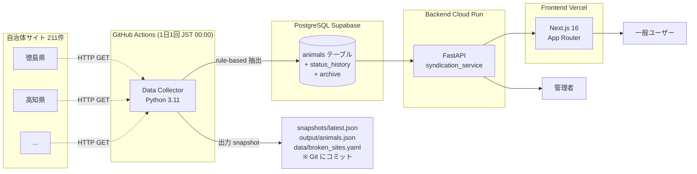

# oneco アーキテクチャ概要

全国の保護動物情報を一元化する Web プラットフォーム。各自治体の公式サイトをクロールして統合 DB に格納し、横断検索 UI で公開する。

## 全体像



## 主要コンポーネント

### 1. Data Collector (`src/data_collector/`)
**役割**: 211 サイトを巡回して動物データを抽出 → DB 投入

- エントリ: `__main__.py`
- 実行: GitHub Actions `.github/workflows/data-collector.yml` が毎日 JST 00:00 (UTC 15:00) に cron 実行
- 抽出方式: **rule-based 抽出**（サイトごとに adapter クラスを用意。`src/data_collector/adapters/rule_based/sites/` 配下）
  - 共通基底: `WordPressListAdapter` / `SinglePageTableAdapter` / `PlaywrightAdapter` / `PdfTableAdapter`
  - LLM 抽出 (Groq / Anthropic) は `extraction: llm` 指定サイトとフォールバック用に温存
- サイト設定: `src/data_collector/config/sites.yaml`
- 失敗追跡: `data/broken_sites.yaml`（連続 3 回失敗で自動スキップ、7 日後に再試行）
- 異常検知: HTML サイズ縮小、snapshot 件数比較で「成功してるのに 0 件」を検知

### 2. Backend API (`src/syndication_service/`, `src/data_collector/infrastructure/api/`)
**役割**: FastAPI で公開・管理 API を提供

| エンドポイント | 用途 |
|---|---|
| `GET /animals` | 動物一覧（ページング・フィルタ） |
| `GET /animals/{id}` | 動物詳細 |
| `GET /animals/stats/by-prefecture` | 都道府県別件数（地図用） |
| `GET /public/stats` | 公開メトリクス（総数、最終更新時刻） |
| `GET /admin/sites` | サイト一覧 + DB 集計（管理者） |
| `GET /admin/stats` | 全体集計（管理者） |
| `GET /feeds/rss`, `/feeds/atom` | RSS/Atom フィード（`/feeds` prefix でマウント） |
| `GET /feeds/archive/rss`, `/feeds/archive/atom` | アーカイブフィード |
| `GET /health` | ヘルスチェック |

- DB: PostgreSQL (Supabase 想定)、SQLAlchemy + asyncpg
- レート制限: slowapi (`X-RateLimit-*` ヘッダ)
- 認証: 管理 API は NextAuth 経由の OAuth (frontend 側で認可)

### 3. Frontend (`frontend/`)
**役割**: 公開 UI と管理ダッシュボード

- Next.js 16 + React 19 + App Router、Tailwind v4
- デプロイ: **Vercel** (`.vercel/project.json`)
- 認証: next-auth v5 (GitHub OAuth)

| ルート | 用途 |
|---|---|
| `/` | トップ（日本地図、都道府県別件数） |
| `/animals` | 動物一覧（検索・フィルタ） |
| `/animals/[id]` | 動物詳細（動的 OG 画像付き） |
| `/stats` | 公開メトリクスページ（動的 OG 画像付き） |
| `/favorites` | お気に入り（localStorage） |
| `/admin` | 管理ダッシュボード |
| `/sitemap.xml`, `/robots.txt` | SEO |

- API 接続: `lib/animals.ts`, `lib/public-stats.ts`, `lib/admin.ts`
  - 公開 API: `NEXT_PUBLIC_API_BASE_URL`
  - 管理 API: `BACKEND_INTERNAL_URL`（サーバーサイドのみ）

## 1 日のサイクル

```
JST 00:00  GitHub Actions data-collector.yml が起動
   ↓
   1. sites.yaml を読む (211 サイト)
   2. broken_sites.yaml でスキップ判定
   3. 各サイトを rule-based adapter で取得・抽出
      - per-site timeout (通常 120s / Playwright 180s / sites.yaml で個別上書き可)
      - robots.txt 遵守チェック
      - HTML サイズ異常検知 (前回 snapshot との差)
   4. 抽出結果を DB (animals) に upsert + status_history 記録
   5. snapshots/latest.json と output/animals.json を更新
   6. broken_sites.yaml を更新
   7. これら 3 ファイルを git commit して main に push
   ↓
JST 00:30 頃  完了 (収集サマリ: 成功 X サイト / 失敗 Y サイト)
   ↓
   Frontend は次のアクセス時に最新 DB を読む
```

## ホスティング

| コンポーネント | サービス | 備考 |
|---|---|---|
| Frontend (Next.js) | Vercel | `.vercel/project.json` 連携 |
| Backend (FastAPI) | Google Cloud Run `oneco-api` (asia-northeast1) | `deploy-backend.yml` で WIF キーレスデプロイ |
| DB | Supabase (PostgreSQL) | transaction-mode プーラー (:6543) 経由、`alembic` で migration |
| Cron 実行 | GitHub Actions | サーバーレス収集（cost ≒ 0） |
| シークレット | Keychain (ローカル) / GitHub Actions Secrets (CI) | 命名: `oneco-*` プレフィックス必須 |

## 主要ディレクトリ

```
oneco/
├── src/
│   ├── data_collector/         # サイトクロール + 抽出 + DB 投入
│   │   ├── __main__.py         # CLI エントリ
│   │   ├── adapters/rule_based/sites/  # サイト別 adapter
│   │   ├── config/sites.yaml   # サイト定義
│   │   ├── orchestration/      # CollectorService
│   │   ├── llm/                # LLM フォールバック (Groq/Anthropic)
│   │   └── infrastructure/
│   │       ├── api/            # admin/animals エンドポイント (FastAPI)
│   │       └── database/       # SQLAlchemy models, repository
│   ├── syndication_service/    # RSS/Atom + SNS 自動投稿 (Threads)
│   └── notification_manager/   # LINE 通知 (実装済み・未配線)
├── frontend/                   # Next.js 16 SPA
├── data/broken_sites.yaml      # 連続失敗サイトの記録 (自動更新)
├── snapshots/latest.json       # 前回収集の全データ (自動更新)
├── output/animals.json         # 最新収集サマリ (自動更新)
├── alembic/                    # DB migration
├── .kiro/                      # Spec-driven dev (steering + specs)
└── .github/workflows/          # 全9本 (docs/wiki/09-workflows.md 参照)
```

## キーとなる設計判断

1. **rule-based を default 抽出に**（2026-05-15）
   LLM API コストを $0 に抑える。サイト構造が変わったら adapter を直す運用。
2. **収集データを git にコミット**
   DB を立てなくても snapshot / broken_sites の履歴が main の git log に残るので、運用問題のデバッグがしやすい。
3. **部分失敗を exit 0 で許容**
   1 サイトでも成功すれば毎日の自動 push を走らせる（全停止を避ける）。
4. **連続失敗サイトの自動スキップ + 再試行猶予**
   `consecutive_failures >= 3` で毎回スキップ、`grace_days=7` 経過で再チェック → adapter 修正後の自動復帰を担保。
5. **frontend は Vercel 一本化**（2026-05-19）
   Next.js 16 + App Router + 動的 OG 画像が Vercel 最適化前提のため。詳細は memory `project_hosting.md` 参照。

## 関連ドキュメント

- [docs/wiki/](docs/wiki/README.md) — 体系ドキュメント（データフロー・adapter・自己修復・監視ほか）
- `.kiro/steering/product.md` — プロダクトビジョン・マネタイズ
- `.kiro/steering/roadmap.md` — フェーズ計画
- `.kiro/specs/<feature>/` — 各機能の要件・設計・タスク
- `DEPLOYMENT.md` — 本番デプロイ手順
- `CONTRIBUTING.md` — 開発フロー
